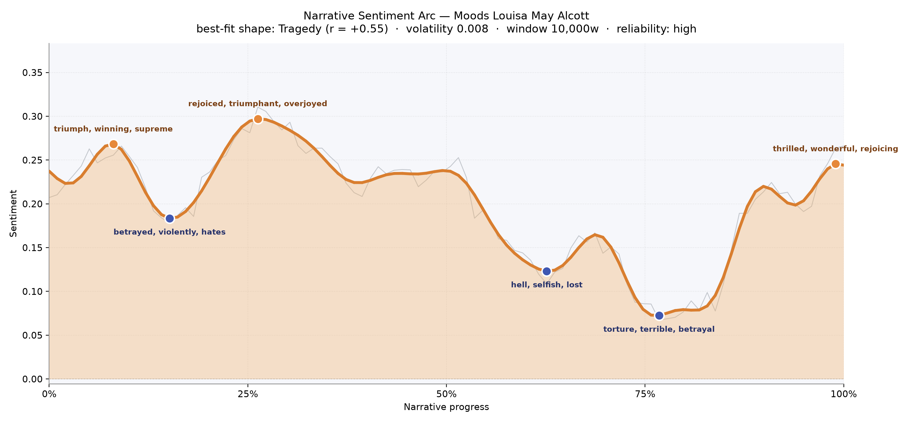
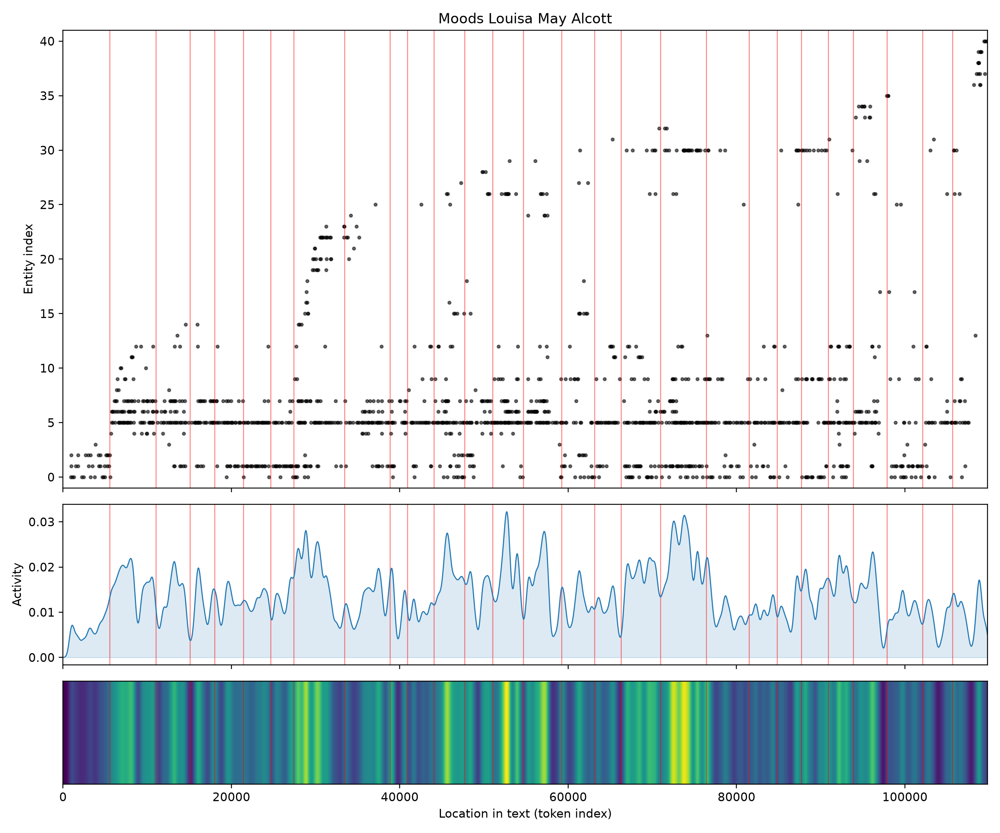
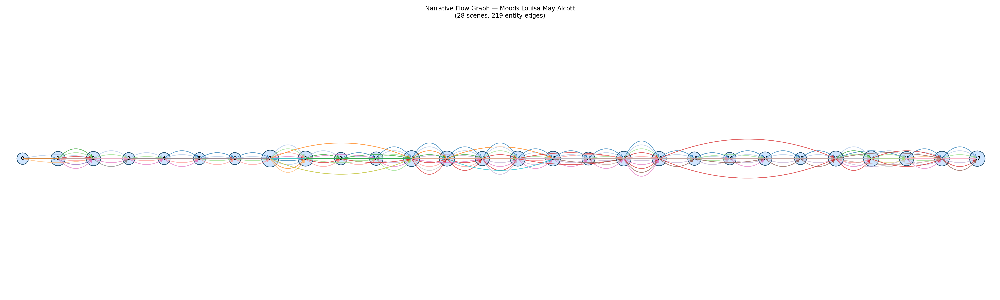

# Moods
### by Louisa May Alcott

86,749 words · a Tragedy arc — a life brightened at the outset, then slowly darkened by the weight of its own choices

## The shape of the story

*Moods* opens with light on its face. In its first tenth, the reader is carried by a rush of good weather — the arc lifts on "triumph, winning, supreme, pleasant, amused," the small, giddy vocabulary of a young woman still able to believe her heart will decide well. A second, higher crest arrives around the quarter mark, thickening with "rejoiced, triumphant, overjoyed, fun, brilliant" — Sylvia at her most sunlit, before consequence has grown teeth. Alcott is a merciless architect. From that peak, the line eases downward for the whole long middle of the book, the way a slow ocean pulls a swimmer past the sandbar without a splash. By the two-thirds mark the trough is bruised with "hell, selfish, lost, despair, arrested, tyrannical," and just past three-quarters the deepest valley opens under the feet, weighted by "torture, terrible, betrayal, panic, despair." The very last pages lift again — "thrilled, wonderful, rejoicing, supreme, best" — but this is not restoration so much as a hard-earned calm, the kind of light that finds a room only after grief has swept it clean. The whole descent is measured, not lurching; the volatility is quiet. This is a book that breaks its heroine gently and on purpose.

<figure><figcaption>Two early crests of girlish happiness give way to a long, deliberate sinking; the final rise is convalescence, not victory.</figcaption></figure>

## Who lives on the page

Sylvia stands at the center of the novel with a completeness few Alcott heroines match — her name appears more than twice as often as anyone else's, and the story bends around her weather. Warwick, the storm-bringer, is the second presence, followed by Mark, her brother, and Adam — another face of the same restless masculine energy that torments and tempts her. Prue, the practical elder sister, keeps the domestic hearth in view, while Geoffrey (that is, Moor — the label "moor" caught by the tools as a place-word is really Geoffrey Moor, Sylvia's steady husband) supplies the quiet counterweight. Faith, Ottila, Jessie, and Yule fill the outer ring: confidante, rival, cousin, father. A handful of the smaller labels — "tilly," a stray "gabriel," "nat," "phebe" — flicker in and out as household or village figures. What the roll call confirms is that this is a chamber drama of four or five souls circling one young woman's conscience, not a crowd novel.

<figure><figcaption>Sylvia's line runs unbroken through the book; the men enter in bands, thicken through the middle, and cluster densely near the close.</figcaption></figure>

## The weave of scenes

The scene-weave reads like a slow braid tightening toward the end. The opening chapters are sparse — four or five figures per scene, the world still small around Sylvia's father's house. Around the eighth scene the strand count jumps to seventeen: this is the river journey, the widening of her world, and the graph shows it as a sudden thickening of arcs bowing across neighboring chapters. Through the middle the scenes stay populous and their connective threads loop far, a sign that Alcott is holding several relationships in play at once — husband, friend, sister, self. The final quarter braids tightest of all: twelve, thirteen, ten, eleven, thirteen figures per scene, with long arcs vaulting back to earlier chapters. That backward reach is the shape of reckoning — old choices returning to be answered. The threads thin only at the very first and very last node, as if the story steps quietly onto the stage and quietly off.

<figure><figcaption>Twenty-eight scenes, densest in the middle and again at the close — a novel of gathering consequence.</figcaption></figure>

## What a reader takes away

*Moods* leaves the reader with the ache of a decision made too young and lived with too honestly. Sylvia's happiness is real, and so is its cost; Alcott refuses to punish her theatrically or rescue her cheaply. The final lift is the smallest kind of light — the sort that arrives when a person has stopped bargaining with their life and simply accepts it. You close the book quieter than you opened it, and a little more careful with your own heart.
