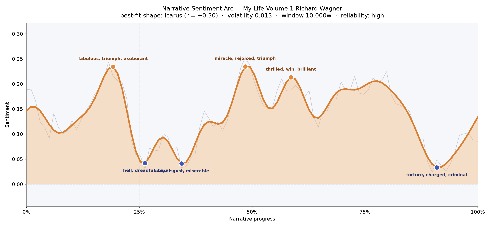
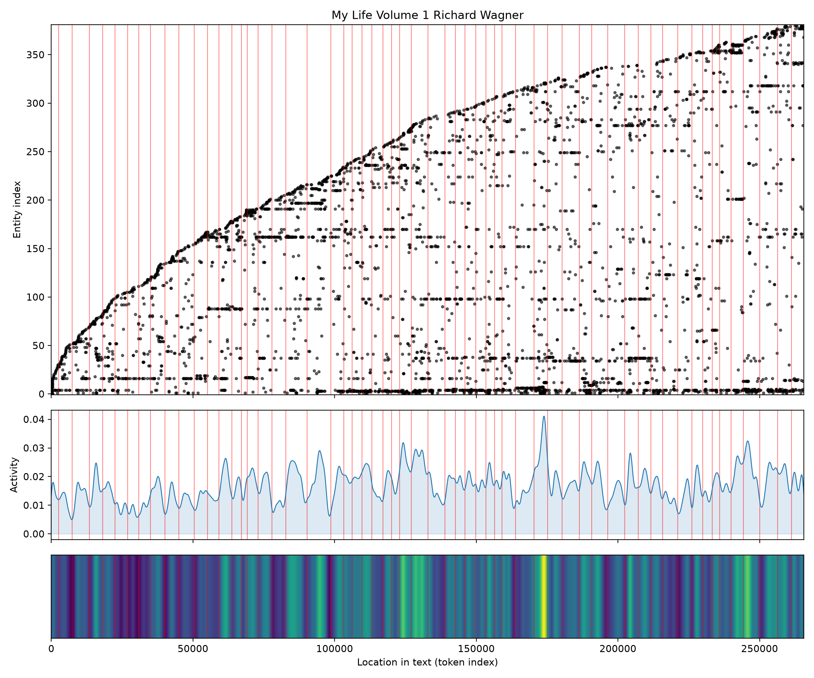
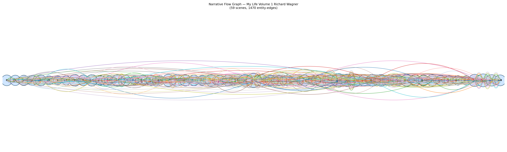

# My Life, Volume 1
### by Richard Wagner

221,692 words · an Icarus arc — a life that soars on ovations before the wax begins to melt

## The shape of the story
Wagner's memoir climbs like a man who cannot stop climbing. The opening third is buoyant, full of the young composer's appetite for stage and scandal — a first bright crest around the one-fifth mark that glitters with "fabulous, triumph, exuberant, rapturous, wonderful". Then the ground gives way. Around the quarter mark the mood bruises hard, thick with "hell, dreadful, bad, bankruptcy, harassed", and just after it deepens again into "disgust, miserable, despair, deceived, terrible" — the writer remembering, one suspects, the flight from Riga, the debts, the doors that stayed closed in Paris.

The recovery is not gentle; it is operatic. The middle of the book lifts twice into its highest weather, first with "miracle, rejoiced, triumph, wonderful, fantastic", then again with "thrilled, win, brilliant, triumph, miracle, masterpiece" — the sound of a man remembering the nights his own music finally rang back at him from a full house. But this is an Icarus story, and the last stretch confirms it. Near the ninetieth percentile the arc collapses into its darkest trough of all, heavy with "torture, charged, criminal, arrested, loss, betrayed" — the Dresden uprising and its aftermath rushing up to meet him. The reading is dependable rather than jittery; the swing is small and the sample enormous, so the pattern feels earned rather than accidental.

<figure><figcaption>Two golden summits in the middle third, a final steep drop toward exile.</figcaption></figure>

## Who lives on the page
The presences that dominate this volume are, tellingly, cities. Dresden hovers over everything with more than three hundred appearances, followed by Paris, Leipzig, Berlin, Magdeburg, Königsberg, Riga — a European map traced by a man who could never afford to stay put. Only a handful of human names crowd through: Minna, the long-suffering first wife, is the single most-mentioned person; Liszt arrives as friend and rescuer; the automatic tagger has mistaken a few of Wagner's own operas — Rienzi, Tannhäuser, Lohengrin — for people or places, a charming slip that nonetheless tells the truth about this memoir, which treats its works as living characters. The German and French labels drift through as national moods rather than figures. What emerges is less a cast than a geography of ambition: Wagner is the sun, and the cities are the planets he keeps trying to bend into orbit.

<figure><figcaption>A widening constellation of names and places, thickening as the composer's world enlarges.</figcaption></figure>

## The weave of scenes
Read as a musical score, the narrative flow is remarkably dense and continuous — fifty-nine scenes strung by nearly fifteen hundred connecting threads. There are no thin passages, no lulls where the cast falls away; instead the whole braid pulses with the same textured busyness from overture to coda. A few scenes swell wider than their neighbours, gathering forty, fifty, even sixty distinct presences at once — the crowded evenings, one imagines, of premieres and salons, when everyone Wagner knew seemed to occupy the same room. The visual impression is of a long chandelier of overlapping loops: parallel friendships and cities re-entering, dropping out, re-entering again, exactly the way a working artist's life actually feels when it is remembered from the inside.

<figure><figcaption>A continuous chandelier of scenes — no quiet stretches, only shifting densities of company.</figcaption></figure>

## What a reader takes away
What remains, when the book closes, is the sensation of a man narrating his own flight while the feathers are still coming loose. The triumphs are real and the disasters are real, and Wagner writes both with the same slightly theatrical relish. You leave the volume convinced that greatness and grievance are, for this author, the same muscle — and that the next book is going to hurt.
