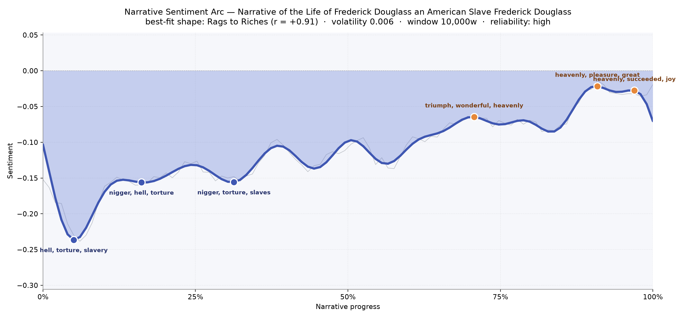
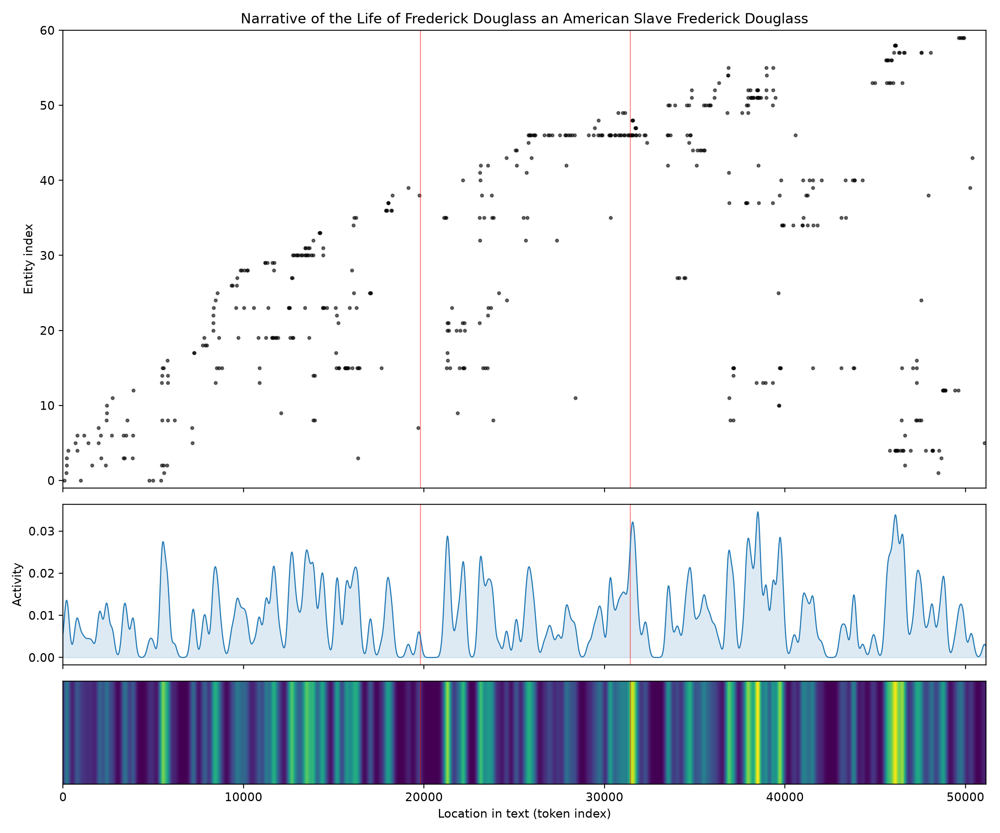
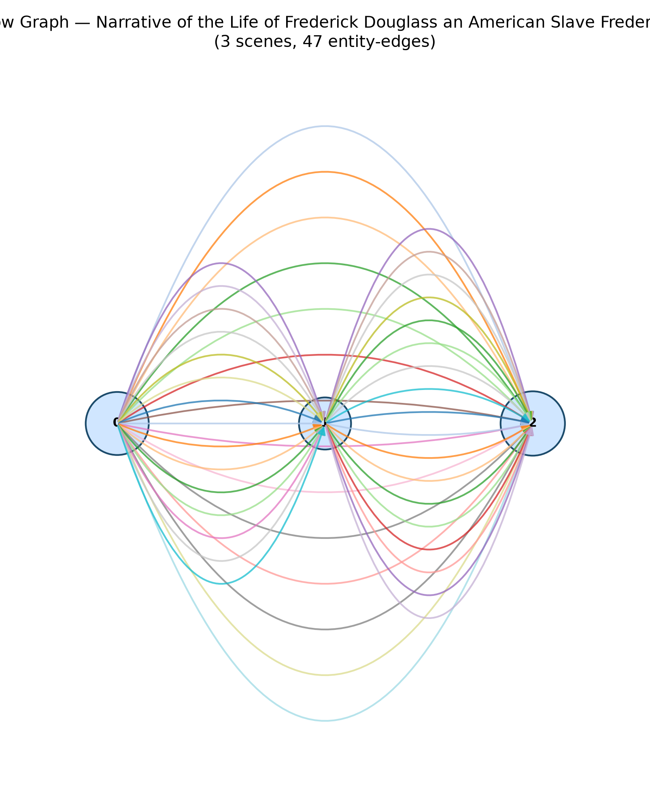

# Narrative of the Life of Frederick Douglass, an American Slave
### by Frederick Douglass

41,320 words — a Rags to Riches arc, a life dragged through the pit of bondage and hauled, inch by inch, into daylight.

## The shape of the story

Douglass opens his book at the bottom of a well. The first fifth of the pages presses down with a weight the reader can feel in the ribs — the earliest trough is thick with "hell, torture, slavery, lost, slave, slaves", and the second bruise, arriving soon after, spills into "nigger, hell, torture, slave, died, slaves". A third dip near the one-third mark holds the same vocabulary of "torture, slaves, bad, cruel", as if the narrator refuses to let the reader climb out of the plantation before he does.

Then the ground begins, slowly, to tilt upward. There is no sudden sunrise. The rise is stubborn, earned, incremental — the arc of a man teaching himself to read by candle-stub, learning to strike back at the overseer Covey, walking north on his own two feet. By the two-thirds mark the language brightens into "triumph, wonderful, heavenly, devoted, pleased, joy". Near the ninety-percent mark the register turns to "heavenly, pleasure, great, sweetest, loved, popular", and the closing pages catch a final updraft of "heavenly, succeeded, joy, great, excitement, won". The shape is unmistakable: a life that starts in hell and ends at a lectern, a rag-to-riches curve where the riches are not money but voice.

<figure><figcaption>A steady climb out of the pit — the line never fully clears zero, because the freedom at the end is remembered against everything that came before.</figcaption></figure>

## Who lives on the page

The book is populated almost entirely by the men and places that owned or shaped Douglass. Covey — the overseer, the "nigger-breaker" — dominates the roll with fifty-six appearances, and his shadow falls across the middle of the book like a locked door. Baltimore is nearly as present, forty-two mentions, because the city is where the boy first hears free English on the street and first understands that literacy is the crowbar of the soul. Around them stand Lloyd (the Colonel), Master Hugh, Thomas, Freeland, Gore the overseer whose calm cruelty freezes the page, and Hamilton. New Bedford and Maryland anchor the geography of before-and-after; Easton flickers as a smaller marker between. One label, "christianity", is a group rather than a person — it belongs to the book's argument about slaveholding religion, and Douglass names it plainly. A few tags blur person and place — "lloyd's" reads as the plantation as much as the man — but the picture is honest: this is a memoir where the antagonists are named, the geography is named, and the narrator's own name is the one presence held slightly back, the "I" behind every scene.

<figure><figcaption>The upper scatter shows figures accumulating as Douglass's world enlarges — a diagonal rise from a handful of plantation names to a Northern cast.</figcaption></figure>

## The weave of scenes

The scene-weave resolves into three great chambers connected by dense, colored threads. Read the picture like a triptych: childhood on the Eastern Shore, apprenticeship in Baltimore and the reckoning with Covey, and the escape north into speech. Forty-seven threads run between the three, which is remarkably tight for a book with only three panels — Douglass keeps carrying his people forward. Covey does not vanish when the second chamber closes; his memory bows into the third. The middle chamber is the leanest (twenty-five presences against forty and forty-two on either side), which is faithful to the felt experience of the book: the middle is where the world narrows to one man, one field, one fight, before opening again.

<figure><figcaption>Three chambers, densely braided — the past is never left behind, only carried into a wider room.</figcaption></figure>

## What a reader takes away

You close the book carrying two things at once: the specific weight of what a boy was made to survive, and the quieter astonishment that he learned to name it. Douglass does not sell you catharsis. The arc rises, but it never quite crosses into unqualified brightness — freedom, in this telling, is not the erasure of the pit but the ability to speak from the rim of it. That is the inheritance: language as the tool of the rescued, and testimony as the debt paid forward.
