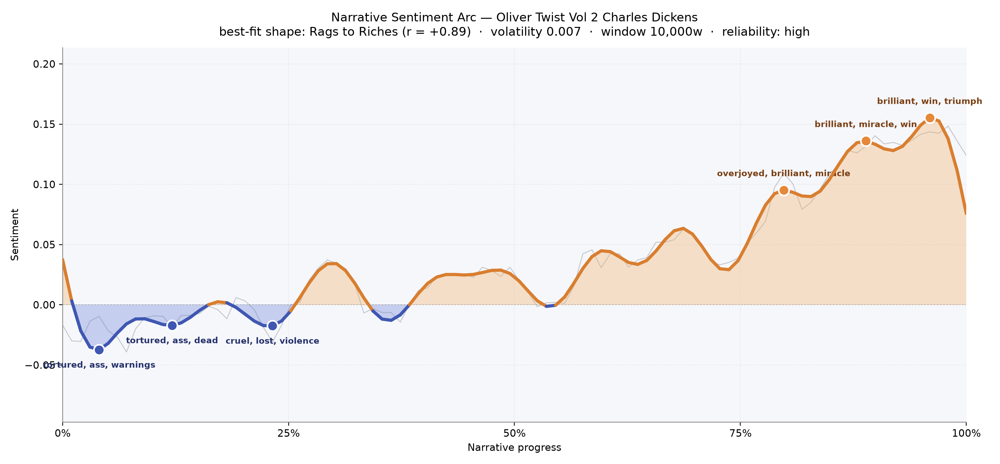
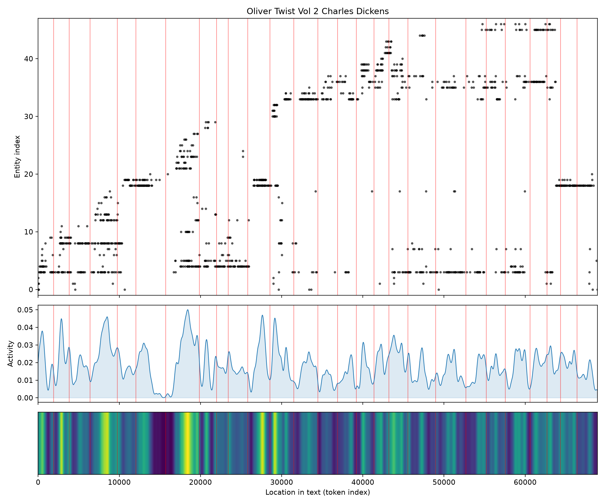
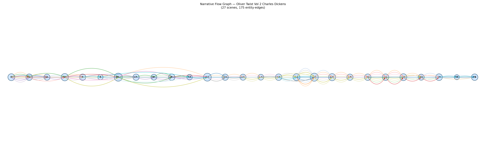

# Oliver Twist, Vol. 2
### by Charles Dickens

52,008 words · a Rags to Riches arc — a bruised beginning that climbs, tentatively, into daylight

## The shape of the story

If you plotted a reader's pulse against these fifty-two thousand words, you would draw this exact curve: a low, aching opening; a long, uncertain middle where hope keeps trying to stand; and a final quarter that lifts almost giddily toward light. Dickens is not writing tragedy here, whatever the early pages threaten. He is writing a moral ascent, and the arc bears him out with unusual clarity — the fit to the rise-from-dust shape is strikingly close, and the reliability is high, so the pattern feels earned rather than accidental.

The first valley, only a few pages in, is thick with "tortured, ass, warnings, hideous" — Dickens setting his hooks in the reader's ribs, showing the world that Oliver must survive. The trough deepens again around the twelve-percent mark with "tortured, dead, violently, violent, mad", and once more near a quarter of the way through with "cruel, lost, violence, ugly, die, dying". These are the book's foundational cruelties: the workhouse language, the thieves' language, the language of a child pushed toward extinction. Then something turns. By the three-quarter mark the register glows with "overjoyed, brilliant, miracle, blessings, happiness", and the final peaks — around the ninety-percent stretch — swell with "brilliant, miracle, win, triumph, joyful". Even the arithmetic of Dickensian goodness is here: the higher the peak climbs, the more insistently he presses providence into the words.

<figure><figcaption>A low, wounded opening yielding, slowly then all at once, to a rising tide of miracle-words.</figcaption></figure>

## Who lives on the page

Oliver is the centre of gravity — his name recurs nearly two hundred times, more than any other figure — but the surrounding cast is unusually crowded for a volume this size. Bumble, the beadle whose bluster Dickens loves to puncture, is close behind. Sikes and Fagin bring the underworld; Rose Maylie, Harry, and Dr. Losberne bring the drawing-room air of rescue. Giles and Brittles, the pompous household servants, get an outsized number of mentions because Dickens keeps returning to their comic self-importance around the burglary. Blathers, the Bow Street man, and Mrs. Corney, the workhouse matron who becomes Mrs. Bumble, round out a moral geography that runs from parish poorhouse to country parlour.

A couple of the tallies are slightly comic in their misfiling: "jew" appears as a collective label rather than a character — Dickens's insistent, uncomfortable shorthand for Fagin — and "brittles" surfaces tagged as a place when he is very much a person. Read past those small confusions and the shape is legible: this is a book carried on the shoulders of a wronged boy and the two households, criminal and kindly, that fight over him.

<figure><figcaption>The cast crowds in around the middle chapters, then thins as the ending narrows to a few faces.</figcaption></figure>

## The weave of scenes

The scene weave gives the book a spine of twenty-seven episodes, laced with a hundred and seventy-five threads connecting the presences who reappear across chapters. Density concentrates in two bulges: the early-middle stretch, where Dickens crowds sixteen presences into a single scene as the burglary and its aftermath rope together thieves, servants, doctors, and constables; and the late run, where another sixteen-person scene marks the reveal — the parlours filling with everyone the plot has been holding apart. The threads thin at the two ends, as one would expect: a quiet frame around a densely braided middle. Those threads are not parallel but knotted; Dickens keeps rethreading the same figures through both halves of his social map, which is exactly what makes the moral machinery of the book satisfying.

<figure><figcaption>Twenty-seven scenes braided by recurring faces, thickest where the two worlds collide.</figcaption></figure>

## What a reader takes away

You close this volume with the sensation of a bruise fading — the ache of the first quarter has not been forgotten so much as answered. Dickens has spent his darkest words early so that his brightest words, at the end, land with the force of vindication. The reader inherits a stubborn, slightly sentimental belief: that goodness, harried and outnumbered, can still walk out of the fog.
