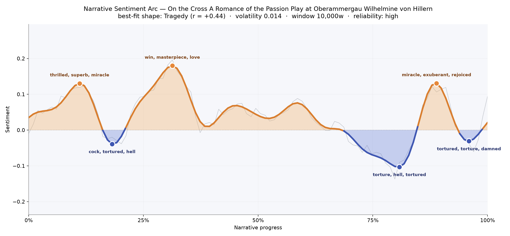
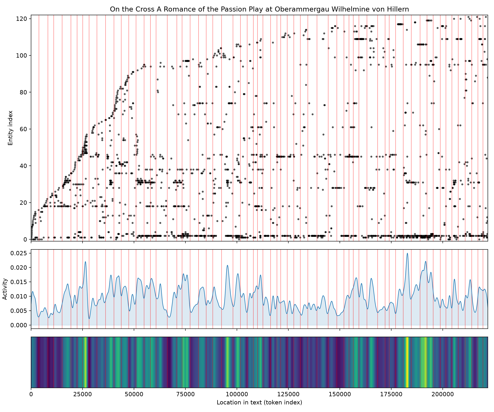

# On the Cross: A Romance of the Passion Play at Oberammergau
### by Wilhelmine von Hillern

171,090 words · a Tragedy arc — a life that shines, believes, and then is nailed slowly to its own longing.

## The shape of the story

Von Hillern's novel behaves like a long processional. It begins in bright weather — the first crest, near the tenth of the way in, lifts with "thrilled, superb, miracle, rejoicing, triumph, brilliant", the language of a woman watching a stage and mistaking rapture for love. Almost immediately the ground gives way: a short valley near the fifth mark bruises with "cock, tortured, hell, torture, miserable, died", the first cold shadow of the Passion itself falling across a private heart.

Then comes the highest, most deceptive climb of the book, roughly a third of the way through, glittering with "win, masterpiece, love, happiness, faithful, blessing" — Madeleine's certainty that she can carry both her rank and her passion for Freyer, the peasant who plays the Christ. From that summit the arc undulates gently, the middle chapters breathing in and out, before the long descent that gives this book its shape. Near four-fifths through, the deepest trough of the whole novel closes in, dense with "torture, hell, tortured, criminals, mad, died" — the private crucifixion of vanity, guilt, and separation. A brief, almost hymnal rise near the ninth-tenth mark warms with "miracle, exuberant, rejoiced, soothe, good, great", the sound of grace reaching down, but the final pages settle again into "tortured, torture, damned, loathed, die, angry". A tragedy, then, in the older ecclesiastical sense: the ascent is the illusion; the fall is the truth; the consolation, when it comes, is quieter than the wound.

<figure><figcaption>A tragedy told in three summits and three descents — each fall deeper than the last.</figcaption></figure>

## Who lives on the page

The novel belongs, overwhelmingly, to Freyer — the woodcarver-actor whose Christ-role becomes the axis of Madeleine's obsession. His name is spoken 475 times, three times more than anyone else's, and every current in the book eventually turns toward him. Around him gathers a tight company: the Countess (also appearing as Countess Wildenau and Madeleine von Wildenau — clearly the same aristocratic woman under different formalities), the loyal peasant Josepha, the sober Ludwig Gross who directs the Play, and Martin, whose steadier presence anchors the village scenes. Sacred figures — Mary, Joseph, Christus — drift through as roles and as invoked names, blurring the line between the actors and what they enact.

A few of the top names are Oberammergau itself — "ammergau" is the village, not a person — and a scatter of tagging noise ("thou", "gross" on its own) reminds us these are lists mined from prose, not a cast page. Still, the essential drama is unmistakable: a countess, a peasant Christ, and the villagers who love them both.

<figure><figcaption>Freyer's line runs the length of the book; the village crowds around him in dense vertical rain.</figcaption></figure>

## The weave of scenes

Sixty-four scenes braid across the length of the novel, and the flow chart reads like a rope pulled taut at both ends and thick in the middle. The opening chapters are dense — twenty, twenty-two, twenty-eight figures crowding a single scene, the pageant's whole company massed on the stage of Ammergau. Then the book narrows: after the halfway mark the scene populations thin to five, six, seven presences at a time, chamber-piece intimacies between Madeleine, Freyer, Josepha. The longest connective threads — arcs looping from early to late — carry Freyer and the Countess forward like two notes held under everything else. Near the final third the count swells briefly again, gathering the village for the last performance, then contracts to the private, punishing quiet of the book's close.

<figure><figcaption>Public crowd scenes at the edges; a whispering, two-voice middle where the tragedy is actually committed.</figcaption></figure>

## What a reader takes away

What lingers is the confusion of loves — sacred and profane pressed so close that neither can be told from the other. Von Hillern gives us a woman who mistakes a passion play for permission, and a man who cannot step out of the role that has become his soul. You close the book carrying the smell of pine smoke and greasepaint, and the sense that some crosses are chosen and some are simply borne.
