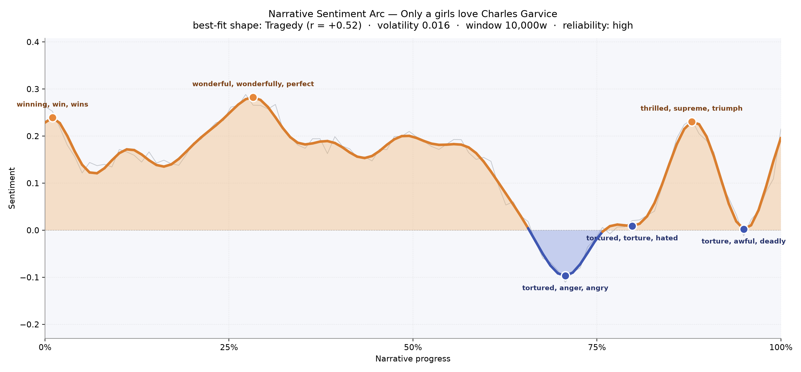
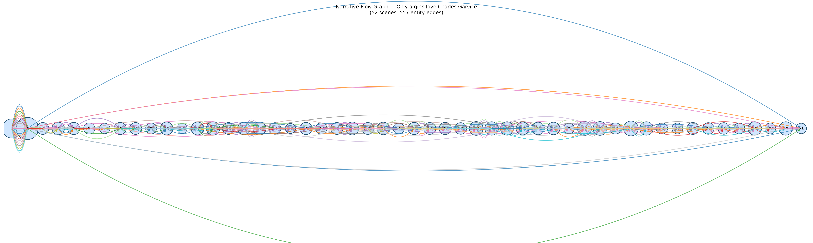

# Only a Girl's Love
### by Charles Garvice

A 150,430-word Victorian romance that traces a Tragedy arc — a courtship that blooms into radiance, then collapses under the weight of engineered ruin.

## The shape of the story

For most of its length, this novel behaves like a book determined to please. The opening pages glitter with "winning, win, wins, amazing, triumph, wonderful" — the vocabulary of a heroine stepping into her own luck. That brightness deepens near the quarter mark, where the prose grows almost giddy on "wonderful, wonderfully, perfect, great, grateful, good," the diction of a young woman falling in love and being loved back without complication. If the book ended there, it would be a fairy tale.

But Garvice is writing a tragedy dressed as a romance, and the reader can feel the floor tilt. The long middle keeps its warm surface, yet the emotional line begins a slow, patient descent, as though a hand were quietly loosening every rope that held Stella upright. The plunge, when it comes near the two-thirds mark, is sharp and inky: the valley is thick with "tortured, anger, angry, murdering, illegal, criminal," language that belongs less to a lovers' quarrel than to a courtroom or a nightmare. A second trough follows almost at once, bruised with "tortured, torture, hated, anguish, awful, worse" — the same wound, pressed again. The book briefly lifts near the ninth-tenth into a false dawn of "thrilled, supreme, triumph, brilliant, wonderful," only to close on one last dark hollow of "torture, awful, deadly, killed, mad, desperate." The final chord is not consolation; it is aftermath.

<figure><figcaption>A long sunlit plateau, then a two-stage fall — the anatomy of a courtship undone.</figcaption></figure>

## Who lives on the page

The novel belongs, almost unfairly, to Stella. Her name appears more often than any other — 940 mentions, nearly half again as many as her beloved Leycester, whose 677 appearances make him the clear second sun of the book. Around this central pair orbits the smaller planetary system of the plot: Frank, kind and secondary; the sculptor-uncle Etheridge, whose surname carries the household; Lilian, gentle counterweight; the Wyndward name that shadows Leycester's lineage; and Lenore, the rival whose beauty poisons the middle chapters.

The villain of the piece is Jasper Adelstone, and one can watch the tooling struggle a little with him — he appears both as "jasper" (misread as a place) and as "jasper adelstone" and "adelstone," a fracturing that in fact reflects how the narrator names him: sometimes intimate first name, sometimes cold surname, sometimes both. London is the one true city that presses in on the country idyll, and the author's own name drifts up the list, a whisper of the frontispiece leaking into the count. Small noise, easily forgiven.

<figure><figcaption>A dense, populous world — new figures pour in early, then the same faces recur like refrains.</figcaption></figure>

## The weave of scenes

Fifty-two scenes, laid end to end, form a long spindle of a book: fat in the middle, tapered at the ends. The opening scene alone gathers forty distinct presences, and the second swells to fifty-seven — Garvice front-loads his cast, introducing the country house, the village, the London set, and the sculptor's cottage in rapid succession. After that flourish, the scene sizes settle into a steadier heartbeat of ten to sixteen figures per episode, with a late bulge around scene forty-one (twenty-one presences) that corresponds to the crowded reckoning near the story's climax.

The long sweeping arcs that leap from the first scene to the last are the recurring characters — Stella, Leycester, Jasper — carried like threads through the whole tapestry. Between them, shorter local braids gather and dissolve: a ballroom here, a legal office there, a sickroom, a moor. The overall silhouette is that of a Victorian three-decker: broad ensemble, patient middle, a knot pulled tight near the end.

<figure><figcaption>A spindle of scenes with a few long threads carrying the lovers from first page to last.</figcaption></figure>

## What a reader takes away

You close this novel with the strange ache particular to Garvice — the feeling of having been coaxed into hope for hundreds of pages, then handed a wound. Stella's story is not a lesson so much as a bruise; it lingers because the sunlit chapters were so unguardedly warm. What remains is the shape of tenderness betrayed, and the sense that a girl's love, in this author's hand, is both the most luminous thing in the world and the easiest to break.
