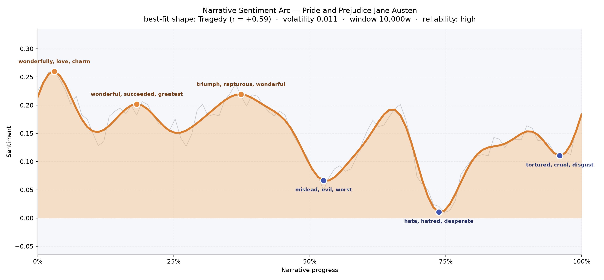
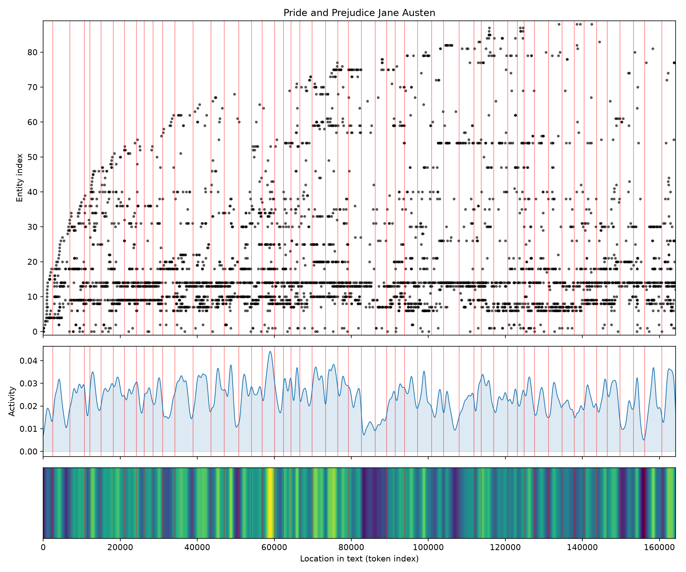
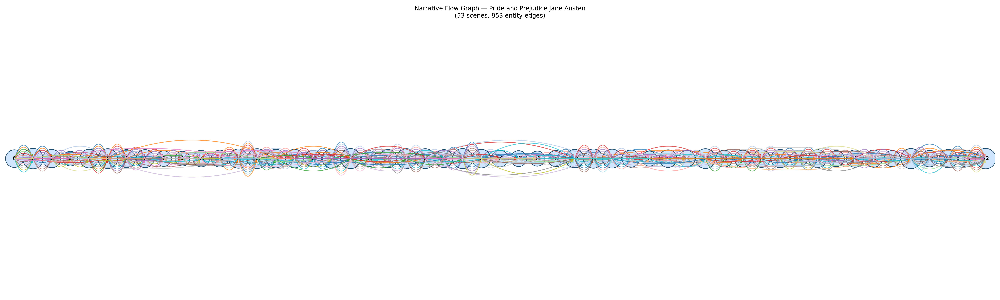

# Pride and Prejudice
### by Jane Austen

128,560 words · a Tragedy-shaped arc — brightness lifted early, then a long descent into wounded pride before a chastened warmth returns

## The shape of the story

For a novel remembered as the great comedy of English manners, the emotional line beneath *Pride and Prejudice* is startlingly grave. The first half opens like a lit ballroom, with an early crest that glitters with "wonderfully, love, charm, beauties" — the brightness of arrival, gossip, and courtship, when Longbourn is still buzzing with news of a young man of good fortune. A second lift, around the eighteen-percent mark, hums with "wonderful, succeeded, greatest, admire" as invitations bloom and Jane and Bingley meet in earnest. The third, and highest, comes near the one-third turn: a burst of "triumph, rapturous, wonderful, rejoicing, excited, affectionate" that reads like a house in full-throated celebration — an engagement announced too early for comfort, a party's laughter carrying across a lawn.

Then the floor tilts. Just past the midpoint the mood cools sharply into a trough thick with "mislead, evil, worst, worse, lost, anger" — the tone of Darcy's first, disastrous proposal and the letter that follows, of Wickham's history unspooled, of Elizabeth reading herself as she has never read herself before. The deepest valley, near the seventy-percent mark, bruises with "hate, hatred, desperate, anger, loss, betray" — Lydia's flight, the family's terror, the sense that the whole social order is about to give way. A final small dip late in the book still carries "tortured, cruel, disgust, worse, cheat, betrayed", so that even the rapprochement between Elizabeth and Darcy arrives through a corridor of shame rather than a fanfare. Austen's happy ending is real, but it is earned by descent: the arc dips like a bright afternoon giving way to a long, chastening evening before the lamps are lit again.

<figure><figcaption>Three early crests of drawing-room delight, then a two-part fall into shame and scandal before a softened close.</figcaption></figure>

## Who lives on the page

The census of names is beautifully lopsided, and beautifully true to how the novel reads. Elizabeth towers over everyone with 633 mentions — nearly twice Darcy's 392 — which is exactly right: this is her consciousness the reader borrows, her misreadings and re-readings that structure every scene. Behind them come Jane, Bingley, and the surname "Bennet" as a household drumbeat, then Wickham and Collins as the two rival suitors of moral gravity, one charming and hollow, the other pompous and safe. Lydia, Catherine (Lady Catherine as much as Kitty's aunt-figure), Lizzy (Elizabeth again, under her family name), and the Gardiners round out the circle of intimacy. A few labels are more setting than person — Netherfield is a house, London a distant magnet, and "charlotte" is read here as a place by the tool even though we know her as Elizabeth's married-off friend; a light comic irony, given how much of Austen's plot depends on estates behaving like characters.

<figure><figcaption>A dense floor of returning names — Elizabeth, Darcy, Jane, Bingley, Bennet — punctuated by fresh presences as the Bennets travel and the world widens.</figcaption></figure>

## The weave of scenes

Across fifty-three scenes and nearly a thousand connecting threads, the weave is unusually even — a long horizontal braid rather than a pyramid. Austen does not build toward a single spectacular knot; she keeps roughly twenty named presences alive per scene, weaving them in and out of drawing rooms, carriages, and letters. Two slight thickenings show through the pattern: one around Netherfield and Rosings in the middle stretches, where the cast crowds together for balls and formal calls, and another near the close, where every thread returns for the double weddings. The scenes at the edges are a little sparer, as if the novel is tuning up and then, at the end, sending its players out one by one after the curtain call. The overall impression is of a social fabric being tested at its seams and mended in place.

<figure><figcaption>A long, level braid: no single climactic knot, but a steady interlacing of household and neighbourhood across the whole book.</figcaption></figure>

## What a reader takes away

What lingers is not the wit, though the wit is everywhere, but the discipline of feeling underneath it. Austen lets her brightest people be humiliated, and only then permits them tenderness. To close the book is to feel that happiness in her world is not a gift but a correction — the reward of having been, at least once, entirely wrong about oneself.
