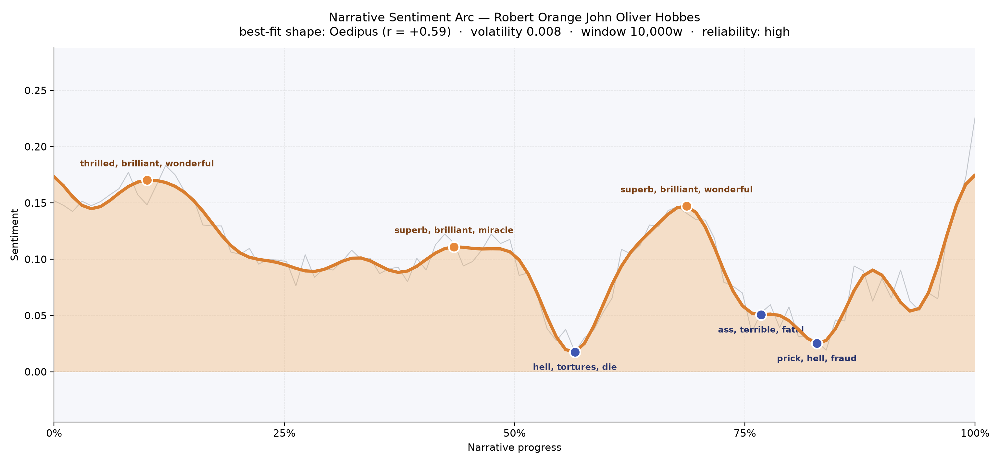
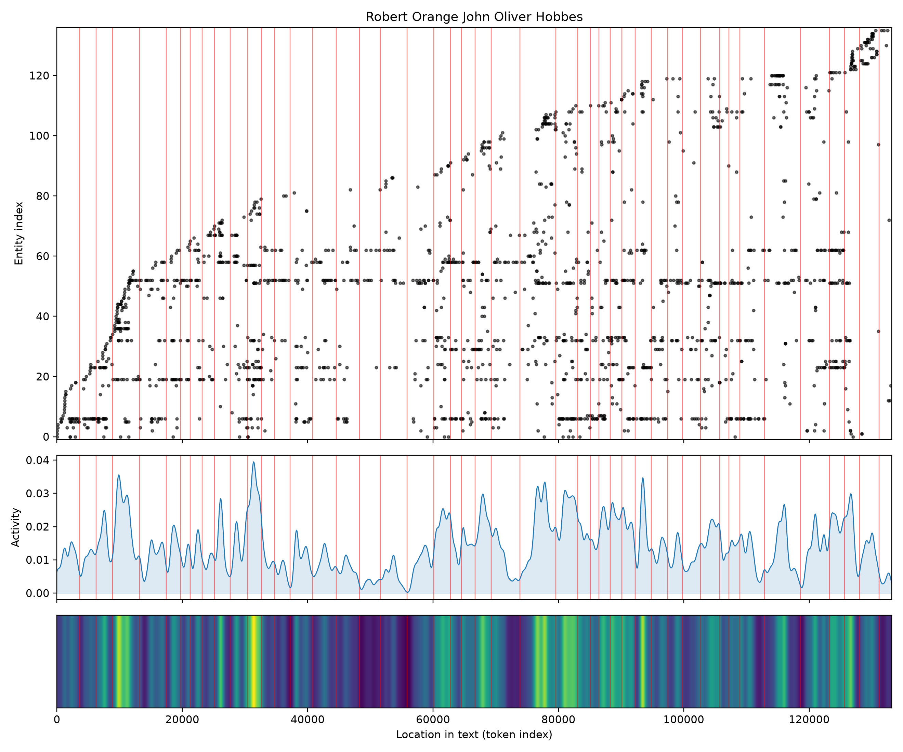
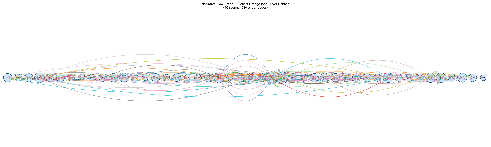

# Robert Orange
### by John Oliver Hobbes (Pearl Craigie)

roughly 100,800 words · an Oedipus arc — a life lifted by grace only to be quietly undone by conscience

## The shape of the story

Robert Orange opens the way a drawing-room comedy might, in a bright wash of feeling. The earliest crest of the book is thick with "thrilled, brilliant, wonderful, supreme, affection, beauty" — a young man of promise, a woman of mind, London society leaning toward them with encouraging warmth. That warmth returns, softer, near the middle: another rise scented with "superb, brilliant, miracle, triumph, supreme, love", as if fortune wants to be sure we noticed her earlier smile.

Then the floor gives. Just past the halfway mark, the arc drops into its deepest hollow, and the language darkens with it — "hell, tortures, die, dead, lost, worst" — a moral vertigo more than a battlefield. Two more troughs follow, each shallower but no less pointed: one bruised with "terrible, fatal, deceive, destroy, hatred", the last shadowed by "hell, fraud, guilty, kill, desperate". A late rise lifts the closing pages, but it is the lift of resignation dressed as peace, not restoration. This is the Oedipus curve at its most Victorian: the higher a soul is raised, the more exquisitely it can fall by its own scruple.

<figure><figcaption>Two bright plateaus of society and love, then a moral trench near the two-thirds mark that never fully closes.</figcaption></figure>

## Who lives on the page

Sara presides over the book with 190 mentions — she is the axis around which the rest turn, more argued about than argued with. Robert himself sits just behind her; the pairing tells you everything about where Hobbes's sympathies rest. Reckage and Parflete arrive in matched frequency, the political friend and the rival husband, and Pensée and Brigit fill in the drawing-room chorus. Beauclerk and the shrewd cameo of Disraeli round out a cast that is unmistakably late-nineteenth-century London: parliament, presbytery, and salon in the same breath.

A few labels want a gentle correction. "Orange" appears often as a place-name because it also happens to be the hero's surname; "Agnes" is tagged as a location but is a person; "Marshire" and "England" are genuine settings; "reckage" and "d'alchingen" are surnames dressed as institutions by the tagger. Read past those small mislabels and the roster is remarkably human — a novel of intimates, not of crowds.

<figure><figcaption>Sara and Robert thread the length; a bright flare of new faces near the seventy-thousand mark marks the crisis chapters.</figcaption></figure>

## The weave of scenes

Across forty-six scenes the flow graph reads like a long, patient conversation with sudden crescendos. The opening chapters are dense with introductions — nineteen figures in the first scene alone, twenty-eight by the fourth — as Hobbes assembles her London. Then the middle thins to conspiratorial duets and trios: scenes with only four or five presences, private rooms, letters read aloud, the small stages on which large decisions happen.

The great swell arrives around scenes twenty-five and twenty-six, where forty-five and thirty-eight figures crowd in — the public reckoning, the political and social climax braided into a single roaring passage. After that the book breathes out into paired scenes and quieter councils, threads that had run parallel finally touching. The very last scene closes on five presences, an intimate coda. The braid is unmistakable: society, faith, and love kept separate for most of the novel, tied together only when the knot must be pulled tight.

<figure><figcaption>A long horizontal weave that fattens at the two great gatherings and tapers to a hushed final chamber.</figcaption></figure>

## What a reader takes away

Robert Orange leaves you with the ache particular to conscience novels — the sense that the best characters here are punished not by fate but by their own fineness. Hobbes's people rise on charm and conviction, and it is precisely their convictions that pull them under. You close the book carrying two feelings at once: gratitude for a world so beautifully furnished with talk, and a quiet, adult sorrow at how little that furnishing protects the heart.
