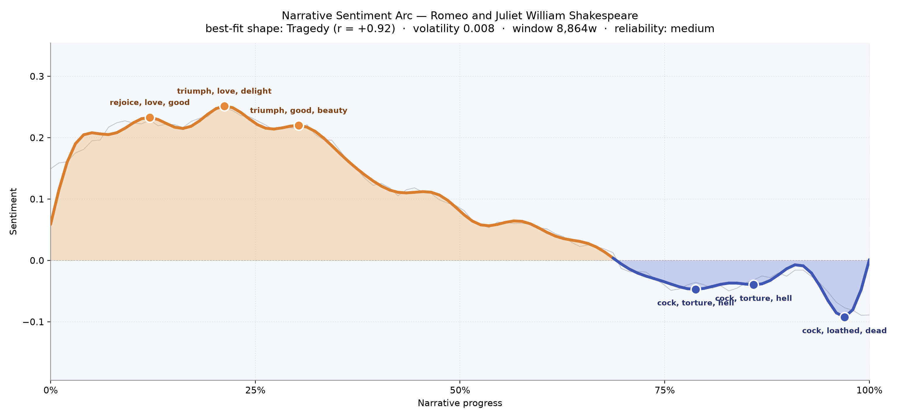
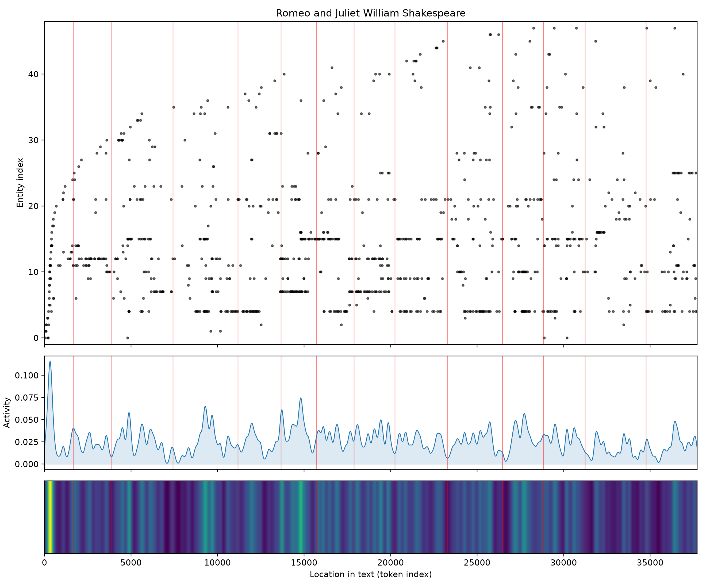
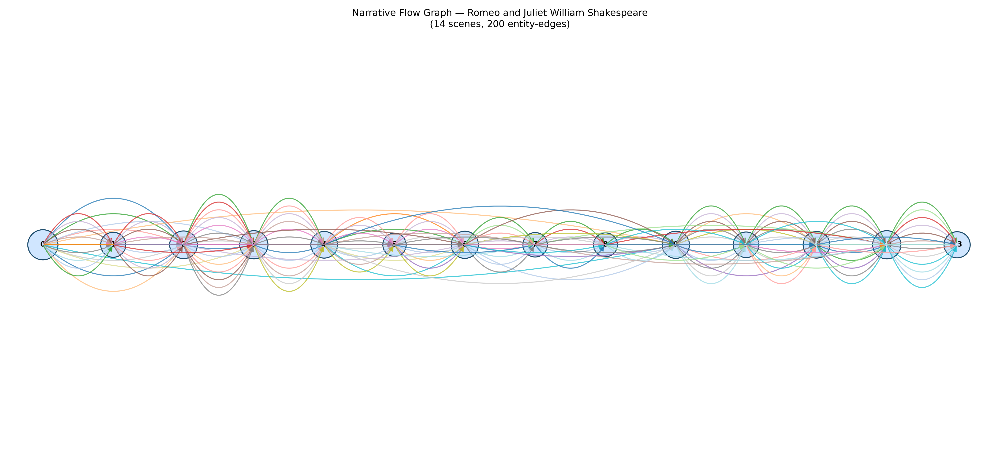

# Romeo and Juliet
### by William Shakespeare

26,862 words · a Tragedy arc — a bright morning that curdles into a night no one wakes from

## The shape of the story

Few stories fall the way this one falls. The arc opens sunlit, hovers in that first-love glow, and then, with the slow patience of a candle guttering, tips downward and does not recover. In the first third the language is thick with "rejoice, love, good, beauty, bliss," and a little later "triumph, love, delight, beauty, happy" gilds the balcony hours; even at thirty percent the register still hums with "triumph, good, beauty, love, wealth, best." You can feel the lovers' invention of each other in that stretch — the vertigo of being seen for the first time.

Then the tide changes. The middle of the play does not thrash; it simply loses altitude, degree by degree, until the reader realizes the sunlight has gone. By the final quarter the trough near the crypt bruises with "cock, torture, hell, damned, abuses, kill," deepens into "cock, torture, hell, damned, terror, deadly," and closes at the lowest point of the whole book with "cock, loathed, dead, loss, abhors, hate." That the arc's ruling shape is a straight tragic descent — no reprieve, no false dawn — is exactly what makes the ending feel earned rather than cruel. It is a medium-length work, so the curve is more a hand-drawn slope than a surveyor's line, but the direction is unmistakable: joy first, then dusk, then the tomb.

<figure><figcaption>The bright plateau of the balcony years gives way to a long, unhurried descent into the vault.</figcaption></figure>

## Who lives on the page

The tally of names is a small confession about who the play truly belongs to. Juliet dominates — a hundred and sixty-three appearances — and the Nurse, her hovering, gossiping second mother, comes next with a hundred and twenty-four. Mercutio and Benvolio, the two mercurial friends who set the streets of Verona crackling, follow closely, and then, curiously, Romeo himself appears fewer times than one might expect, roughly a third as often as his beloved. That imbalance is telling: the play is spoken *at* Romeo and *about* him more than by him; Juliet, the Nurse, and the friends do much of the naming.

Around this core cluster the older world hardens into shape — Montague and Capulet as houses more than men, Paris as the rival suitor, the Prince keeping order, Peter running errands. Verona and Mantua flicker at the edges as the two poles of exile. A few odd entries betray the tooling: "thou" and "nay" have been misread as figures, and "exit" is a stage direction that slipped in wearing a costume. Filter those out and the roster is almost a family portrait — young lovers at the centre, chaperones and rivals at the shoulders, feuding fathers hovering at the frame.

<figure><figcaption>Presences thicken around Juliet and the Nurse and swell again in the crypt-bound final act.</figcaption></figure>

## The weave of scenes

Read as a visual score, the fourteen scenes braid together like a garland pulled tight at both ends. The opening beads are dense — the streetfight, the ball, the balcony — with the widest cast per scene at the very start, twenty-five presences crowding the stage before the story has quite decided what it is. The middle of the play thins, briefly: scenes six through nine carry fewer bodies, as the story narrows into private rooms — the friar's cell, the wedding, the duel, the exile — where two or three figures do all the heavy speaking. Then the weave thickens again toward the finale, twenty-one presences at the second-to-last scene, as families, watchmen, and the Prince converge on the tomb. The arcs looping between clusters are the play's cross-cutting threads — a Nurse who runs between houses, a friar whose letter never arrives, a rumour that outruns the truth.

<figure><figcaption>Dense choral scenes bookend a hushed, chamber-piece middle.</figcaption></figure>

## What a reader takes away

You leave the book carrying two feelings at once — the ache of having briefly believed, with the lovers, that a garden could hold the world, and the harder ache of watching that belief be handed, unbroken, to a stone crypt. It is not the deaths that stay. It is the plateau of joy that came first, and how gently, how patiently, the light was taken back.
