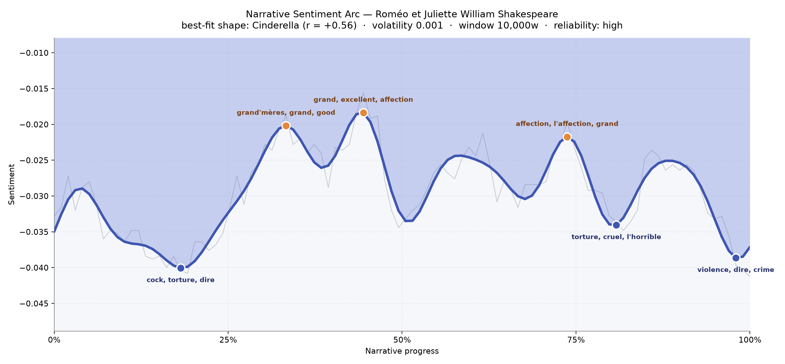
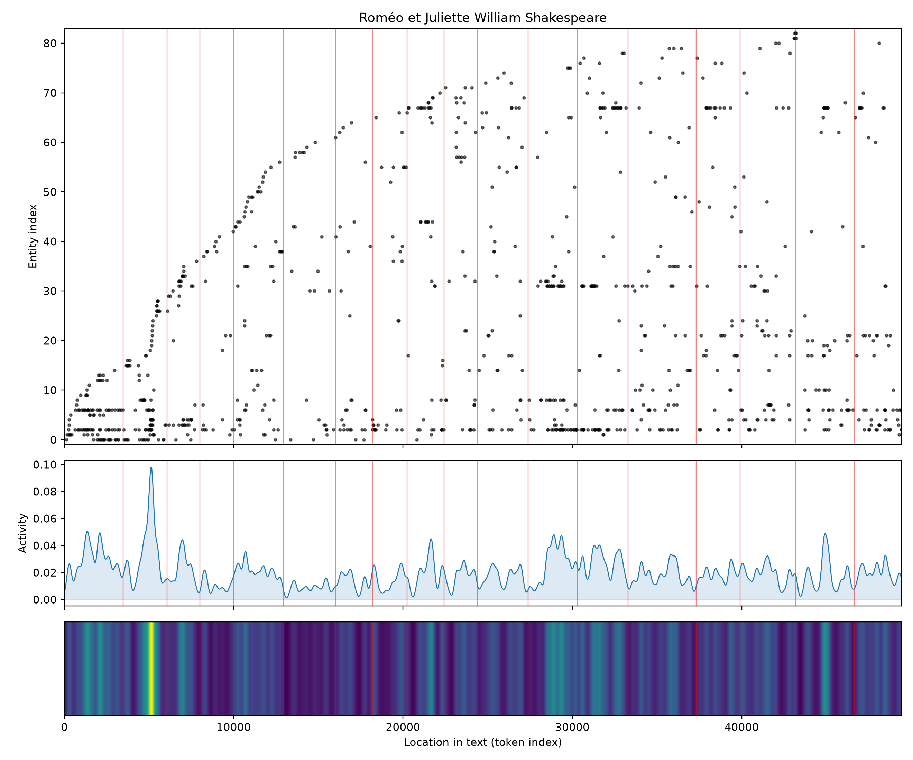
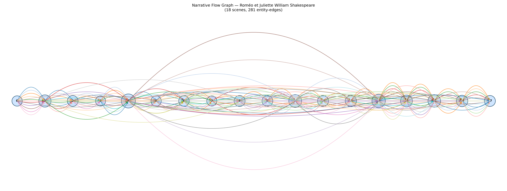

# Roméo et Juliette
### by William Shakespeare (French translation)

roughly 36,900 words · a Cinderella arc — a heart lifted three times toward tenderness before the world closes its hand

## The shape of the story

For all the play's reputation as pure disaster, the felt reader-shape here is closer to a Cinderella than a Tragedy: three small ascents toward warmth, each one a little more fragile than the last, until the final quarter simply refuses to lift again. The mood begins low — a Verona already muttering. Very early on, near the one-fifth mark, the floor drops into the story's first real bruise, thick with "cock, torture, dire, terrible, cruel, foul", and you can feel the street brawls and Tybalt's first heat pressing on the page. Then the arc climbs, gently, toward the balcony and its aftermath: the crests near a third of the way in and again just past the middle carry the warm French-and-English cluster of "grand'mères, grand, good, excellent, affection, great" and then "grand, excellent, affection, good, great, l'affection" — the vocabulary of a household half-charmed, half-worried, blessing children it does not entirely understand. A third crest, deeper into the second half, softens further into the lovers' private register: "affection, l'affection, grand, love, woo, d'affection". After that the line will not rise. The valley near four-fifths in is knotted with "torture, cruel, l'horrible, vile, bankrupt, terrible" — Mercutio dead, Tybalt dead, banishment weighing — and the very last dip, almost at the closing curtain, is a plain-spoken indictment: "violence, dire, crime, l'horrible, corruption, cruel". The reading is reliable, and it matches how the play actually breathes: three inhalations of hope, and then a long, unbroken exhale.

<figure><figcaption>Three tender crests of "affection" pressed between four hard troughs — the shape of a love story that keeps almost winning.</figcaption></figure>

## Who lives on the page

The tally of presences is exactly the one the play's memory keeps: Roméo above everyone else, Juliette the counterweight at roughly half his mentions, then the household names — the "frère" (Friar Laurence, whose title the French text repeats far more often than his given name), Tybalt, Capulet, Montaigu, Mercutio, Pâris, Laurence again by first name, and Benvolio. The two great cities of the play, Vérone and Mantoue, sit inside the same list, which is honest: in this text they behave almost like characters, one a cage, the other a rumour of exile. A few labels are clearly the translator's or transcriber's furniture — "shakspeare" appears because the front matter and running headers name him, "madame" is an honorific the French edition uses for the Nurse and Lady Capulet more or less interchangeably, and "dieu" is God as an oath rather than a person. Because this is a French rendering of an English play, the labelling occasionally mis-sorts figures as places; the underlying cast, though, is exactly right, and Roméo's dominance over every other name is the single loudest fact of the book.

<figure><figcaption>The cast fans out early, then a sharp spike of activity around the first brawl — Verona announcing itself before the lovers even meet.</figcaption></figure>

## The weave of scenes

Read as a visual score, the eighteen scenes hang along a single taut string, with two great arches leaping from near the opening to near the close — the Montague/Capulet feud and the Friar's plan, each threading through almost the entire play. The middle scenes are the densest: the fifth, eleventh, fourteenth and sixteenth carry the widest rosters of named figures (the ball, the marriage plot, the fights, the tomb-plan), while the very first and very last scenes are quieter, almost solo — a prologue and a hushed reckoning. The braid is neither parallel nor tidy; it's a crowd that keeps re-forming around the same two names, tightening at the climax and only loosening once everyone the story loves is already gone.

<figure><figcaption>Long arcs spanning nearly the whole play — the feud and the friar's scheme — over a dense mid-book weave of houses, streets and confidants.</figcaption></figure>

## What a reader takes away

You close this French Roméo et Juliette with the odd sensation of having been promised a fairy tale and handed an elegy in the same breath. The vocabulary of affection keeps returning — "grand", "excellent", "l'affection", "love" — as if the book itself is trying, three separate times, to be a comedy. What stays with you is not the final crime so much as those three doomed attempts at tenderness, and how gently, and how completely, Verona refuses them.
