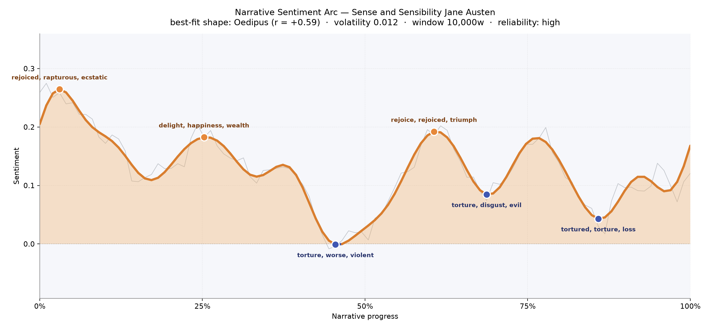
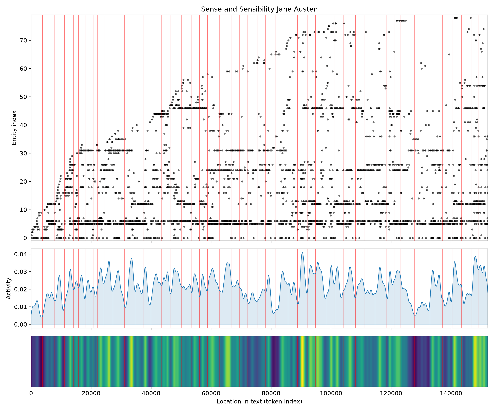
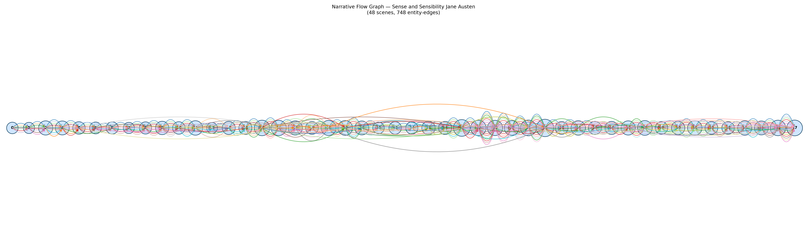

# Sense and Sensibility
### by Jane Austen

roughly 120,865 words · an Oedipus arc — a life lifted by hope, then quietly undone by its own excesses before rising, chastened, into a soberer light

## The shape of the story

Austen's novel opens on a small, giddy uplift and never quite promises to be a comedy again. The earliest peak, so close to the first pages, glitters with "rejoiced, rapturous, ecstatic, miracle, rejoicing" — the sound of a household briefly permitting itself to feel — and yet even here the reader senses the buoyancy is borrowed against something. A second crest around the quarter mark, thick with "delight, happiness, wealth, happy, magnificent, admire," puts Marianne and Elinor at the Middletons and the Palmers, in rooms where laughter is a currency traded on future disappointments.

Then, at the book's middle, the ground gives way. The deepest valley near the halfway mark cuts with "torture, worse, violent, hated, lost, betray" — Willoughby's silence, Marianne's slow, incredulous unravelling, Elinor's held breath. Austen briefly grants a lifting near two-thirds, seasoned with "rejoice, rejoiced, triumph, good, grand, great," but she will not let the reader relax: another dip near the seven-tenths mark carries "torture, disgust, evil, worse, violent, hysterics," and the late-book trough at roughly the six-sevenths point aches with "tortured, torture, loss, disgusting, selfishness, violent." The final upturn is small, almost apologetic, like a candle relit after a storm.

<figure><figcaption>Early rapture, mid-book collapse, then a chastened, quieter recovery — the shape of a heart taught to distrust its own weather.</figcaption></figure>

## Who lives on the page

Marianne presides over the novel numerically as she does emotionally — her name appearing more than any other figure, more even than Elinor's. That imbalance is telling: this is nominally Elinor's book of self-command, but it is Marianne's suffering that pulls the prose toward itself, like weather toward a low pressure system. Edward Ferrars, Mrs. Jennings, Willoughby, Lucy Steele, Colonel Brandon, John Dashwood, the Middletons and the Palmers — the whole comic and calamitous circle is here, drawn in the proportions the story demands. A few labels aren't quite people: "dashwood" and "norland" gesture at family and estate, "barton" is the Devonshire cottage the sisters retreat to, and "fanny" is really the odious Fanny Dashwood rather than an institution. That the tallying catches houses and place-names alongside characters feels apt for Austen, whose people are half-defined by the drawing rooms they enter.

<figure><figcaption>A widening cast as the sisters move from Norland to Barton to London, activity thickening around the great mid-book crises.</figcaption></figure>

## The weave of scenes

Across forty-eight scenes and hundreds of connective threads, the flow reads like a long garland pulled taut in the middle. The opening panels are modest in cast — nine or ten presences at a time, a family in mourning and reduced circumstances — before the population widens as the Dashwoods move to Barton and again as London swallows them. Density blooms in the late-middle: scenes carrying twenty-nine, thirty-two figures at once, the visual equivalent of a crowded assembly room where every whisper matters and every acquaintance is a potential informant. The threads braid rather than run parallel; Willoughby's arc crosses Brandon's, Lucy's confidences knot into Elinor's silence, and Mrs. Jennings' rumor-mill loops the whole party together. Toward the close, the cast thins again into intimate pairs — the quiet architecture of proposal, reconciliation, and settlement.

<figure><figcaption>A garland of scenes, thickest at the London crises, thinning at the ends for the small chambers of grief and resolve.</figcaption></figure>

## What a reader takes away

You close the book warmer than the arc alone would suggest, because Austen never confuses her diagnostics for her sympathies. The novel teaches, in Marianne's fever and Elinor's endurance, that feeling is not the opposite of judgement but its raw material — and that a heart properly educated by loss is not a smaller heart, only a truer one. What lingers is the quiet: two sisters restored to speech, a candle steadied, the weather turned merely ordinary again, which after such a storm is very nearly happiness.
