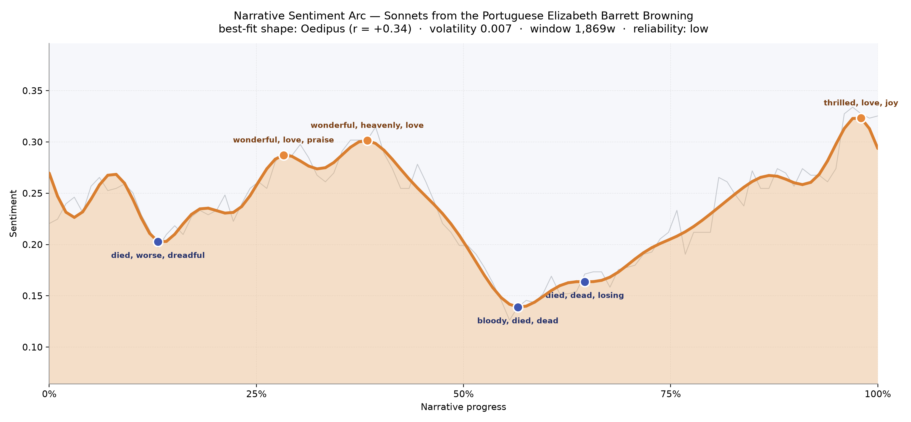
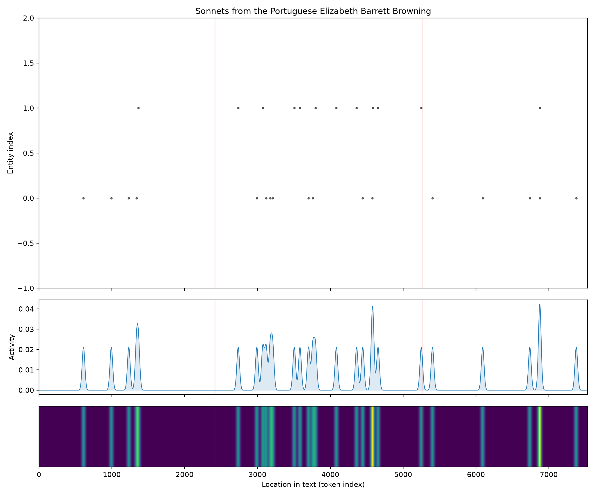
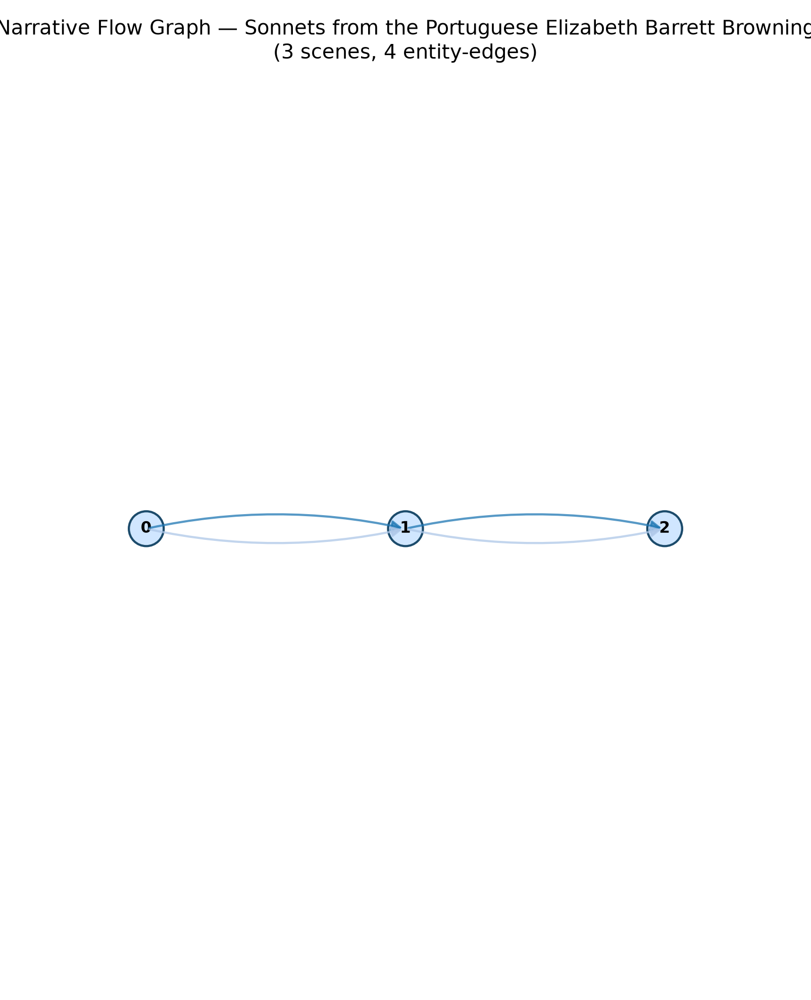

# Sonnets from the Portuguese
### by Elizabeth Barrett Browning

5,666 words · an Oedipus arc — a love lifted into radiance only to be shadowed by mortality's cold hand before rising, transfigured, at the close

## The shape of the story

Read straight through, this small book of forty-four sonnets moves like a lit room being crossed by weather. It opens tender but wary, and by the early quarter the poems climb into a warm plateau where the speaker cannot stop saying the beloved's name; the peak near the one-third mark glows with "wonderful, love, praise, loved, beloved, beautiful," and the crest just after it doubles down with "wonderful, heavenly, love, beloved, beautiful, great," as if the voice has found the exact vocabulary of adoration and refuses to let it go. Then, at almost exactly the middle, the light gutters. The deepest valley near the fifty-six-percent mark bruises with "bloody, died, dead, losing, despairs, bad" — the speaker remembering illness, bereavement, the sister and brother lost, the sense of being a woman half-buried before this love arrived. A smaller earlier dip at thirteen percent already carried "died, worse, dreadful, ungrateful, dead, bloody," a foreshadow of the darker middle. What lifts the arc back up is remarkable: the final crest at the very edge of the book blazes with "thrilled, love, joy, happy, good, perfect," and it feels earned rather than declared, because we have watched the speaker walk out of the shadow with her hand in another's. This is a short book, so the arc is impressionistic rather than definitive, but the felt experience is unmistakable — devotion, doubt, and a hard-won yes.

<figure><figcaption>A courtship in three weathers: the early glow, the middle shadow of grief and self-doubt, and the final thrilled ascent.</figcaption></figure>

## Who lives on the page

Only two presences surface repeatedly, and both are really the same relationship in different grammatical clothes. "Thou" appears seventeen times and "belovëd" twelve — the pronoun and the epithet that Browning bestows on Robert Browning throughout the sequence. The reading tool has misfiled "thou" as a place-name, which is a charming small failure: in these sonnets the beloved *is* a place, a country the speaker learns to live in. There are no other named figures because Browning refuses them; the poems are a closed circuit between two souls, and even God enters only as witness. What this concentration suggests is a book with almost no exterior world — no cities, no dinner tables, no rivals — only the address, over and over, from *I* to *thou*. It is the most focused emotional geometry a lyric sequence can hold.

<figure><figcaption>Two presences threading the whole book: the archaic "thou" and the near-constant "belovëd," brightest in the middle where the sonnets grow most urgent.</figcaption></figure>

## The weave of scenes

The flow diagram gives us three linked movements — beginning, middle, end — braided by the two figures who never leave the frame. It is the plainest possible architecture, and for a sonnet cycle that is exactly right: courtship, crisis, consummation. The middle node carries the greatest weight of activity in the density panel below, which is where the beloved is most invoked and where the speaker most argues with herself about whether she deserves this gift. The strands are thinner at the outer nodes not because the poems there are weak, but because the speaker is either still guarded (early) or has stopped arguing (late). The braid is short and taut, like a ribbon pulled between two hands.

<figure><figcaption>Three movements — approach, reckoning, avowal — held together by a single "I" and a single "thou."</figcaption></figure>

## What a reader takes away

You close this book carrying a very particular warmth: the sense that love, when it is real, must first pass through the honest naming of everything one has lost. Browning does not skip the middle darkness; she walks the reader through it, and that is why the final "how do I love thee" lands as a vow rather than a flourish. The inheritance is small and durable — permission to be loved after grief.
