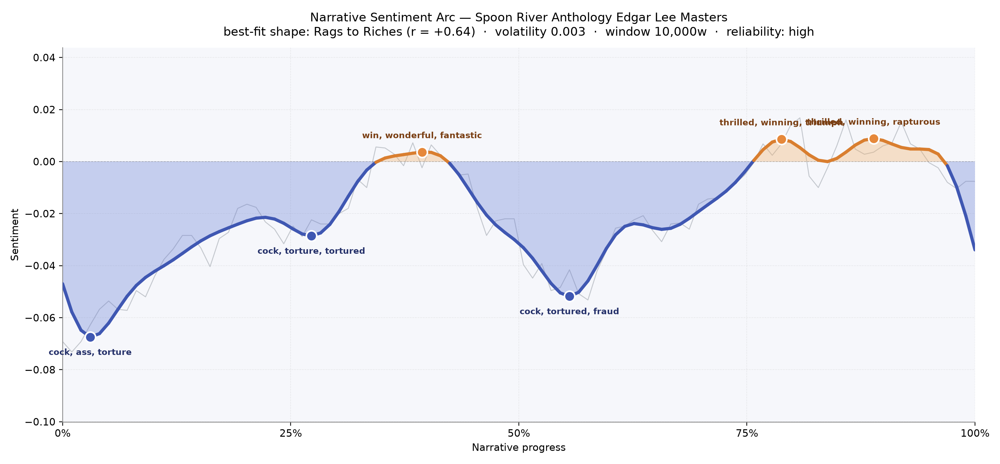
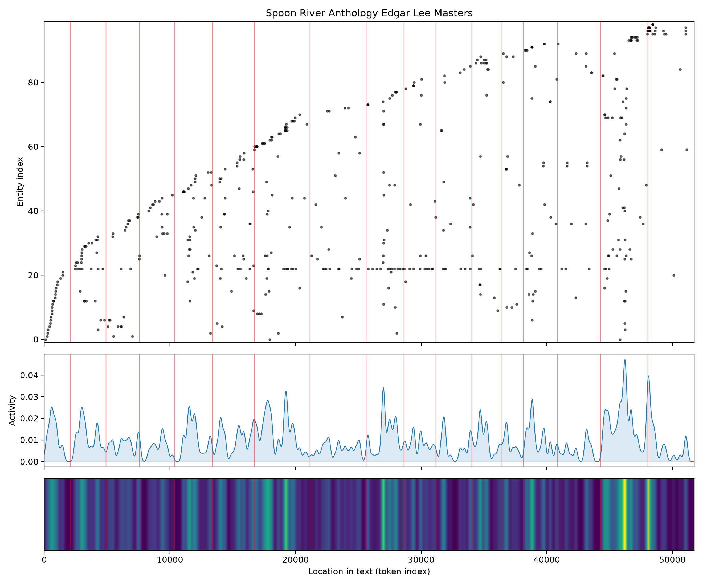
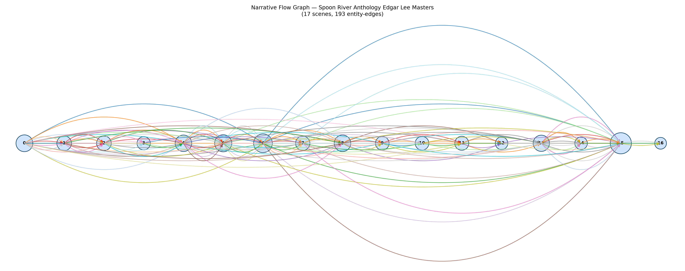

# Spoon River Anthology
### by Edgar Lee Masters

39,408 words · a Rags to Riches climb — the graveyard learning, slowly, to sing

## The shape of the story

The arc of Spoon River begins underground. It opens in a trough so low it feels physical — a dark, muttering register thick with "cock, ass, torture, tortured, killing, bankruptcy" — as if the dead of the hill were shoving their worst confessions forward first, each headstone competing to be the most wronged. Masters is not easing us in. He is opening the coffin lids in the order the sleepers most need to be heard, and the earliest voices are the bruised ones: the bankrupted, the tortured, the ones ground down by the town.

Then, slowly, the ground gives. Around the one-third mark the line lifts into its first shy patch of sunlight, a passage flecked with "win, wonderful, fantastic, triumph, ecstatic, brilliant" — not because the town has changed, but because we have begun to hear its idealists, its lovers, its small brave inventors. The middle sags again, the second-hardest valley of the book, when the poems return to "cock, tortured, fraud, rape, despair, guilty" — a courthouse stretch, a stretch of ruined women and ruined ledgers. What is remarkable is how the last quarter climbs and stays climbed, riding a broad plateau of "thrilled, winning, triumph, rapturous, rejoicing" into the closing epilogue. Grief has not been solved; it has been outlasted. That is what a Rags to Riches shape feels like when a poet, rather than a novelist, is drawing it: a village of ghosts that begins in accusation and ends, against the odds, in praise.

<figure><figcaption>A long climb out of the grave: three deep valleys of confession give way to a sustained late-book brightening.</figcaption></figure>

## Who lives on the page

The most-spoken name here is not a person at all but the river itself — Spoon River, invoked seventy-four times, the town that outlives everyone in it. After the water comes the local aristocracy of the dead: Thomas Rhodes the banker, Benjamin Pantier the sad lawyer, Kinsey Keene, A. D. Blood the self-righteous mayor, Daisy Fraser the town's honest sinner, Doc Hill. These are the figures the other ghosts keep circling back to accuse, defend, or mourn. Behind them the wider world flickers in — Chicago, New York, Peoria, Paris — the elsewheres the villagers dreamed of or fled to. A few names look like strays from another book entirely: "Loki," "Yogarindra," and a stray "Jesus" have wandered in from the more mystical late poems and the Spooniad, and they read less as townspeople than as costumes Masters lets his dead try on. That mixing is part of the anthology's charm: a plain Illinois graveyard that keeps opening, unexpectedly, onto myth.

<figure><figcaption>Names accrue steadily across the book, with a late burst of new voices — the epilogue crowding in latecomers.</figcaption></figure>

## The weave of scenes

Read as a visual score, the flow graph looks exactly like what the book is: not a plot but a chorus. Seventeen bands of poems, one hundred and ninety-three threads of shared names arcing between them, and — crucially — one enormous ribbon that leaps from near the beginning all the way to the sixteenth panel, the dense late cluster that holds the Spooniad and the epilogue. The middle sections are the busiest, with the sixth and seventh panels swelling to twenty-nine distinct figures apiece; these are the pages where townspeople start recognising each other across the dirt. The final panel narrows sharply to a handful — a quiet coda after a crowded wake. There is no protagonist to follow; instead there are braided returns, the way a real town's gossip loops back on the same handful of scandals for decades.

<figure><figcaption>A chorus, not a plot: dense middle chapters and a single long arc reaching into the late Spooniad.</figcaption></figure>

## What a reader takes away

You close Spoon River the way you leave a cemetery at dusk: quieter, and stranger, and oddly consoled. Masters has arranged his dead so that the bitterest speak first and the reconciled speak last, and the cumulative motion of that choice is a promise — that even a town this small, this cruel, this ordinary, contains enough tenderness in its buried mouths to end on a note of praise. What lingers is the shape of the climb itself: the sense that grievance is not the final word, only the first one.
