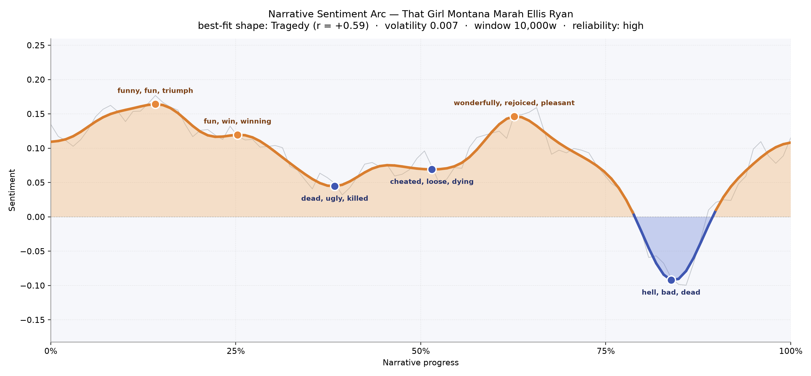
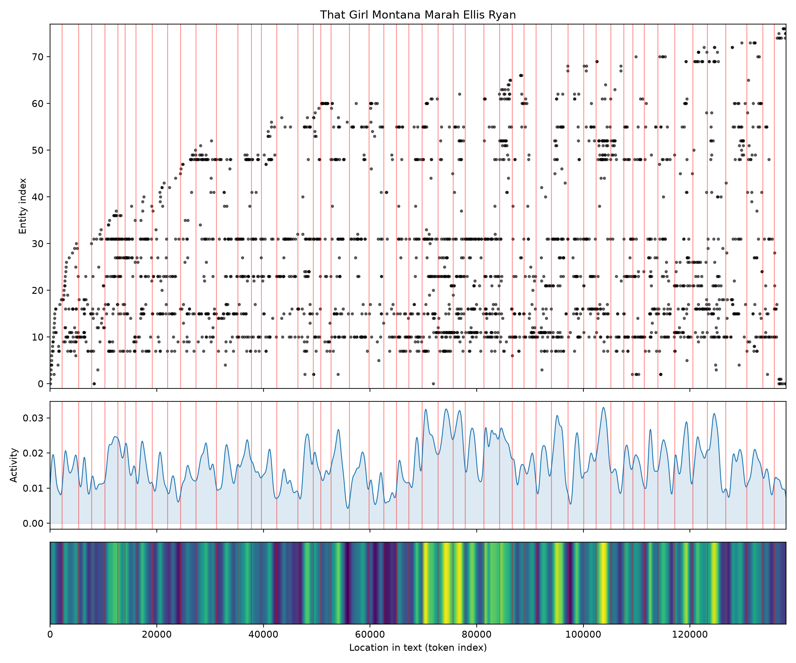
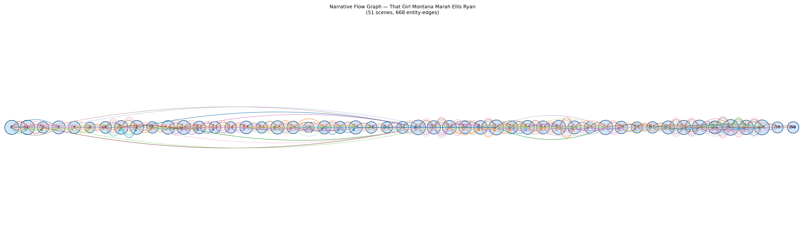

# That Girl Montana
### by Marah Ellis Ryan

A 104,759-word frontier novel that traces a Tragedy arc — a life warmed by triumphs before the ground gives way beneath it.

## The shape of the story

Marah Ellis Ryan's Montana story begins in a bright, almost boisterous key. The earliest peak comes barely a seventh of the way in, thick with "funny, fun, triumph, winner, rejoicing, wonderful" — the noise of a camp swelling around a young woman whose arrival has upended it. A second lift near the quarter mark keeps that mood aloft, softer but still glowing with "fun, win, winning, nice, good", as if the book itself doesn't yet know how far it intends to fall.

Then the ground shifts. Around the two-fifths mark the arc dips into its first true trough, bruised with "dead, ugly, killed, bad, hate, horrible", and although a middle plateau near the halfway point tries to steady itself, it can only manage the wary vocabulary of "cheated, loose, dying, worry, terror, desperate". A generous, false dawn arrives at roughly the three-fifths turn — the story's last long inhale, sweetened by "wonderfully, rejoiced, pleasant, impressed, glad, joy" — before the book drops, all at once, into its deepest and most unmistakable valley near the four-fifths mark, where the language turns to "hell, bad, dead, ugly, awful, killed". Sentiment slides below zero here, the only stretch that does; you can feel the author refusing to let her heroine off easily. The close climbs a little, but never back to the warmth of the opening. It is the felt shape of a life lifted up so it can be more truly undone.

<figure><figcaption>A long, easy warmth in the first half; a bright false peak past the middle; then the plunge into hell-language near four-fifths in.</figcaption></figure>

## Who lives on the page

The novel belongs to a tight camp of frontier figures. Overton — the mining-camp name that shadows almost every scene — appears more than any other, followed by the girl herself, "Tana" (the shortened Montana), then Dan, Lyster, and Huzzard, the men whose affections and suspicions circle her. Max, Haydon, Harris and Seldon fill out the second ring, and Akkomi and Joe drift in from the edges of the story. The presences of "Indian" and "Indians" — grouped by the tooling as a peoples-tag rather than a name — are unmistakable reminders that Ryan wrote this book on Kootenai country and knew it; Kootenai itself surfaces as a place-name, alongside Lavina, which is almost certainly a small town rather than a person. It is a cast of about a dozen names doing most of the emotional work, with a wider frontier chorus behind them.

<figure><figcaption>A handful of names — Overton, Tana, Dan, Lyster — thread through the whole book; new figures keep arriving even in the last third.</figcaption></figure>

## The weave of scenes

Across fifty-one scenes and hundreds of connecting threads, the book reads like a long braided rope rather than a series of separate rooms. Early scenes are already crowded — nineteen or twenty named presences from the first chapter — because Ryan sets her camp before she settles her heroine. The middle sags to a slimmer, more intimate weave of seven to a dozen figures per scene, the parts where the arc is at its softest. Then the density climbs sharply in the last quarter: scenes of twenty-one, twenty-two, twenty-five people knotted together, exactly where the sentiment plunges. The visual score confirms what the arc suggests — the climax is not a single duel but a crowd closing in.

<figure><figcaption>A long horizontal braid; the thickest knots of connection cluster in the final third, where the story's crowd tightens around Tana.</figcaption></figure>

## What a reader takes away

*That Girl Montana* leaves the taste of a frontier that welcomed a bright girl only to test her against every hardness it had. The volatility is low — the story doesn't jerk you around — but the direction is unmistakable: warmth, then worry, then a hell-word valley you cannot unread. What lingers is Ryan's insistence that a woman on the edge of the map deserved a serious arc, not a sentimental one.
