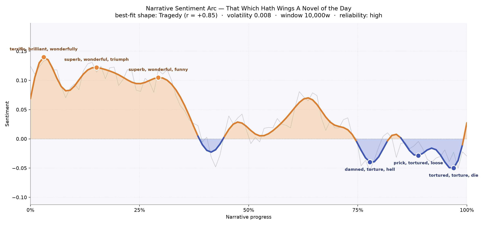
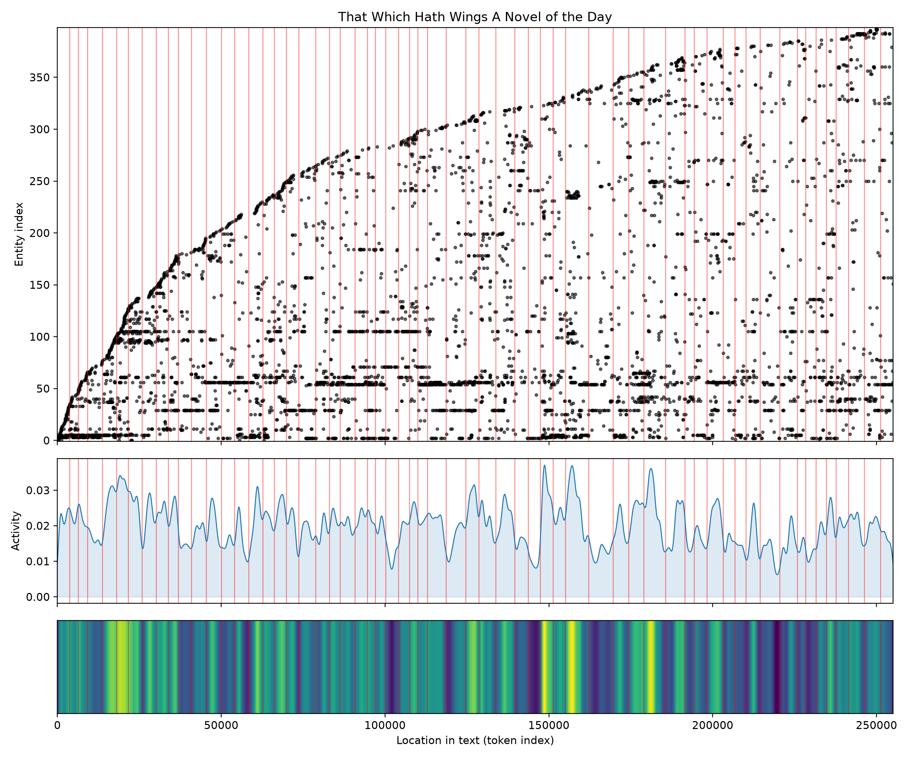
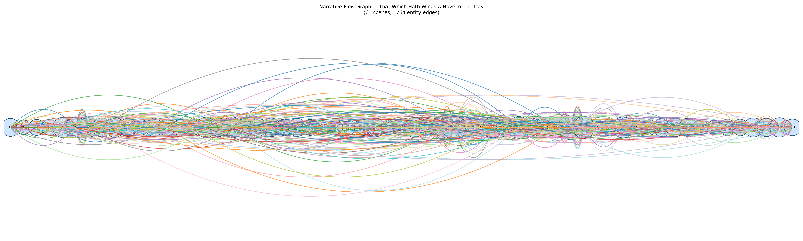

# That Which Hath Wings A Novel of the Day
### by Richard Dehan

189,683 words - a Tragedy arc - brightness at the start, a long descent into the dark by book's end

## The shape of the story

The novel opens in what feels like sunlight. Its earliest pages are almost buoyant, humming with "terrific, brilliant, wonderfully" - the vocabulary of a world still confident in itself, still capable of talking about triumph without irony. That opening brightness holds for a long stretch: a second bright crest arrives about a sixth of the way through, thick with "superb, wonderful, triumph, brilliant, wonderfully, winning", and a third, softer peak near the first third of the book still finds room for "superb, wonderful, funny, handsome, pleasant, pleasure". These are the last, longest breaths of the pre-war summer this novel remembers.

Then the line begins to slope. The reader senses it before they can name it - dialogue tightens, laughter thins, kindness starts to cost. By the two-thirds mark the sentiment has crossed under the waterline and the deepest trough opens, bruised with "damned, torture, hell, tortured, dreadful, violence". A late aftershock at almost nine-tenths of the way through is uglier still, close and physical: "prick, tortured, loose, whitewash, jerk, terror". The final valley, right against the last page, is where the book truly buries its dead - "tortured, torture, die, madness, ungrateful, desperate". This is the classical shape of tragedy: not a fall from a single height, but a slow forgetting of joy, until the reader arrives at the end holding only ash. The fit is unusually strong and the reading confident; there is no ambiguity about what Dehan is doing to us.

<figure><figcaption>Three bright crests early, then a steady descent into three dark valleys of torture, madness, and desperation.</figcaption></figure>

## Who lives on the page

Four figures anchor the book. Patrine appears most often of anyone, a modern young woman whose name recurs like a bell throughout. Sherbrand - the aviator whose winged calling gives the novel its title - is her near-equal in presence. Franky and von Herrnung close out the central quartet, one English and easy, the other German and ominous, and their tallies map the private geometry of a love plot pulled apart by the coming war. The name Saxham, though the counting files it as a place, is in fact Dr. Owen Saxham, the surgeon who threads Dehan's earlier novels - his weight here is deep and quiet. Margot and Lynette, similarly mislabelled, are women in the story rather than towns.

Around them the world declares itself: German, British, French, and the cities Paris and London. That constellation of nationalities is not decorative. It is the whole apparatus of the argument - a novel written on the very edge of 1914, already listening for the guns. A stray "bird" in the list of names is a lovely accident of the counting, and altogether fitting for a book about flight.

<figure><figcaption>New figures keep arriving well past the midpoint, a widening cast against a Europe on the brink.</figcaption></figure>

## The weave of scenes

Sixty-one scenes braid across the length of the book, and the weave is remarkably dense in the middle third, where scene populations swell past fifty and sixty distinct presences per chapter. The visual score shows a long central body, thicker than either end, with two pronounced knots where the drawing-room world and the war-world grind against each other. The threads never really run parallel; instead they cross and recross, characters ricocheting between London parlours, Paris streets, and the aerodrome, so that by late book almost every scene is speaking to every other. The tapering at the edges is telling - the opening is compact and observed, and the ending, though busy in incident, narrows again to a smaller company gathered around the ruined centre.

<figure><figcaption>A long-bodied braid, thickest at the middle where private lives and public catastrophe collide.</figcaption></figure>

## What a reader takes away

You close this book heavier than you opened it. Dehan lets you believe, for a hundred pages and more, in wit and courage and the promise of a young couple who might make it; then she teaches you, patiently, what the twentieth century intends to do with such promises. The wings of the title do not save anyone. What lingers is the specific ache of tragedy told without hysteria - a novel of the day, indeed, and of the day after, and after.
