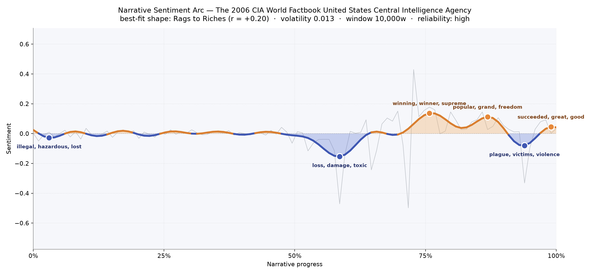
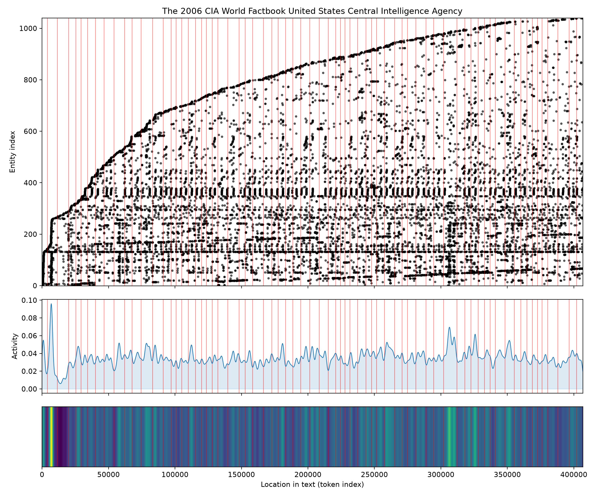

# The 2006 CIA World Factbook
### by the United States Central Intelligence Agency

a reference almanac of roughly 1,027,800 words · a slow Rags to Riches curve — a world that lists its troubles first and its triumphs last

## The shape of the story

You do not usually go looking for narrative in a reference book, but the Factbook has one anyway, and it is oddly moving. The arc drifts almost flat for the first half — a long, patient recitation of borders, GDPs, exports, and illiteracy rates — before dipping into a wide trough near the two-thirds mark that bruises with "loss, damage, toxic, damaging, hazardous, destruction". That is the environment sections talking: the pages where country after country tallies its deforestation, its polluted rivers, its exhausted soils. The mood lifts again at three-quarters of the way through, brightening into a plateau that shines with "winning, winner, supreme, popular, won, great", and then into another crest woven from "popular, grand, freedom, progress, peace, solidarity" — the political and civic sections, where nations name their parties and celebrate their independence days. Just before the close, a smaller valley darkens with "plague, victims, violence, corruption, victim, abuse", the transnational-issues pages listing trafficking, narcotics, and epidemics. Then a final gentle rise, worded with "succeeded, great, good, peace, effective, resolve". It is a Rags to Riches curve, but only faintly — the shape is quiet and the swings very small, because a Factbook whispers where a novel shouts. Still, the arc is unmistakable: a book that catalogues damage before it catalogues aspiration.

<figure><figcaption>A quiet curve that dips into environmental worry, climbs through political ceremony, and settles on the language of resolve.</figcaption></figure>

## Who lives on the page

The cast of this book is nations, not people. The United States looms largest — cited more than seven hundred times — followed by the United Kingdom, France, China, Germany, Russia, Australia, Spain, and the ever-recurring city of Washington. A few labels are diplomatic shorthand rather than characters: "na" is the almanac's "not available", "ppp" the acronym for purchasing-power parity, "imf" the International Monetary Fund, "un" the United Nations. What emerges is a portrait of the world seen from a very particular window — Western capitals dominate the frame, and the great weight given to France, the French, and Washington, D.C. is less a bias of prose than a bias of appendices, comparative statistics, and cross-references. The people who actually run these countries are almost invisible; the countries themselves are the protagonists, each with a résumé of coastline and coup.

<figure><figcaption>A dense strata of recurring nations at the bottom, and a long staircase of one-off mentions climbing above — every country cameoed at least once.</figcaption></figure>

## The weave of scenes

Read as a visual score, the flow diagram is astonishing: seventy-one sections braided together by more than seven thousand connective threads. Nearly every section — every country entry — shares figures with almost every other, because the same handful of great powers, trading blocs, and international organisations reappear in each nation's neighbourly and economic write-up. Density is remarkably even across the whole span; there is no thin prologue or hushed epilogue, only the steady drumbeat of another capital, another currency, another climate. A slight thickening appears in the middle — the alphabetically dense stretch of European and Asian entries — but the overall texture is a woven mat rather than a rising staircase. It is the least dramatic and most democratic narrative flow imaginable: each country a knot, each mention of the United States or the United Nations a shared thread pulled tight through them all.

<figure><figcaption>A single, evenly braided fabric — every entry linked to nearly every other through the same recurring powers.</figcaption></figure>

## What a reader takes away

What lingers, oddly, is atmosphere. You come to the Factbook for facts and leave with a mood — a hushed, cartographic melancholy about pollution and corruption, cut with the ceremonial optimism of national mottoes and elections. It is a book whose emotional inheritance is the gentle reminder that the world is measured, that its damages are catalogued, and that even in the driest prose there is still a hand reaching, finally, for the word "peace".
