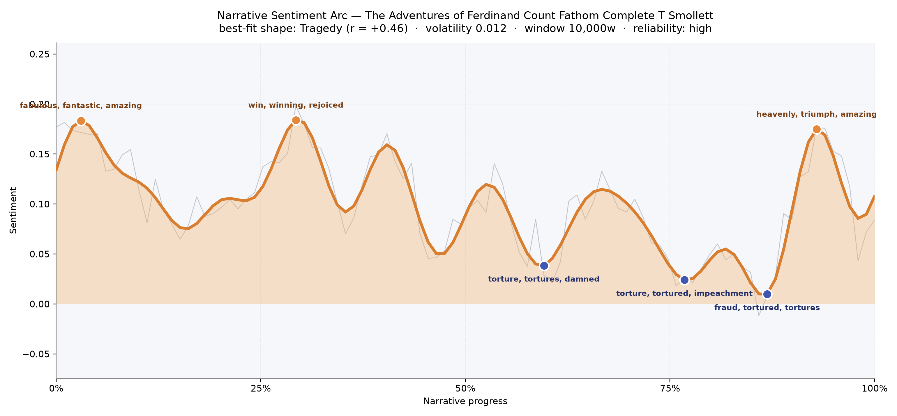

# The Adventures of Ferdinand Count Fathom
### by Tobias Smollett

163,104 words · a Tragedy arc — a life dressed in triumph before it is stripped to the bone.

## The shape of the story

Smollett's picaresque begins in high colour and ends in a strange, unearned brightness that only sharpens the darkness before it. The arc opens like a debutante's entrance — the first peak is bright with "fabulous, fantastic, amazing, rejoiced, triumph, affection," the tone of a rogue's mother crowing over her prodigy. A second bright ridge, roughly a third of the way in, is the sound of Fathom in full flight: the language of "win, winning, rejoiced, triumph, masterpiece, good" is the vocabulary of a confidence man mid-swindle, and Smollett lets us hear it without irony until the irony catches up.

Then the ground opens. Past the midpoint the arc drops into a long, punishing trough that thickens with "torture, tortures, damned, tortured, anguish, scandalous" — the moral bill arriving for every earlier triumph. A second dip a little later doubles down on "torture, tortured, impeachment, lost, evil, losing," and the deepest valley of all, near the eighty-seventh part of the book's fortunes, is the bleakest register Smollett offers: "fraud, tortured, tortures, despair, charged, criminal." The late peak, curling up in the final tenth with "heavenly, triumph, amazing, wonderful, rejoice, miracle," feels less like a happy ending than like a benediction spoken over ruin — the last-minute repentance that eighteenth-century readers loved and modern ones distrust. The volatility is low and the reading is a confident one, so this shape is the book's real skeleton, not a trick of scale.

<figure><figcaption>Three glittering crests, then a long slide into torture, despair and the criminal dock — with a last-page miracle drawn in a fainter ink.</figcaption></figure>

## Who lives on the page

The crowded stage belongs to Renaldo, whose name rings out more than any other and whose fortunes are the moral spine of the book — the wronged nobleman around whom Fathom's schemes coil. Fathom himself and his other name, Ferdinand, split the count between his masks: rogue and gentleman, predator and pretender. Serafina, the beloved lost and reclaimed, and Don Diego, her Castilian father, thicken the sentimental plot; Wilhelmina and the "mademoiselle" of the German episodes glint on the edges of Fathom's amorous cons. The counting tools have miscast a few of these — Fathom and Ferdinand are tagged as institutions rather than persons, and Wilhelmina and Antonia are misfiled as places — but a reader will hear them all as living voices. Around them the geography is proper picaresque: England and London anchor one pole, and the French, German and Tyrolese tags trace Fathom's route across a Europe of inns, coaches and forged papers. Smollett's own name surfaces in the list too, a residue of front-matter rather than a character. For a novel this long, the cast reads cleanly.

<figure><figcaption>Names accumulate steadily through the early cons, thin briefly at the midpoint, then surge in the final quarter as the reckoning gathers its witnesses.</figcaption></figure>

## The weave of scenes

The scene-map reads like a long, low-slung suspension bridge. Sixty scenes stretch out in a nearly straight line, most of them modest in population — small rooms, two or three figures, a letter, a duel, a disguise. The early chapters are slim and quick, the middle stretches into a plateau of steady traffic, and then, in the last fifth, the graph fattens dramatically: scene 49 spikes to twenty-nine presences, scene 57 to thirty-two, the closing scene to twenty-eight. That late thickening is the trial-and-recognition machinery of the eighteenth-century novel firing all at once — the long arcs sweeping from the opening pages to the finale are the returning ghosts of earlier victims, gathered for the last act. It is a book whose braided threads all come home late, and the picture shows them arriving together.

<figure><figcaption>A slender chain of early cons, a plateau of middle mischief, and then a swollen finale where every wronged party crowds back into the room.</figcaption></figure>

## What a reader takes away

What lingers is the queasy pleasure of watching charm curdle. Smollett gives the swindler his glittering morning and then insists, patiently and at length, on the afternoon of consequence. The last-page miracle is a courtesy the century required; the tortures in the trough are what the book actually believes. You close it warier of a graceful stranger, and quietly grateful for the plainer people who suffer him.
