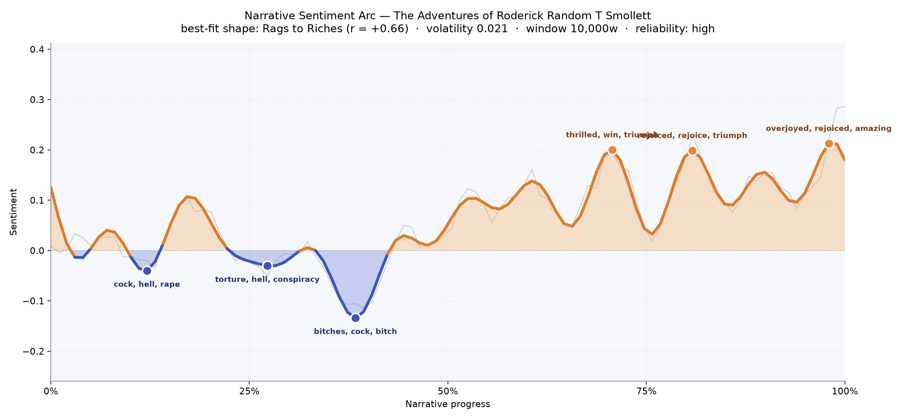

# The Adventures of Roderick Random
### by Tobias Smollett

193,190 words · a Rags to Riches arc — a life kicked into the gutter and hauled, bruised but grinning, into the sun

## The shape of the story

Smollett's picaresque swings out on a long, generous curve: the reader begins with a young man whose horizons are pinched by cruelty, and follows him upward, by degrees, into fortune and love. Early on, the line dips into shadow — the first trough near the twelfth of the way in reeks of "cock, hell, rape, damned, dreadful, desperate", a vocabulary of tavern brawls, cudgellings, and the sexual menace that stalks a friendless boy adrift on the roads. A second dip, roughly a quarter through, thickens with "torture, hell, conspiracy, lost, guilt, crime" — the ship-of-fools stretch, where Roderick is press-ganged, betrayed by his supposed betters, and hauled to the West Indies in chains of officers' malice.

The book's true bruise, though, arrives at the third-mark. Here the arc plunges to its darkest point, thick with "bitches, cock, bitch, ass, hell, died" — the raw sailor-talk and mortal loss of the naval catastrophe. After that trough, however, Smollett refuses despair. The line begins to climb and simply keeps climbing. The late peaks brim with "thrilled, win, triumph, masterpiece, affection, best", then "rejoiced, rejoice, triumph, love, good, great", and finally a coda of "overjoyed, rejoiced, amazing, rapturous, miracle, good" — a homecoming so full-throated it borders on operatic. The felt experience is of a hero pummelled into resilience, then, in the last quarter, showered with reunions and inheritances.

<figure><figcaption>A slow climb out of shipboard darkness into a triumphant last quarter.</figcaption></figure>

## Who lives on the page

The most-named figure isn't the hero at all — it's Strap, the loyal barber-companion whose 204 mentions dwarf everyone else's. That imbalance is a clue to Smollett's method: Roderick narrates in the first person, so his own name (a modest 29 appearances) fades into the pronoun "I", while Strap, forever hovering at his elbow with borrowed coin and terrified counsel, gets called by name in every scene. Narcissa, the beloved, glows at 105 — a bright, recurring lodestar. Morgan the choleric Welsh surgeon's mate, Thompson the doomed shipmate, Banter the town wit, Melinda the mercenary flirt, Weazel the puffed-up captain, Crampley the villainous mate, and Wagtail the fop: this is the crowded coach-inn of Smollett's world, each name a caricature waiting to spring.

A few labels are more geography than character — London and England anchor the return home, and the "French" tag catches Roderick's Parisian exile rather than a single person. Jackson and Williams flicker as tavern-companions on the make. The list reads, cheerfully and accurately, like a playbill for an eighteenth-century road-farce.

<figure><figcaption>New faces keep arriving to the last page — a picaresque never stops introducing.</figcaption></figure>

## The weave of scenes

Sixty-five scenes, six hundred and seventy-one connective threads: the flow graph reads as an unusually long, evenly-strung necklace. Scene sizes hover in the low teens for most of the book, then swell dramatically at the close — the penultimate scene alone gathers thirty-one named figures, the largest crowd in the novel. That bulge is the reunion chapter made visible: every companion, rival, and long-lost relation converging for the final settling of accounts. The long arcing edges that sweep from the opening scenes to the closing ones show how Smollett braids remembrance into resolution — Strap, Narcissa, Roderick's father, even old shipboard tormentors reappear in the final harbour. Between those bookends the pattern is picaresque-flat: episode after episode, each with its own small cast, seldom carrying more than a handful of persistent presences forward.

<figure><figcaption>A long necklace of episodes that swell into a crowded reunion at the end.</figcaption></figure>

## What a reader takes away

You close the book feeling that the world is harder than it should be and kinder than you had feared. Smollett's genius is to give you the stink of the orlop deck and the bright ribbon of Narcissa's hand in the same breath, and to insist — through Strap's absurd, weeping loyalty most of all — that friendship survives every indignity the eighteenth century can invent.
