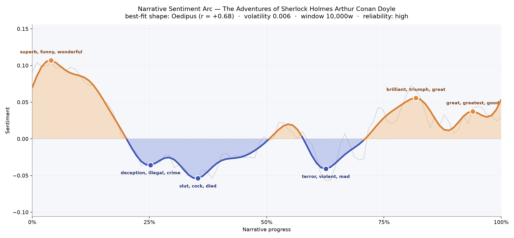
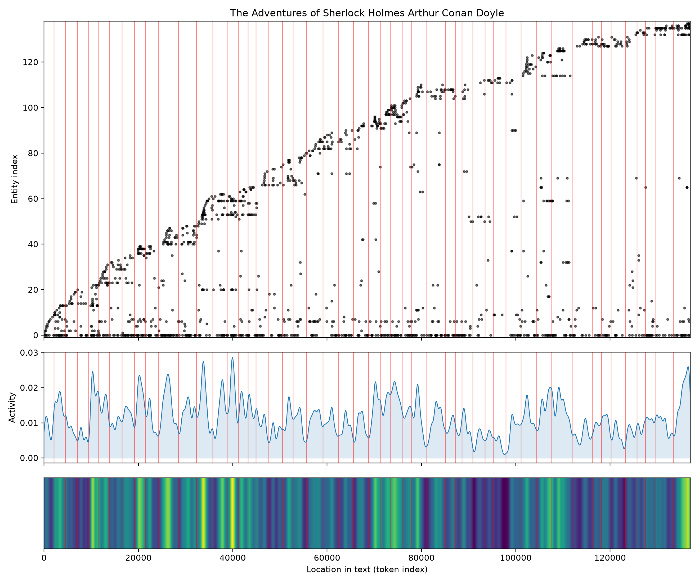
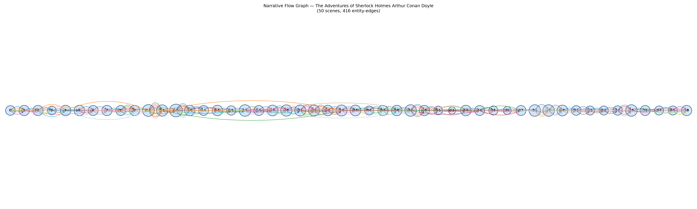

# The Adventures of Sherlock Holmes
### by Arthur Conan Doyle

roughly 105,800 words · an Oedipus arc — an early brightness that darkens, brightens again, and never quite recovers the innocence of its opening.

## The shape of the story

Read as a single long breath, this collection behaves less like a series of tidy puzzles and more like a mood. It opens in a warm, almost celebratory register — the first stretch of pages sparkles with "superb, funny, wonderful, rejoiced, good, handsome", the sound of a narrator delighted by his companion's tricks and by the London he steps into. That gleam does not last. Around the quarter mark the tone tips downward into a corridor of casebook shadows, thick with "deception, illegal, crime, bad, defects, ungrateful"; a little further on, near the third-of-the-way point, the trough deepens into its coldest reading of the whole book, stained by "slut, cock, died, worse, worst, mad" as the domestic cases turn ugly.

The middle offers a pause rather than a rescue. Sentiment lifts briefly toward the equator, then sinks again around the two-thirds mark into a second, softer valley humming with "terror, violent, mad, ungrateful, horrible, anger" — the sound of stepfathers, poisoners, and locked upper rooms. Only in the final third does the arc climb into daylight, buoyed by "brilliant, triumph, great, charming, fascinating, greatest", and it settles near the close on a quieter contentment of "great, greatest, good, impressed, greater, affection". The best-fit shape here is the Oedipus curve — a life lifted, cast down, lifted again, and finally re-shadowed — and with a long book and a steady reading, that reading feels trustworthy rather than impressionistic. The arc glides more than it lurches.

<figure><figcaption>A bright opening, two long troughs of casework darkness, and a hard-won return to good spirits.</figcaption></figure>

## Who lives on the page

The count is unsurprising and, somehow, still touching. Holmes towers with more than four hundred mentions — nearly six times Watson's presence — a proportion that matches how the stories actually feel, since the doctor is a lens more than a subject. Behind them, Inspector Lestrade steps forward often enough to register as the recurring foil from Scotland Yard, and Rucastle, McCarthy, Turner, Hunter, and Frank arrive as the case-of-the-week faces: a governess's monstrous employer, the stepfather with a secret in the valley, the retired guardsman, the imperilled young woman. "Arthur" flickers in the list — half a client's Christian name, half the ghost of the author himself — and "majesty" is less a person than the honorific that trails after the King of Bohemia. "Geese" is a lovely accident: the Christmas-goose caper leaves such a wake in the middle chapters that a bird pushes its way onto the roster of presences. London and England anchor the geography, and Baker Street lodges in as a place that behaves like a character, the hearth to which every case returns.

<figure><figcaption>Named figures accrue in staircase-steps, one new cast per case, while activity spikes cluster around the middle mysteries.</figcaption></figure>

## The weave of scenes

Laid out end to end, the fifty scenes read like beads on a single long string rather than a braided rope. Each story pulses to its own small cluster — a client arrives, a place is visited, a solution is delivered — and then the thread empties before the next case pulls new names into it. The busiest beads sit a little past the opening and again around the middle stretch, where casts swell to seventeen and twenty-one figures at a time; the thinnest bead, deep in the back half, holds just two, the sound of a story stripped down to Holmes and one confession. There is no single climactic knot the way a novel would produce; instead, the eye travels a horizon of small storms, each with its own rise and settle.

<figure><figcaption>Fifty case-beads in a row — dense middles, quiet edges, no single peak because every story is its own small peak.</figcaption></figure>

## What a reader takes away

You close the book with the odd, warm ache of a returning traveller. The pleasure was never really the crimes; it was the fireside, the hansom cab, the sound of a violin and a friend who notices everything. The arc dips because the world outside 221B is genuinely dark, and rises because that door keeps opening again — and in the end, what stays with you is less any single deduction than the shape of an affection that outlasts the fog.
