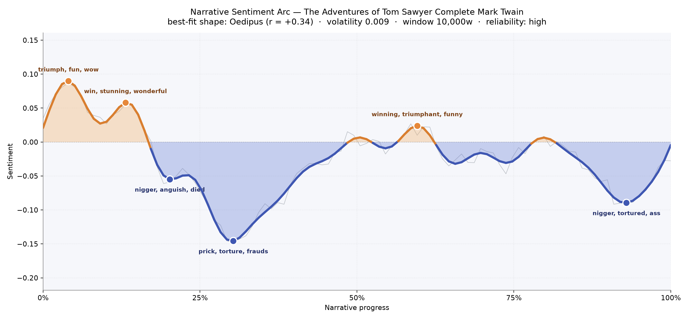

# The Adventures of Tom Sawyer
### by Mark Twain

Roughly 74,000 words of barefoot mischief and moonlit dread — an Oedipus arc, a boyhood lifted into sunlight only to be pulled, again and again, toward something darker underneath.

## The shape of the story

Twain opens the book the way a boy opens a summer morning — bright, whistling, sure of himself. The earliest crests of feeling glitter with "triumph, fun, wow, winning, stunning," the vocabulary of whitewashed fences turned into empire and Sunday-school tickets bartered like small currencies. For a while the novel behaves like a comedy of little conquests, and you can almost hear the shrill delight of a schoolyard in the prose.

Then the ground gives way. The first true valley bruises with "anguish, died, dead, miserable" — a chill that arrives with the graveyard and never fully leaves the book. The deepest trough, near the one-third mark, is stitched with "prick, torture, frauds, hell, disgust, hideous," the moral vertigo of a child who has seen a murder and cannot un-see it. There is a brief clearing later, a small return of "winning, triumphant, funny, terrific" as Tom is reborn at his own funeral and courts Becky through a schoolroom's small storms. But the arc will not let him stay in the light. The final valley, near the ninth-tenth of the book, gathers "tortured, died, kill, killing" around Injun Joe in the cave, and even the rescue feels shadowed by what nearly happened in the dark.

This is the Oedipus shape — a life raised only to be lowered — softened here by Twain's affection for his hero, so it reads less like doom and more like the first honest bruise of growing up.

<figure><figcaption>A boyhood in three weathers: a sunny opening, a long moral dusk, and one last darkening in the cave.</figcaption></figure>

## Who lives on the page

Tom towers over every other name in the book — nearly seven hundred mentions, three times the presence of anyone else — and that dominance is the novel's whole design. He is the weather system every other character orbits. Huck comes next, quiet and irregular as a shadow along a fence, his silence often speaking louder than Tom's chatter. Becky Thatcher (labelled here as a place, one of those small misreadings the counting sometimes makes with a first name that sounds like a town) is a steady thread through the middle chapters, and Joe Harper drifts in as the third pirate on Jackson's Island.

Around them stand the adults and shadows: Aunt Polly, worn thin with love and switch; Muff Potter, the drunkard framed; and Injun Joe, the book's true engine of dread, whose name rises whenever the temperature of the prose drops. Sid, Mary, and the Welshman round out a St. Petersburg that feels less like a town than a stage lit for a single boy's growing up.

<figure><figcaption>Tom's black dots blanket every mile of the book; the rest come and go like neighbours through a picket gate.</figcaption></figure>

## The weave of scenes

Read as a visual score, the thirty-six scenes braid rather than march. The middle of the book blooms thickest — the courtroom, the island, the schoolhouse, the picnic — a wide belly where ten, twelve, sixteen figures share the same air at once. The opening and closing chapters are leaner, more intimate: a boy and an aunt, a boy and a cave. Long arcs of connection sweep from early scenes to late ones, the way a childhood friendship keeps looping back on itself. There is no single climactic pillar; instead the book behaves like a river with several deep pools, and the cave sequence near the end is the one you feel pulling hardest at the current.

<figure><figcaption>Thirty-six scenes, threaded by recurring faces — a braided river rather than a straight road.</figcaption></figure>

## What a reader takes away

You close the book carrying two things at once: the taste of a strawberry summer, and the memory of a candle guttering in a cave. Twain's gift is to hold them together without apology — to insist that the same boy who cons his friends into painting a fence is also the boy who watches a man die by lantern-light and cannot sleep. It is the emotional inheritance of every real childhood: the joy is genuine, and so is the darkness underneath it.
