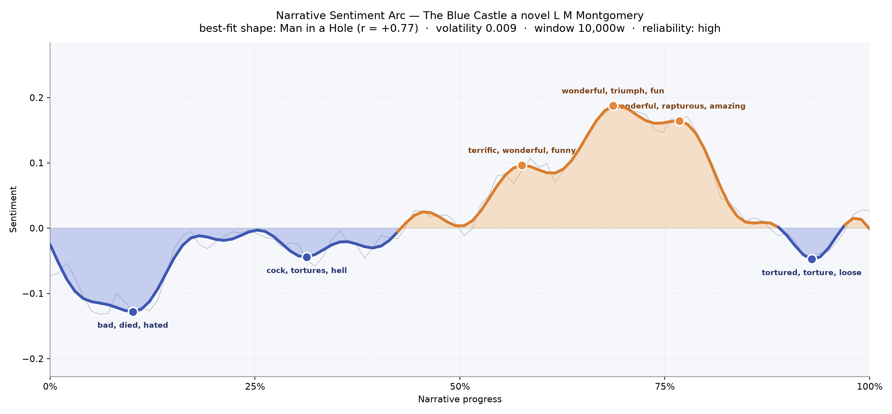
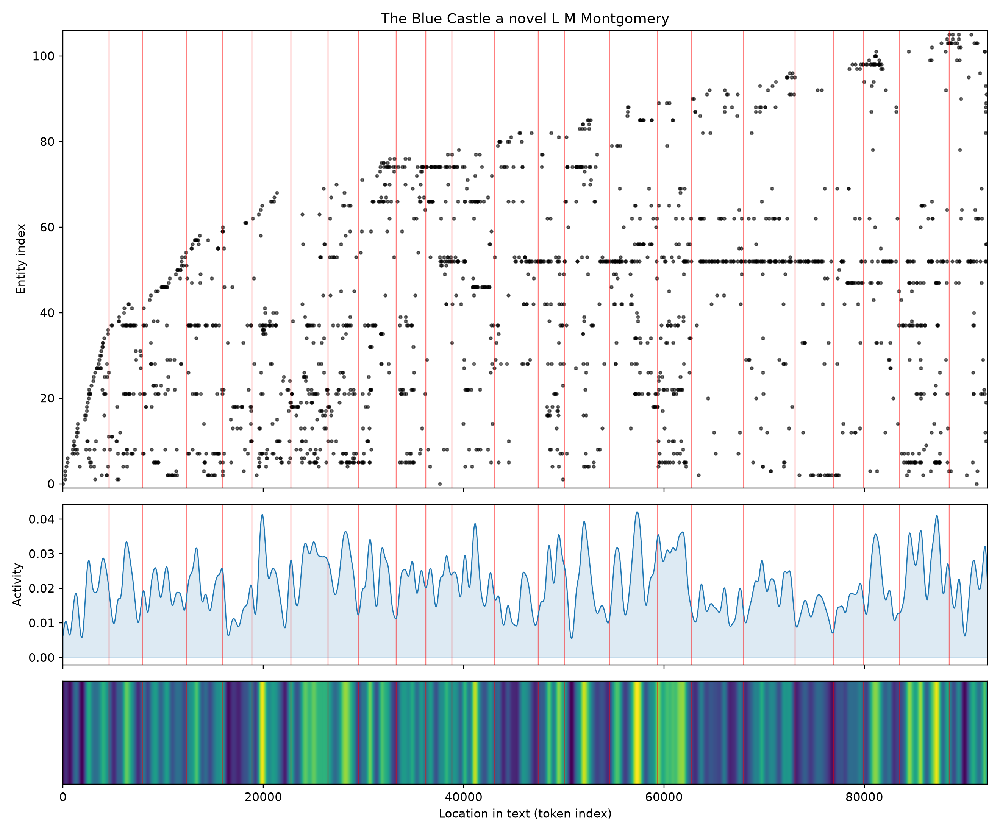
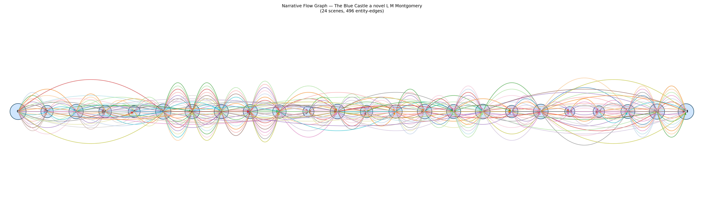

# The Blue Castle
### by L. M. Montgomery

71,509 words · a Man in a Hole arc — a life pressed down into shadow, then lifted into something like sunlight

## The shape of the story

Reading *The Blue Castle* is like watching someone climb out of a small grey room and into an open sky. The arc begins with the low, dull ache of Valancy's stifled girlhood: an early trough, near the first tenth of the book, bruises with "bad, died, hated, ugly, terrible, lost" — the small-town cruelties of a family that has taught her to expect nothing of herself. A second, shallower dip near the one-third mark is knotted with "tortures, hell, selfishness, fatal, agonised", the private inner weather of a woman who has just been told, in effect, that her time is short.

Then the line lifts, and it keeps lifting. Past the midpoint the story blossoms into its lake-country happiness: the first peak is thick with "terrific, wonderful, funny, fun, miracle, triumph", and the higher summit around the two-thirds mark reads like a laugh caught in the throat — "wonderful, triumph, fun, triumphant, rapturous, amazing". A third crest near three-quarters keeps the glow with "wonderful, rapturous, amazing, fantastic, miracle" before the arc settles into a small late shiver where "tortured, torture, loose, killed, hideous, mad" hint at the last misunderstanding before the ending resolves. The best-fit shape is a Man in a Hole, and it fits with the confidence of a well-cut dress; the arc is stable enough to trust, its rise slow and earned rather than sudden.

<figure><figcaption>A gentle descent into resignation, then a long, buoyant climb into joy.</figcaption></figure>

## Who lives on the page

The novel is Barney's book almost as much as Valancy's — his name (and its fuller form, "Barney Snaith") tops the roll of recurring presences by a wide margin, a quiet signal of how much of Valancy's happiness is spoken through him. Around them cluster the Stirlings who make her early life so airless: Uncle Benjamin, Uncle James, and Cousin Stickles, each named often enough to feel like wallpaper she cannot peel off. "Frederick" appears frequently too, and "Doss" — the nickname the family uses to keep Valancy small — is really Valancy herself, catalogued under the diminutive they inflict on her. Cissy, the doomed friend whose keeping becomes Valancy's first act of defiance, recurs steadily; Olive, the cousin she is always measured against, hovers nearby. Some labels here are places rather than people — Mistawis, the lake of the island cottage, and Deerwood, the town — and one or two, like "Stirling" and "Redfern", read as family surnames doing double duty. Together they map the two worlds the book pivots between: the pinched parlours of Deerwood and the wide open shore of Mistawis.

<figure><figcaption>A crowded early roll-call of relatives thins into the smaller, warmer cast of the lake.</figcaption></figure>

## The weave of scenes

The scene weave hums along in twenty-four beads, strung by a dense braid of shared figures. Nearly every scene threads back to nearly every other — the connections arch overhead like the ribs of a trellis — because Barney, Valancy, and the Stirling relatives keep reappearing across the whole span. The middle sags a little in one lean pocket (a scene with only ten recurring presences, likely the small hush of the island interlude), and the opening and closing chapters bulge with the widest cast, as the family gathers first to smother Valancy and later to gape at what she has become. The overall pattern is less parallel threads than a single, continuous cord being pulled taut and loosened, tightened and loosened again.

<figure><figcaption>Twenty-four scenes held together by a single, insistently returning cast.</figcaption></figure>

## What a reader takes away

*The Blue Castle* leaves the sweet, slightly stunned feeling of having watched a shy woman finally close a door behind her and open a window instead. It is a book about permission — the permission a person can, at last, give herself — and its arc, low then luminous, is the shape of that permission being granted.
