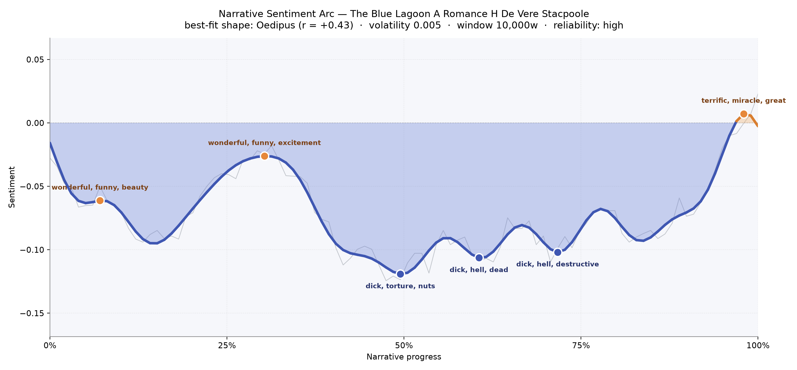
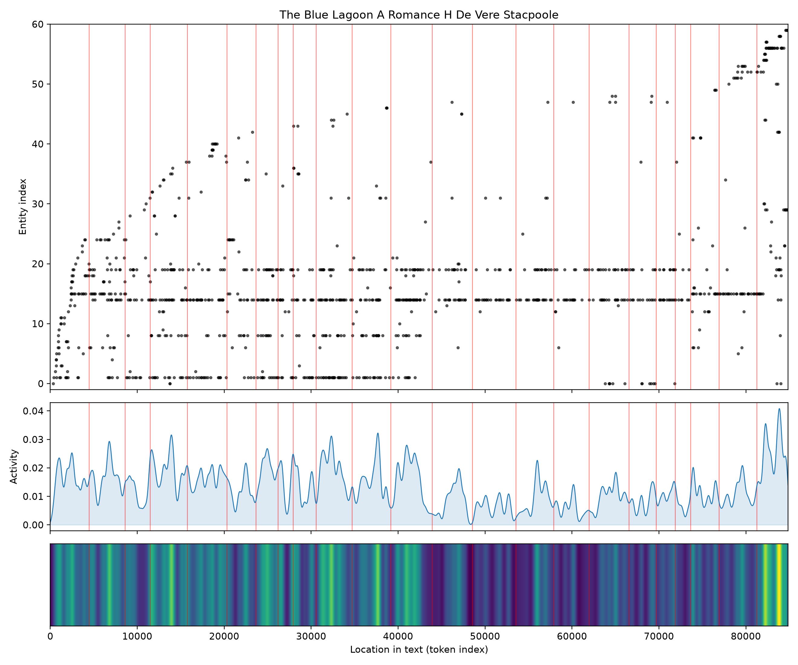
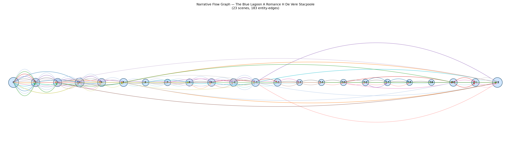

# The Blue Lagoon: A Romance
### by H. De Vere Stacpoole

66,249 words - an Oedipus arc, a life briefly lifted, then let down into shadow, then lifted only barely at the end.

## The shape of the story

The arc of *The Blue Lagoon* moves the way a small boat drifts on a long swell: it lifts, it hangs, and then the ocean simply lowers it. The opening pages sit high on the water, buoyed by first wonder, sentences carrying "wonderful, funny, beauty, love, joy, beautiful" as if the world were being discovered for the first time by children who don't yet know it can hurt. A second, smaller crest around the one-third mark still sparkles with "wonderful, funny, excitement, great, happy, dazzling" - the island's honeymoon, the reef pools, the sun on the lagoon.

Then the mood begins its long, slow subsidence. The deepest trough sits almost exactly at the book's midpoint and is bruised with "dick, torture, nuts, bad, betrayed, kill"; a second valley follows, thick with "dick, hell, dead, rotten, lost, terror"; a third lingers past the two-thirds mark, murmuring "dick, hell, destructive, mad, lost, nuts". You can feel Stacpoole tightening the horizon - fever, isolation, the sea's indifference. Only in the last breath does the line lift again, and even then only to the waterline, glinting with "terrific, miracle, great, beautiful, charm, excited", a final rescue-flare of feeling rather than a true dawn. This is an Oedipus curve in the older sense: not tragedy alone, but a life raised up so its fall can be felt.

<figure><figcaption>A long, patient descent from island wonder into fever and loss, with only a thin, almost accidental brightness at the close.</figcaption></figure>

## Who lives on the page

Three names carry the book. Dick towers over everything with three hundred appearances - he is the gravity of the story, the boy-then-man whose voice bends every scene toward him. Emmeline shadows him at one hundred and eighty-six, quieter but constant, the moon to his sun. Paddy Button, the old Irish sailor, presides over the first third with one hundred and thirty-five mentions and then, tellingly, thins away, as an old caretaker must. Lestrange - Dick's father, searching from a great distance - hovers at seventy-six, a name that belongs more to longing than to presence.

A few of the labels are honest place-marks rather than people: the Pacific rolls beneath everything, Northumberland and London belong to the world the children were taken from, and the schooner *Le Farge* is a vessel, not a figure. "Stacpoole" is simply the author's name caught from the title page. What remains is a very small cast for a very large ocean - which is exactly the book's point.

<figure><figcaption>A dense early swarm of names on the ship, then a long middle held by three figures on an island, then a final flurry as rescue-world names return.</figcaption></figure>

## The weave of scenes

Read as a visual score, the scene-graph is a long ribbon strung between two dense knots. The opening scenes are thickly braided - the doomed ship, the crew, the passengers, the port-side world all crowd into the first few chapters (twenty-five, fifteen, fourteen, eighteen distinct presences pressed into a small span). Then the threads thin, deliberately, to the loneliness of the island: chapters carrying only four or five recurring figures, the smallest ensemble a novel can hold - a boy, a girl, a memory, a sea.

At the far right, the weave suddenly thickens again into a final knot of twenty-three: the outside world crashing back in, rescuers, ships, distant fathers, the noise of civilization returning to a silence that had grown used to itself. The arc of the weave mirrors the arc of the feeling - crowded, then hushed, then crowded again, but changed.

<figure><figcaption>Two crowded knots at either end of a long, thin middle - the shape of a story that empties itself onto an island and only fills again at the last.</figcaption></figure>

## What a reader takes away

*The Blue Lagoon* leaves behind the ache of a paradise that could not stay one. You close the book carrying the smell of salt and frangipani and the quieter knowledge that innocence, once asked to grow up alone, cannot be kept. It is a romance in the older sense - a story that treats wonder and grief as the same weather - and its inheritance is that soft, sea-worn sadness that follows any beautiful thing you know cannot last.
