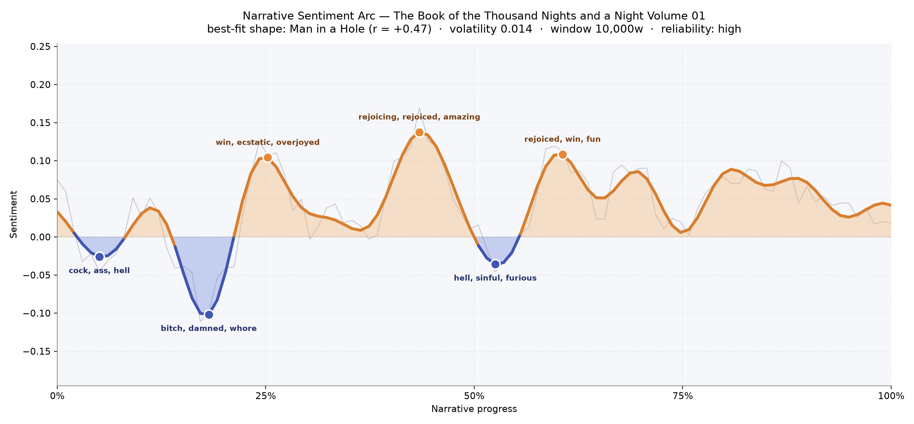
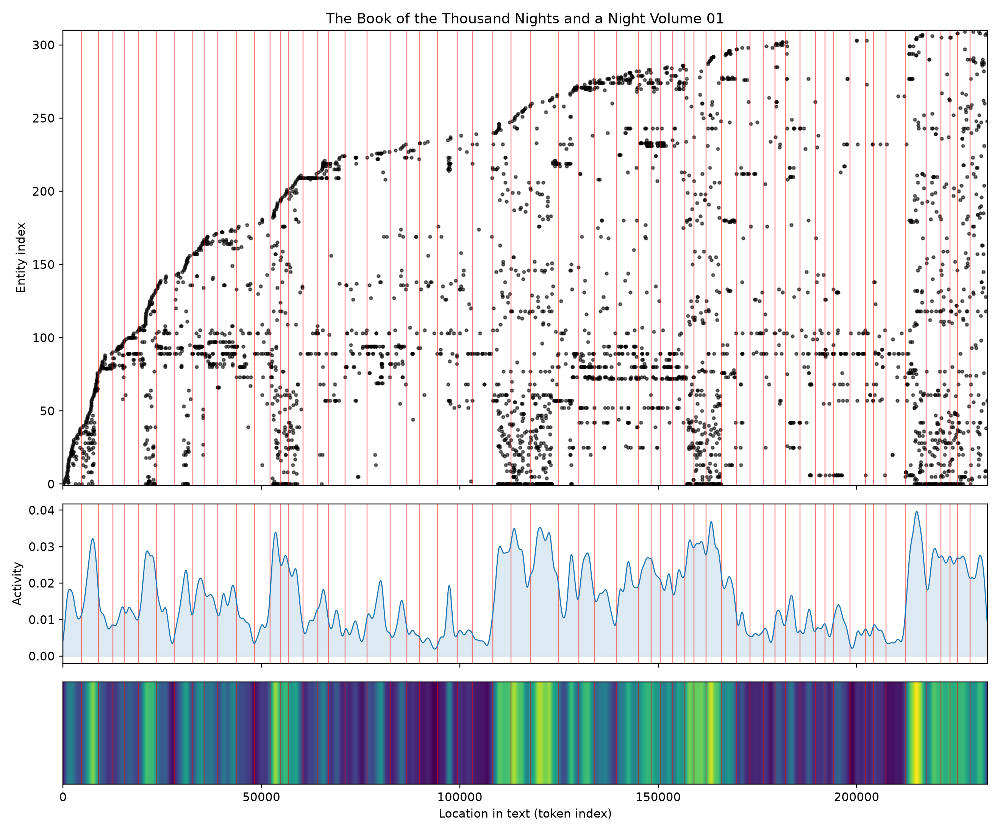

# The Book of the Thousand Nights and a Night, Volume 01
### by Richard F. Burton (translator)

roughly 178,000 words · a Man in a Hole arc — a first, jagged fall into darkness, then a long climb back toward light and laughter

## The shape of the story

Burton's opening volume of the *Nights* moves the way a lamp swung on a long chain moves — sweeping down into shadow, arcing back up into gold, then dipping again a little less deeply each time. The earliest reader-time is uneasy, thick with "cock, ass, hell" as Shahryar discovers his wife's treachery and the frame darkens; not long after, the deepest bruise of the book lands near the one-seventh mark, a trough heavy with "bitch, damned, whore, torture, evil, die" — the murdered brides, the drawn sword, the vizier's daughter walking knowingly toward the marriage bed. From there Scheherazade begins her long defiance, and the mood lifts: a first bright crest around the quarter mark rings with "win, ecstatic, overjoyed, fun, rejoiced, heavenly", and the highest peak of all, near the middle, is a chorus of "rejoicing, rejoiced, amazing, awesome, rejoice, winning" — the reunions and buried-treasure endings that these tales love. A softer valley near the halfway mark still trembles with "hell, sinful, furious, terror, die, evil" — the jinni's cruelties, the fisherman's fear — before a final gentle swell of "rejoiced, win, fun, beautiful, good" carries us out. The dominant hole is early and singular; the rest of the volume is a woman keeping herself alive by telling.

<figure><figcaption>One long fall into the sultan's grief, then a slow, tale-by-tale climb back into wonder.</figcaption></figure>

## Who lives on the page

The most-named presences are less private characters than a whole cultural weather. "Arab" and "Moslem" and "Persian" recur constantly, as does "thou" (an artifact of Burton's mock-archaic English, more a mode of address than a person). The living figures who do surface by name are exactly the ones a reader remembers: the wazir who must fetch fresh brides, the ifrit uncorked from his brass jar, the caliph (Harun al-Rashid, wandering Baghdad in disguise), the sultan whose grief begins everything, and above all Badr al-Din Hasan, whose long-lost-cousin romance runs like a bright thread through the middle of the volume. Cities crowd in almost as vividly as people — Cairo, Baghdad, Egypt — because in the *Nights* place is character. The list has its noise: "quoth" isn't a person, and honorifics like "king" and "sultan" bleed together across dozens of stories. But the ranking honestly reflects the book's texture: a tapestry of rulers, jinn, viziers and travelling merchants, moving between three or four beloved cities.

<figure><figcaption>Old presences persist along the bottom; each new tale sends up its own fresh scatter of names.</figcaption></figure>

## The weave of scenes

The scene-weave reads like a strand of beads with three heavy stones and many small ones between. Along the spine you can see clusters that swell where the great tales sit — the Fisherman and the Jinni, the Three Ladies of Baghdad, the long saga of Nur al-Din Ali and Badr al-Din Hasan, the Hunchback cycle — and thin, taut passages between, where Scheherazade hands one story off to the next. The high, sweeping arcs that leap from early scenes to late ones are the frame itself: characters and places from the opening return dozens of nights later, because everything is nested inside the sultan's bedroom. Density spikes hard near the two-thirds mark and again at the very end, where the largest scenes light up (73, 78 presences apiece) — the great crowded finales of the Hunchback story, with tailor, barber, broker and Jew all crossing paths. The middle sags a little, as shorter fable-nights ask less of the cast.

<figure><figcaption>A braided score: three great swellings of population, tied together by the long thread of the frame tale.</figcaption></figure>

## What a reader takes away

You close this volume with the sense of having been kept awake, benignly, by a voice that refuses to end. The early wound never quite heals — the sultan's cruelty is the pressure behind every sentence — but the storytelling itself becomes the cure, piling wonder on wonder until dawn. It is a book about the moral usefulness of delight: rejoicing, again and again, as a form of survival.
