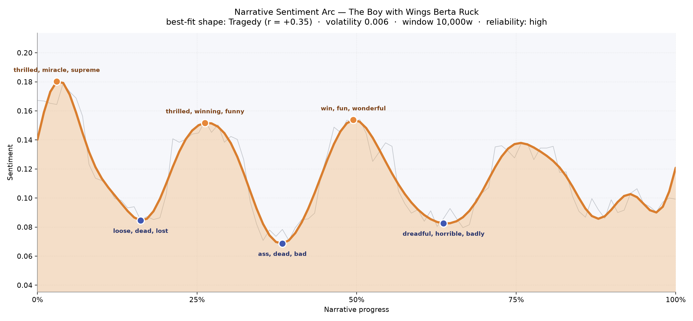
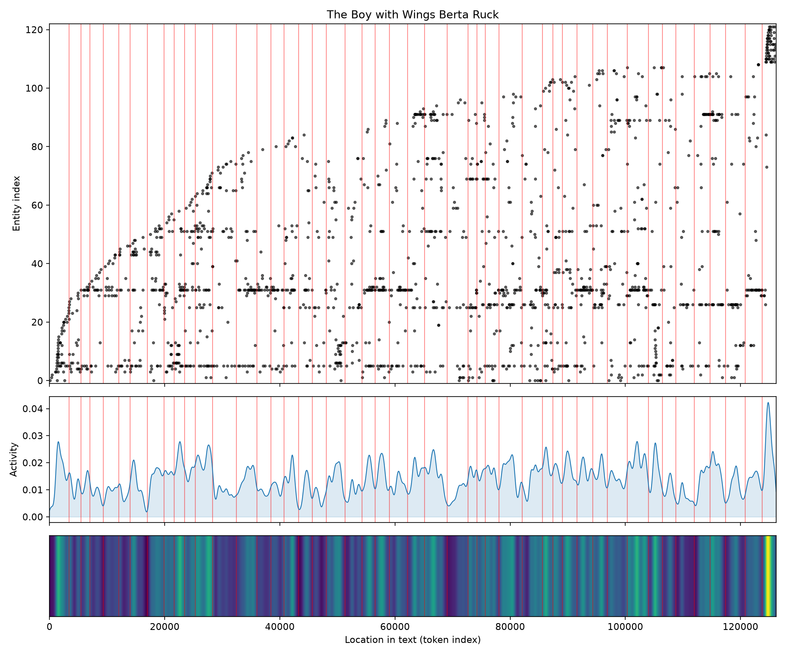
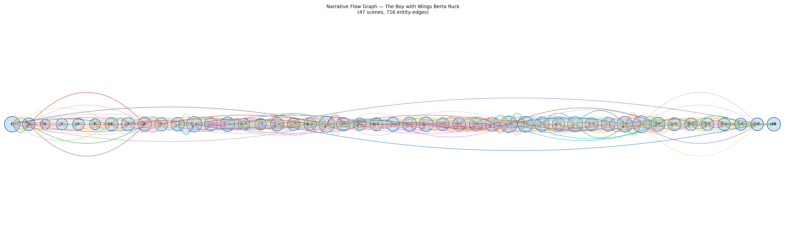

# The Boy with Wings
### by Berta Ruck

92,279 words · a Tragedy arc — a book of high, hopeful crests that keep being pulled back down toward the shadow of the war in the air

## The shape of the story

Berta Ruck writes in a voice so buoyant that you almost miss the undertow. On the page the mood keeps lifting — sunlit courtships, sudden luck, a young airman's exhilaration — but each rise is met by an answering fall, and the pattern of the whole book tilts, gently but unmistakably, downward. It is the shape of a wartime romance that cannot help remembering what wartime costs. The reading is a long one and the arc holds steady enough to trust: this is not a jitter, it is a mood.

The earliest crest, near the opening, is almost giddy — the pages sparkle with "thrilled, miracle, supreme, fun, fantastic, wonderful", the kind of vocabulary a woman writes when she is falling in love with the idea of a boy who flies. A second high, about a quarter of the way in, doubles down with "thrilled, winning, funny, brilliant, loved, love". Halfway through, at the story's exact middle, Ruck grants us her most triumphant peak — a chapter thick with "win, fun, wonderful, brilliant, triumphant, funny" — as if the novel itself is briefly airborne.

But the troughs are what give the book its ache. The first valley sits under "loose, dead, lost, dying, irritating, irritated"; a deeper one near the two-fifths mark bruises with "ass, dead, bad, fatal, idiotic, rotten"; and the darkest hollow, past the two-thirds line, is heavy with "dreadful, horrible, badly, fatality, killed, die". Read them together and you can hear the war humming under the flirtation — a young flier's world where a fatality is always one flight away.

<figure><figcaption>Four bright crests, three widening hollows: love keeps taking off, and something keeps pulling it back to earth.</figcaption></figure>

## Who lives on the page

The book belongs, unmistakably, to Leslie and Gwenna. Leslie Long — logged both as "leslie" and "leslie long" — dominates the page count, and Gwenna Williams (catalogued twice, once by first name, once in full) is her steady counterweight. Around them orbit Paul Dampier, the airman whose wings give the novel its title, and a supporting cast of Ryan, Taffy, and Crewe. London sits behind them all as the map on which the courtship is drawn, with a handful of Welsh and German references locating the story in a wartime Britain looking east across the Channel. A few labels are less people than moods — "airman" and "club" are really places and roles rather than named figures, and "Welsh" is a nationality standing in for Gwenna's origin — but the roster is coherent, and it is refreshingly female-anchored: two women's names lead the whole cast.

<figure><figcaption>Leslie and Gwenna hold the low, thick rails at the bottom of the plot; new figures fan in above as the courtships widen.</figcaption></figure>

## The weave of scenes

Across forty-seven scenes the book reads like a long, evenly-braided ribbon. Neither end frays into thinness; the first scene arrives already crowded with twenty-six named presences, and the closing stretch stays busy right through to the last handful of chapters. The densest knots sit past the midpoint — one scene draws in thirty figures, another thirty-two — which is exactly where the darkest valley of the sentiment falls. That is where Ruck packs the room: friends, rivals, aviators, Welsh cousins, London club acquaintances, all crowded together as the news of a fatality ripples out. Elsewhere the weave loosens into two- and three-person scenes — a proposal, a private grief, a letter read alone — before thickening again. It is the visual signature of a social novel written around a private catastrophe.

<figure><figcaption>A steady, evenly braided ribbon with its heaviest knot near the two-thirds mark — the moment the war walks into the drawing-room.</figcaption></figure>

## What a reader takes away

*The Boy with Wings* leaves you with the particular ache of a 1910s romance that refuses to pretend the sky is safe. Ruck writes love as brightness — miracle, thrill, triumph — and then lets the shadow of the aerodrome lengthen across the page. You close the book carrying two things at once: the memory of a girl and an airman laughing in a London club, and the quieter memory of a word like fatality learning to live inside a love story.
