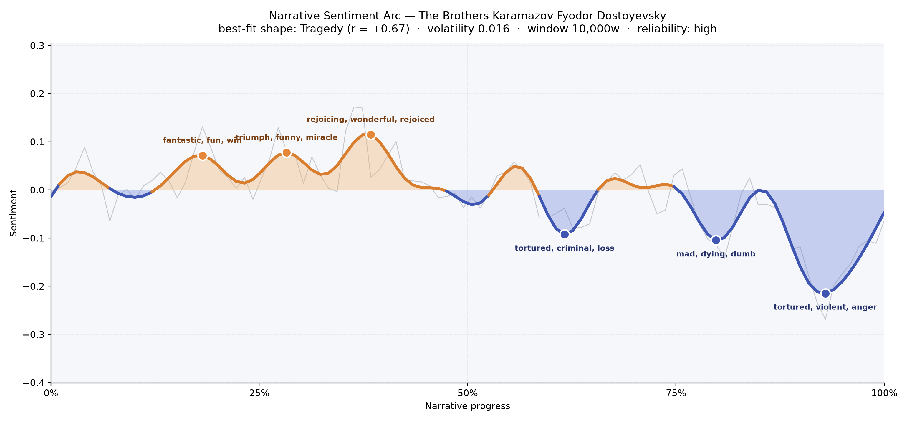
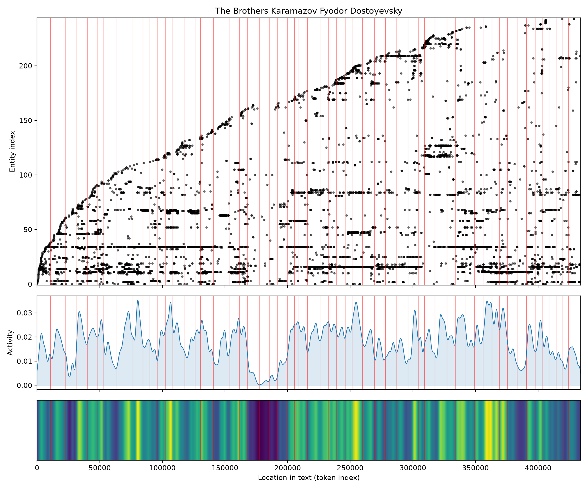
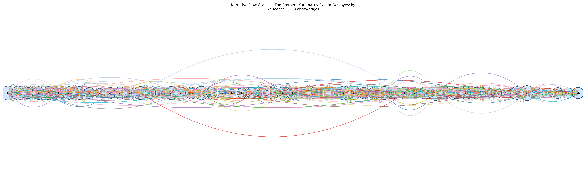

# The Brothers Karamazov
### by Fyodor Dostoyevsky

360,136 words · a Tragedy arc — a house of brothers where early rejoicing curdles into torment and arrest

## The shape of the story

Reading Dostoyevsky's last novel feels like sitting at a table where the candles are slowly, patiently blown out. The first third is not sunny exactly, but it warms: a monastery, a young man's faith, an argument about God carried by voices still capable of being tickled. The arc lifts through a bright shelf near the opening quarter, quickened by talk that is "fantastic, fun, win, miracle, good, perfectly," and rises again around the two-fifths mark into the book's brightest hill, a passage brimming with "rejoicing, wonderful, rejoiced, rejoices, great, love" — the elder Zossima's death and the odd, ecstatic aftermath, a farewell that behaves like a wedding.

After that, the light goes. The middle drops into its first bruise around three-fifths through, thick with "tortured, criminal, loss, miserable, angry, inexcusable," where the household begins to tilt toward the murder and the money. A second, deeper trough near the four-fifths mark is heavier still — "mad, dying, dumb, angry, terrible, losing" — the delirium and the sickroom, illness braided with courtrooms. And then the true floor, near the ninety-percent mark, where the reader is left with "tortured, violent, anger, fatal, lost, arrested." Innocence does not save; brilliance does not save; the book closes on a verdict. The felt experience is exactly what the shape names: a tragedy, arriving not as a shock but as a long, dignified darkening.

<figure><figcaption>Three warm hills at the front give way to three deepening troughs — the reader is walked, not thrown, into grief.</figcaption></figure>

## Who lives on the page

The novel belongs, quietly and unmistakably, to Alyosha. His name appears more than eleven hundred times, more than any other figure, which fits: he is the listener, the errand-runner, the one whose feet carry the plot between the monastery and the town. Behind him crowd the brothers who cannot stop talking: Mitya (also called Dmitri, and once formally Dmitri Fyodorovitch — the same man wearing three name-badges), and Ivan, the arguer, whose Grand Inquisitor rides on his back. Smerdyakov, the servant-half-brother, and Fyodor Pavlovitch, the father whose death organizes everything, hover close behind.

Around this house of men circle the two women who tear at Mitya's heart, Grushenka and Katerina Ivanovna, and the younger presences who give the book its late tenderness: Lise in her invalid's chair, and Ilusha, the boy whose funeral closes the novel. The seminarian Rakitin sneers from the margins; the elder Zossima and old Grigory anchor the sacred and the domestic. A couple of the counted names are ghosts of the King James pronoun — "thou" slips in from Zossima's sermons — but the human cast is otherwise clean and remarkably faithful to the novel Dostoyevsky actually wrote.

<figure><figcaption>New figures keep arriving deep into the book — this is a novel that refuses to close its door.</figcaption></figure>

## The weave of scenes

The scene weave shows fifty-seven chambers connected by nearly thirteen hundred human threads, and the picture looks like a long braided rope with two visible knots. Early scenes are already dense — the family gathering at the monastery packs almost forty named presences into a single room — and the density stays high, dipping only around the middle where Mitya's frantic night rides push the story into narrower, hotter rooms. The two thickest knots sit past the midpoint: the courtroom sequence and the final funeral gather nearly fifty figures each, as if the novel were calling everyone back for the reckoning. Threads that started in the first chapter (Alyosha's, Mitya's, the father's) run the entire length of the rope, crossed and re-crossed by shorter arcs — the schoolboys, the lawyers, the Poles at Mokroe — that appear, blaze, and vanish.

<figure><figcaption>Fifty-seven scenes braided by long-running family threads and two great gatherings near the end.</figcaption></figure>

## What a reader takes away

You close the book carrying a father's corpse, a brother's sentence, a boy's grave, and — improbably — the memory of a good afternoon by a stone. That is Dostoyevsky's stubborn arithmetic: he lets the arc fall, and then hands you, on the last page, a reason not to fall with it. The tragedy is real; the small warmth at the end is realer.
