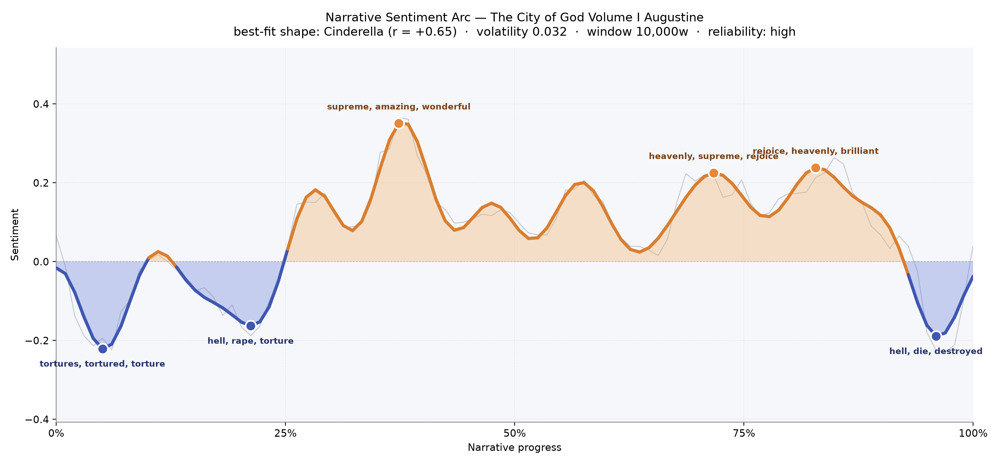
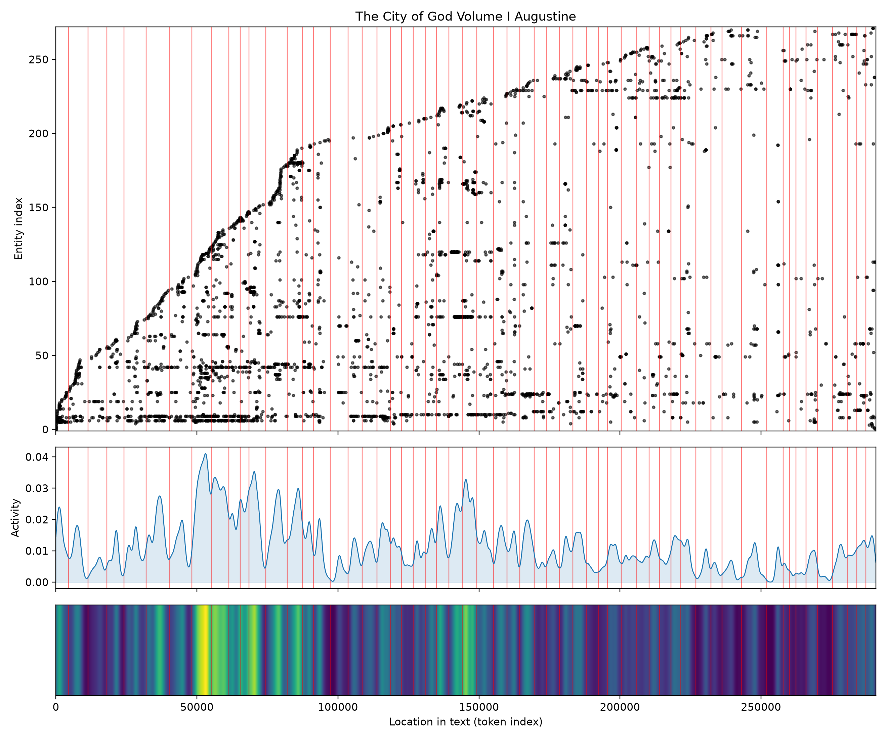
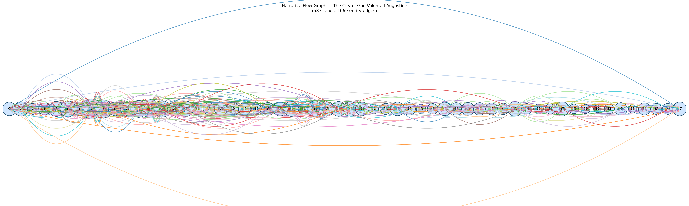

# The City of God, Volume I
### by Augustine of Hippo

230,301 words · a Cinderella arc — a soul dragged through ruin before it is lifted into praise

## The shape of the story

Augustine opens in the smoke of a sacked Rome, and you feel it. The first quarter of the book lives below the waterline: the earliest trough, barely an hour into a reader's long walk, bruises with "tortures, tortured, torture, dead, cruelty, loss" — the raw testimony of a city that had believed itself eternal. A second dip, near the fifth of the way through, thickens with "hell, rape, torture, destroyed, crime, deprivation," and the argument here is less an argument than a coroner's report on paganism's promises. Then, at roughly a third of the way in, the mood breaks like weather. The highest crest carries "supreme, amazing, wonderful, win, heavenly, praises" — Augustine has turned from indictment to hymn, from the burnt Forum to a city not made with hands. The rest of the book keeps climbing in slow, patient waves: another summit near the two-thirds mark rings with "heavenly, supreme, rejoice, wonderful, wonderfully, miracle," and a later peak, four-fifths through, rolls over into pure doxology — "rejoice, heavenly, brilliant, rejoicing, supreme, joy." Only in the final pages does a shadow return, a closing valley thick with "hell, die, destroyed, corruption, cruel, worse," as if Augustine cannot let the reader forget what lies outside the walls of the blessed city. The felt shape is a long climb out of catastrophe, briefly darkened at the door — a Cinderella whose ashes are the wreckage of an empire.

<figure><figcaption>From the ashes of Rome to the ramparts of the heavenly city, with one last look back at the dark.</figcaption></figure>

## Who lives on the page

The most-named presences are not really characters but civilizations arguing with each other. Rome and the Romans lead the tally, appearing hundreds of times, and their cognate "Roman" trails close behind — Augustine cannot stop naming the wound. Beside them stand the old gods he means to dethrone: Jupiter towers with over a hundred mentions (the tagger reads him as a place, which is a small, forgivable stumble — he is more a mountain than a man in this book), while Juno and Jove circle him like priests of a fading rite. Against these come the philosophers Augustine takes most seriously: Plato, cited more often than nearly any human figure, and Varro and Cicero, his Roman interlocutors, quoted, corrected, and honored. The Christians and Platonists appear as choruses rather than individuals. Augustine himself is only the thirteenth most-frequent name — a bishop who prefers to hide behind the argument. One entry, "thou," is really the old English pronoun of Marcus Dods's translation catching in the net; take it as a fingerprint of the Victorian voice through which we read him.

<figure><figcaption>A dense pagan pantheon early on; Rome, Plato and the philosophers braid through the whole length.</figcaption></figure>

## The weave of scenes

Fifty-eight scenes, more than a thousand threads between them — this is a tightly braided cathedral of a book. The narrative-flow map shows a great arch of connections spanning end to end, as if Augustine's opening indictment of Rome answers directly to his closing vision of judgment. The middle bulges thickest: scenes seven through fourteen carry the heaviest populations of names, forty to sixty figures apiece, and this is precisely where the sentiment arc first breaks into light. Toward the far right the threads thin and the scenes grow lean — nine, eight, three, five names — the argument distilling into pure theology. What looks like tangled yarn is really disciplined counterpoint: Rome answers Babylon, Plato answers Paul, the earthly city answers the heavenly, again and again, across the whole span.

<figure><figcaption>A cathedral in outline: dense debate at the crossing, slender arches spanning the whole nave.</figcaption></figure>

## What a reader takes away

You close the first volume with the strange feeling of having been consoled by a man who refuses to lie about ruin. Augustine grants the fire, names the dead, does not hurry past the rape or the torture — and only then lifts his eyes. What lingers is not triumph but a chastened kind of joy, the sort that knows exactly what it costs.
