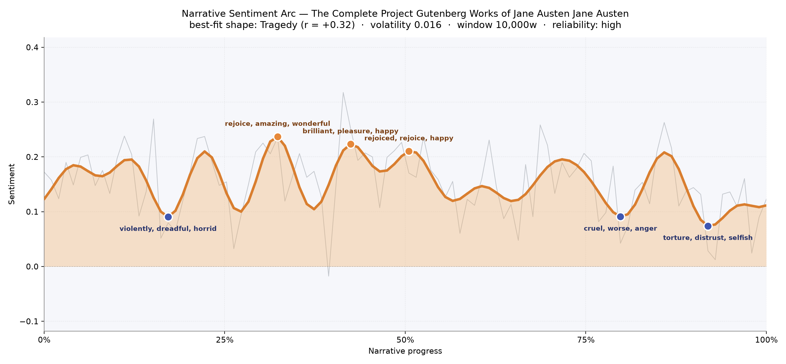
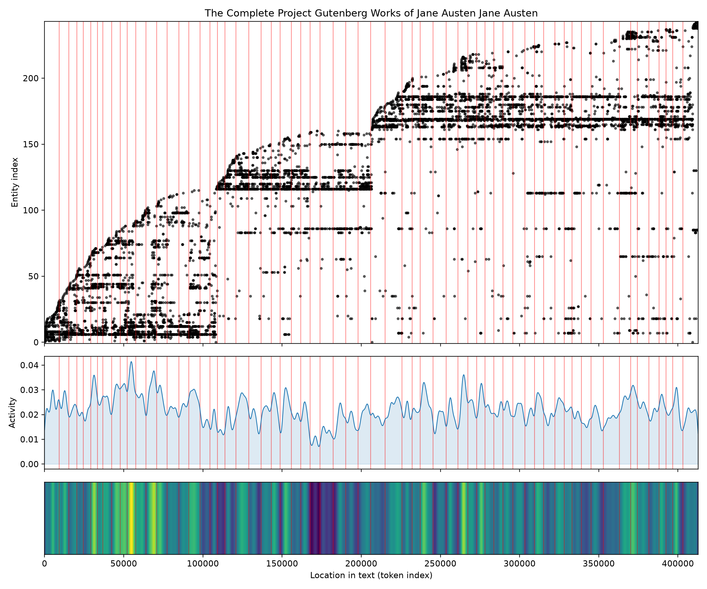
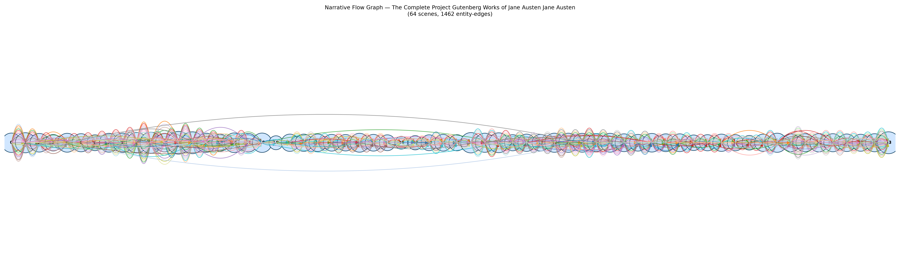

# The Complete Project Gutenberg Works of Jane Austen
### by Jane Austen

784,838 words across six novels bound together as one long reading life · a Tragedy arc — a book that keeps offering happiness, then keeps closing the door on it

## The shape of the story

Read cover to cover, the collected Austen behaves less like six discrete novels and more like a single long emotional weather system. The mood begins mild, climbs, and then, over the second half, slowly, insistently, subsides. The best-fitting shape here is Tragedy — not in the operatic sense, but in Austen's quieter idiom, where drawing-room manners take the place of daggers and the wound is always social. Happiness in this book is real, but it is fragile, and the arc dramatises the way it wears thin.

The three highest peaks all sit in the first two thirds. The tallest crest, near the one-third mark, is thick with "rejoice, amazing, wonderful, good, happiness, pleased" — an unmistakably Austen brightness, the ballroom-and-engagement register. A second, slightly softer rise near the middle keeps the glow going with "brilliant, pleasure, happy, happiness, great, grateful", and a third crest around the halfway line lingers on "rejoiced, rejoice, happy, beauty, pleased, great". For a long stretch you could believe the whole collection is going to hold that light.

Then it doesn't. An early dip, only a fifth of the way in, catches the reader off guard with "violently, dreadful, horrid, frightening, faggot, violence" — the gothic frisson of *Northanger Abbey* leaking into the general weather. Much later, past the three-quarter mark, the mood truly goes cold: one trough darkens with "cruel, worse, anger, deceived, hate, hatred", and the deepest valley, near the nine-tenths line, bruises with "torture, distrust, selfish, worse, dead, angry". The reliability of this reading is high and the volatility low, so this is not noise — it is the felt truth of finishing Austen's works in sequence, where *Persuasion*'s autumnal ache and *Mansfield Park*'s moral chill quietly outweigh the earlier joys.

<figure><figcaption>A steady, sunlit first half; a long, disenchanted descent through the last third.</figcaption></figure>

## Who lives on the page

Because this is a compendium, the cast is a crowd, and the frequencies read like a roll call of the collected novels. Fanny (Price) tops the list, closely followed by the Crawfords, the Bertrams, Mrs Norris and Mr Rushworth — *Mansfield Park* alone accounts for a startling share of the presences on the page. Catherine (Morland) and the Tilneys bring *Northanger Abbey* forward; Anne and the Elliots carry *Persuasion*; Isabella, Henry, Mary, William and Thomas float between books, doing double and triple duty as Austen recycles her favourite Christian names.

Two entries deserve a light asterisk. "Mansfield" is really a house and a village rather than a person, and it has been misfiled among the characters; the same charitable reading applies to how "fanny" is tagged. The absence of Elizabeth Bennet and Emma Woodhouse from the top of the list is itself telling — those heroines are so often addressed as "Miss Bennet" or simply "Emma" that surname-heavy families like the Bertrams and Elliots crowd them out of the count.

<figure><figcaption>Distinct blocks of names light up and go dark as one novel ends and the next begins.</figcaption></figure>

## The weave of scenes

The scene-weave reads exactly like a shelf of novels stitched end to end. Sixty-four scenes, more than fourteen hundred connections between them, and the density is remarkably even — Austen does not build to a single thunderous climax so much as to a series of smaller ones, book by book. Look closely and you can see the seams: pockets where the population thins (a quiet stretch in the twenties, another near scene thirty) mark the transitions between novels, where a whole community is retired and a new one introduced. The final scene swells back up to forty-three connected figures — the last book closing not with silence but with a full drawing room.

<figure><figcaption>A long braid of overlapping households, each novel a bright knot along the line.</figcaption></figure>

## What a reader takes away

To read Austen entire is to learn, slowly, that her wit is a form of endurance. The early joy is genuine; the later chill is genuine too, and it is the chill that lingers. You close the book with the sense that manners are a kind of weather, and that surviving them with a whole heart is its own quiet, tragic triumph.
