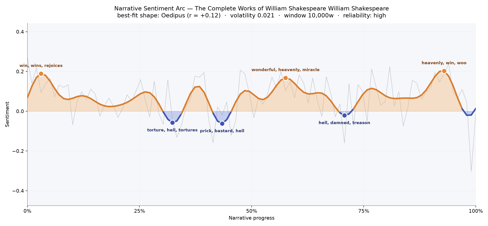
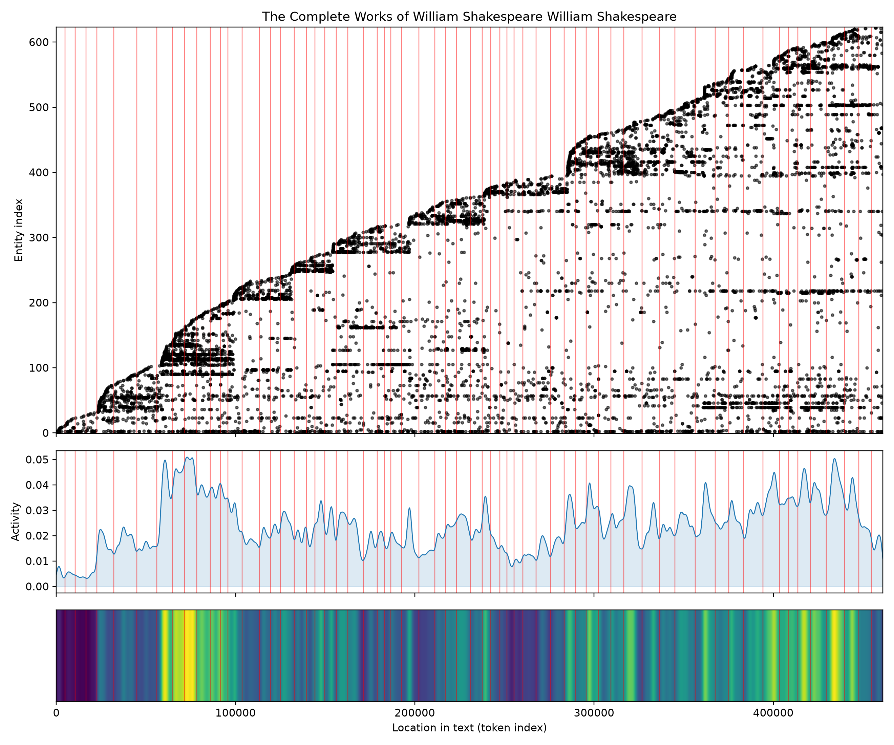
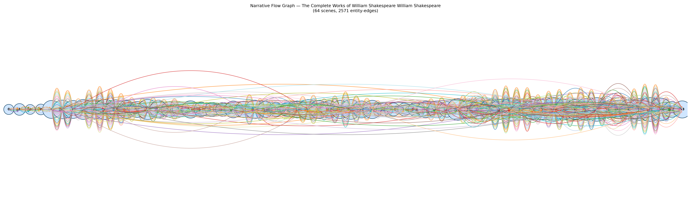

# The Complete Works of William Shakespeare
### by William Shakespeare

988,542 words, sixty-four scenes, high-reliability sentiment reading  ·  an Oedipus arc — a great height gathered only to be pulled, again and again, into the dark.

## The shape of the story

Read as one continuous body of work, the Complete Works do not obey a single mood. They ripple. Yet across nearly a million words the strongest match is an Oedipus curve — that ancient shape of ascent followed by unmaking, a life lifted by fortune only to be undone by the very thing that raised it. The strength of the match is modest, and that modesty feels right: Shakespeare gives us thirty-seven weathers, not one, and the collected arc is a long tide, not a single wave.

The opening is bright. Near the three-percent mark the pulse leaps with "win, wins, rejoices, marvel, good, great" — comedy country, festivals of matched lovers and reclaimed thrones. Then the ground gives way. Somewhere around the first third the reading bruises with "torture, hell, tortures, tortured, terribly, die", and a little later the language coarsens into "prick, bastard, hell, ass, damned, die" — the tragedies stepping to the front, the histories thickening with blood. The middle rallies gorgeously: near the 58% mark the arc rises again with "wonderful, heavenly, miracle, love, good, glad", the sound of the late romances and the reconciliation plays. Then treachery returns with "hell, damned, treason, betray, bad, evil", before a final crest at 93% carried by "heavenly, win, woo, blessing, love, great". The last quick dip at the close feels like a curtain rung down after applause: benediction, then silence.

<figure><figcaption>Comedy, tragedy, romance — an Oedipus tide across a million words.</figcaption></figure>

## Who lives on the page

The frequency list is a fair snapshot of a folio-sized world, though the tools stumble on Elizabethan English: "thou" and "nay" surface as if they were people, and the stage direction "exit" wears a crown it does not deserve. Look past that noise and a cast steps forward. Antony leads, unsurprising — he strides through both his own Roman tragedy and the histories that circle it. Prince and Gloucester speak for the crowded English throne rooms of the Henriads and Lear. Orlando carries the pastoral warmth of Arden; Horatio keeps his mournful watch at Elsinore; Parolles and Enobarbus loiter as those wonderful hangers-on Shakespeare loved to write. Around them the map fills in: France, Rome, England, Ephesus — the countries themselves become presences, borders that the plays cross and re-cross. It is the shape of a mind that thought in kingdoms.

<figure><figcaption>A folio in a single frame — new figures entering ceaselessly, activity rising toward the later plays.</figcaption></figure>

## The weave of scenes

The scene-weave is dense in a way few single novels ever are. Sixty-four sections braid together through more than two and a half thousand shared presences — a tapestry, not a thread. The early scenes are lean: eleven, seventeen, ten distinct figures, the small casts of the early comedies. The middle thickens fast, and the back half swells into scenes carrying seventy, eighty, ninety-three named voices at once — the great crowded histories and tragedies, courts and battlefields and forests packed shoulder to shoulder. The picture looks like a long lit spine with choral bulges near the climax, exactly what a lifetime of playwriting ought to look like when you set it end to end.

<figure><figcaption>Sixty-four scene-clusters braided by recurring figures — a folio drawn as a single loom.</figcaption></figure>

## What a reader takes away

To read Shakespeare whole is to feel a single sensibility working every register a human voice can reach — festive, murderous, tender, obscene, sublime. The arc lifts you into wonder, drops you into hell, and lifts you again with "heavenly, blessing, love" before the last hush. What you carry away is not a plot but a temperature: the sense that grief and delight are the same weather, and that language, when a great mind bends to it, can hold both at once.
