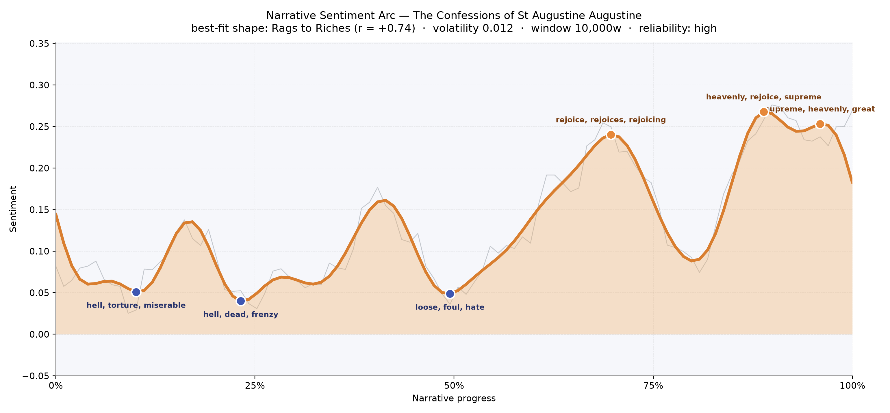
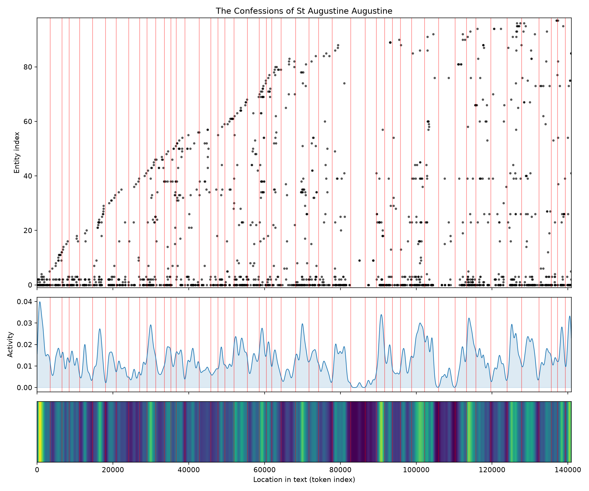
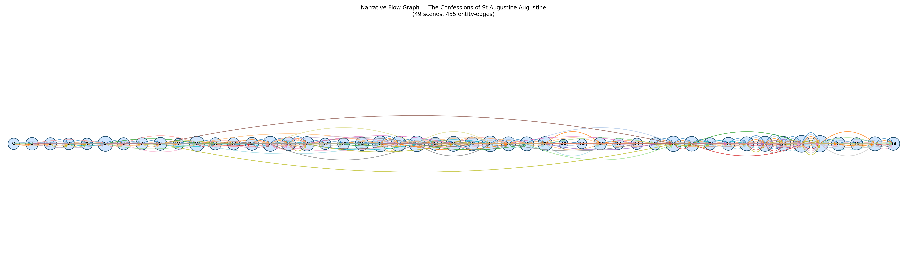

# The Confessions of St Augustine
### by Augustine of Hippo

112,123 words - a Rags to Riches climb, the long slow lift of a soul out of its own weather

## The shape of the story

Augustine's arc is the oldest and most stubborn story a person can tell about themselves: I was lost, and then, slowly, I was found. The line rises. It does not leap. Read as felt experience, the book begins in a low room where the air is stale with self-disgust — the earliest valley is thick with "hell, torture, miserable, foul, ludicrous, loss," a young man cataloguing the sins he half-enjoyed and wholly regrets. A second dip near the first quarter darkens further, its trough carrying "hell, dead, frenzy, falsified, mad, madness" — the years of Manichee confusion, the intellect thrashing against itself. At the midpoint, roughly the moment any long confession would find its worst hour, the mood loosens into another descent freighted with "loose, foul, hate, abhor, horrible, dying," the last shudder before the turn.

And then the climb. Around the two-thirds mark the sentence rhythms brighten with "rejoice, rejoices, rejoicing, wonderful, heavenly, wonderfully" — the garden scene, the child's voice, the opened page. Near the ninth-tenth the language settles into "heavenly, rejoice, supreme, happy, loved, happiness," and the final crest rings with "supreme, heavenly, great, beautiful, love, good." It is not a burst but a widening, the way morning arrives through a window you had forgotten was east-facing.

<figure><figcaption>Three valleys of self-loathing, three crests of rejoicing — a soul climbing toward light it had to be dragged up to see.</figcaption></figure>

## Who lives on the page

The most-named "figure" in this book is not a person at all. It is "thou" — invoked over nine hundred times — followed by "thee" and "thine." The tooling flags them as places or people; a warmer reading names them for what they are: the second-person address to God that carries every sentence of this long letter. Augustine is not writing about his life so much as speaking it up at Someone. That single stylistic fact — an entire memoir written as prayer — bends every count on the list.

Around that great vocative hover the real presences: Rome, the city where ambition curdled; the Manichees, whose dualist tidiness once seduced him; his Christian and Catholic communities; the Greek philosophers behind his young reading; and Nebridius, the friend whose small persistent name is one of the book's quiet warmths. Familiar figures the analysis misses — Monica his mother, Ambrose, Alypius — live in pronouns and titles the counter can't easily catch. What the list does capture is the pressure of the vocabulary: a mind held taut between "truth," "spirit," and "thy word."

<figure><figcaption>Names accumulate steadily through the first two-thirds, then thin as the book climbs into meditation and metaphysics.</figcaption></figure>

## The weave of scenes

Read as a score, the flow graph looks like a long spine with three thickened regions where the strands loop and knot. Forty-nine scenes, hundreds of small threads between them, and the densest bulge sits past the middle — the great confessional chapters where Milan, mother, memory and God are being named in the same breath. Early scenes are lean, single-voiced, a boy remembering pears and school beatings. Near the end the graph thins again as Augustine turns from story toward speculation — the last books on memory, time, and Genesis draw fewer named presences but pull the earlier braid tight. It is not a novel's climax-and-release; it is a life being folded back into its meanings.

<figure><figcaption>A long horizontal spine with a thick knot of interwoven scenes at the conversion, then a thinning as the book turns philosophical.</figcaption></figure>

## What a reader takes away

You close the book carrying the strange comfort of watching a mind talk itself out of its own dark. Augustine gives you permission to be ashamed and, in the same breath, to be lifted — to speak your worst hours toward something larger than yourself and find the sentences come out braver than you began. The arc is rags to riches, yes, but the riches are not glory. They are simply a quieter room, a wider window, and the sudden competence to say thank you.
