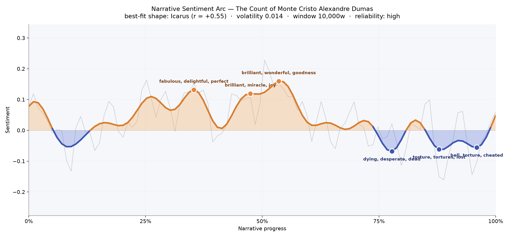
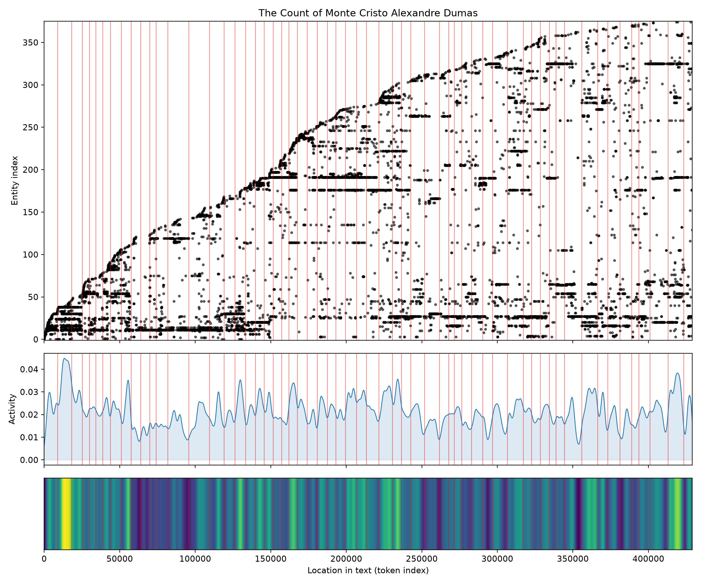
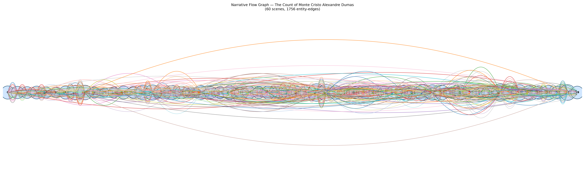

# The Count of Monte Cristo
### by Alexandre Dumas

466,974 words · an Icarus arc — a man who climbs into the sun on stolen wings and burns as he descends

## The shape of the story

Dumas builds a novel that rises like a tide of vindicated joy and then, having crested, keeps falling. For roughly the first two-thirds the arc lifts steadily, pooling into three bright crests: an early plateau near the one-third mark that shimmers with "fabulous, delightful, perfect, grateful, happy, merry" — the sensation of a man discovering that patience, fortune, and knowledge together make a weapon; a middle summit at the halfway point buoyed by "brilliant, miracle, joy, pleasure, happy, succeeded"; and the highest peak just past centre, brimming with "brilliant, wonderful, goodness, perfectly, grand, excitement," which is Monte Cristo at full flight — masked, adored, unassailable.

Then the wax melts. From the three-quarter mark onward the line refuses to climb back. The first true valley, near seventy-eight percent, bruises with "dying, desperate, dead, awful, crime, criminal" — the poisonings in the Villefort house, the machinery of revenge turning on the innocent. A deeper trough near eighty-eight percent is thick with "torture, tortures, lost, mad, terror, bad," and the final dip before the coda closes on "hell, torture, cheated, crime, terror, deceived." That the arc ends only fractionally above zero is exactly right: vengeance leaves a taste even the ocean cannot rinse. The volatility is low and the reliability high, so this shape is not a mood but a design — Dumas plotted the fall as carefully as the flight.

<figure><figcaption>Three warm crests of triumph before the long, sober descent of revenge.</figcaption></figure>

## Who lives on the page

Dantès presides over everything, named more often than any other figure — the prisoner, the count, the alias-wearer, the ledger of grievances made flesh. Around him orbit the men who wronged him and the children who inherit their sins: Danglars the schemer, Fernand (whose name the tool mistakes for a place), Villefort the magistrate, and Caderousse, whose label as a "location" is a small misfire — he is the tavernkeeper, not a town. Franz and Albert carry the Roman and Parisian chapters; Valentine and Maximilian are the tender heart the count almost forgets he has; Mercédès and Edmond haunt the book as two halves of a life that cannot be rejoined. Paris is the only real place that muscles into the top ranks — fitting, since the second half of the novel is Paris digesting a stranger. A few tags are shaky (Monte Cristo listed as an organisation, some honorifics blurred), but the cast reads true: this is a novel of named enemies and a named avenger.

<figure><figcaption>New figures accumulate late and thickly — the count's Paris is a widening net.</figcaption></figure>

## The weave of scenes

Sixty scenes, seventeen hundred and fifty-six connecting threads: the flow graph looks like a braided river seen from above, tapering to slim spindles at the Marseilles opening and the seaside close, bulging in the middle where the Roman carnival and the Parisian salons pack the room with cross-talk. The scene-population counts confirm the eye — the early chapters run lean (fourteen to thirty figures), then swell into rooms holding sixty-nine, sixty-seven, fifty-six presences as balls, trials, dinners, and duels layer their voices. The long arcs that leap from one end of the book to the other are the count's memory: Marseilles reaching for Paris, prison reaching for banquet. Dumas engineers his climax not with a single spike but with a sustained crowded middle-to-late passage, so the reader feels revenge as a social event, staged in public.

<figure><figcaption>A braided middle where salons, courts, and carnivals overlap; slim, quiet ends.</figcaption></figure>

## What a reader takes away

The book leaves you exhilarated and slightly ashamed of your exhilaration. Dumas lets you savour every stroke of the count's revenge, then quietly asks what it cost the children of the guilty, and whether a man who has spent fourteen years planning his return has any life left to live once the plan is done. The joy is real; so is the ash. You close the novel remembering both the flight and the fall.
