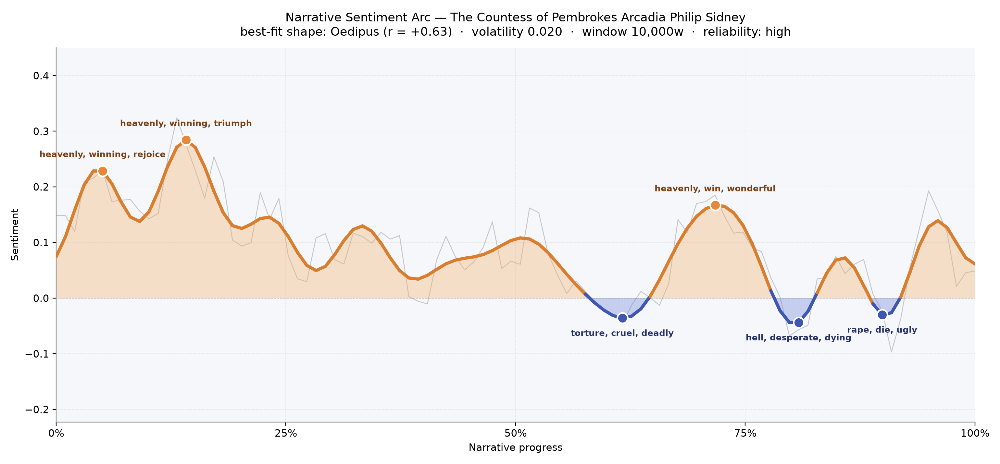
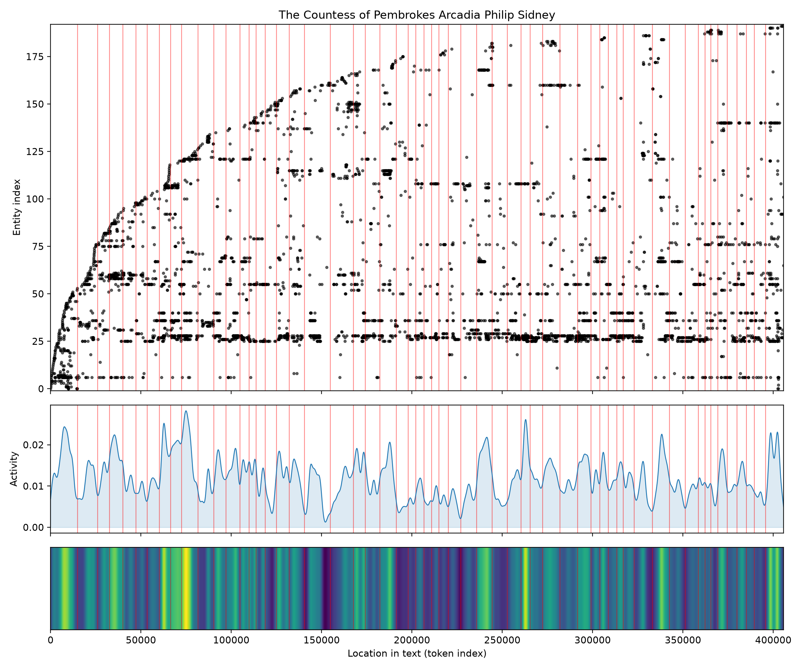
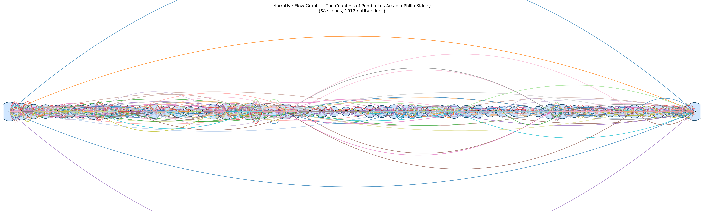

# The Countess of Pembroke's Arcadia
### by Philip Sidney

347,822 words · an Oedipus arc — a pastoral height, then a slow descent into shame and ruin.

## The shape of the story

Sidney's romance opens like a summer morning that refuses to end. For the first quarter of its enormous length the sentiment sits high and bright: shepherds sing, princes disguise themselves, and the language shimmers with "heavenly, winning, rejoice, love, delighted, delightful." That early crest near the fifth percent of the book is answered by an even taller one at the fourteenth, thick with "heavenly, winning, triumph, triumphant, rejoice, perfection" — the vocabulary of a court that still believes its own pageantry.

Then the sun starts to slip. The arc dips slowly, patiently, the way a long summer afternoon dims without you noticing, until near the three-fifths mark it drops below the neutral line and the prose turns cold with "torture, cruel, deadly, loathed, died, destroyed." A brief consolation returns around the seventy-percent mark — a chivalric rally coloured by "heavenly, win, wonderful, triumph, good, finest" — but it is a false dawn. The book's true nadir arrives at four-fifths in, in a stretch stained by "hell, desperate, dying, deadly, die, evil," and near the ninetieth percent the ugliest bruise of all: "rape, die, ugly, evil, loss, guilty." This is the Oedipus curve at its most literal — a life, or a kingdom, lifted only to be undone by the very appetites that lifted it.

<figure><figcaption>A long pastoral morning gives way, by three-fifths through, to a shadow that never quite lifts.</figcaption></figure>

## Who lives on the page

The book belongs, above all, to Zelmane — the Amazon disguise worn by prince Pyrocles — whose name appears more than any other, more even than the princesses Philoclea and Pamela who orbit her/him with such tenderness. Behind them stand King Basilius, his queen Gynecia, prince Musidorus (often shadowed by his shepherd-alias Dorus), the buffoon Dametas, the noble Euarchus, and the darker later pair Amphialus and Cecropia, whose captivity plot brings the book its worst hours. Arcadia itself — the pastoral kingdom — recurs so often it behaves like a character, a green stage that keeps insisting on its own innocence while the humans inside it fail. A few of the labels are noise the counter has misread as places or organisations rather than people, and one entry, "thou," is simply the archaic pronoun surfacing through Sidney's Elizabethan prose; a light reminder that the machine reads sixteenth-century English with a slight squint.

<figure><figcaption>A dense, populous romance: named presences accrue steadily from the first pages to the last.</figcaption></figure>

## The weave of scenes

Read as a visual score, the fifty-eight scenes braid into a single thick rope, fat in the middle and tapering only slightly at each end. The opening scene is enormous — fifty-four distinct presences packed into the first movement, as Sidney assembles his cast in a single grand tableau — and the final scene swells almost as large, gathering everyone back for judgement. Between those bookends the density never truly thins: even the quieter middle passages carry ten to thirty figures each, and long arcs of connection loop over the whole diagram like garlands, tying early princes to late trials. There are no isolated threads, no parallel plots running unaware of one another; this is a court romance where everyone eventually meets everyone, and the graph knows it.

<figure><figcaption>A single braided rope — the Arcadia gathers its people early and refuses to let any of them go.</figcaption></figure>

## What a reader takes away

What remains after Arcadia is the ache of pastoral betrayed. Sidney builds the loveliest of green worlds and then walks his princes and princesses into disguise, lust, captivity, and a courtroom, and the sentiment curve remembers every step. You close the book carrying two feelings at once: the sweetness of the opening songs, still warm on the tongue, and the cold ethical weight of the ending — the sense that even heavenly things, if their loves grow crooked, arrive at hell.
