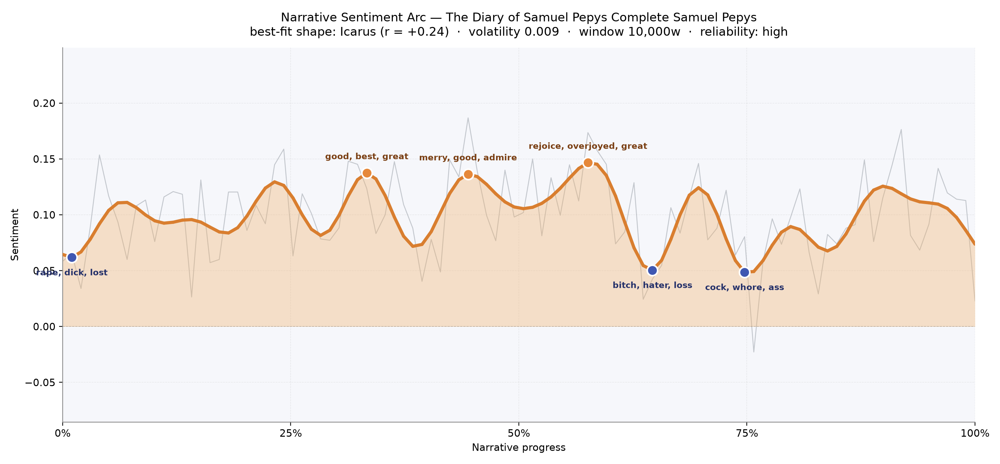
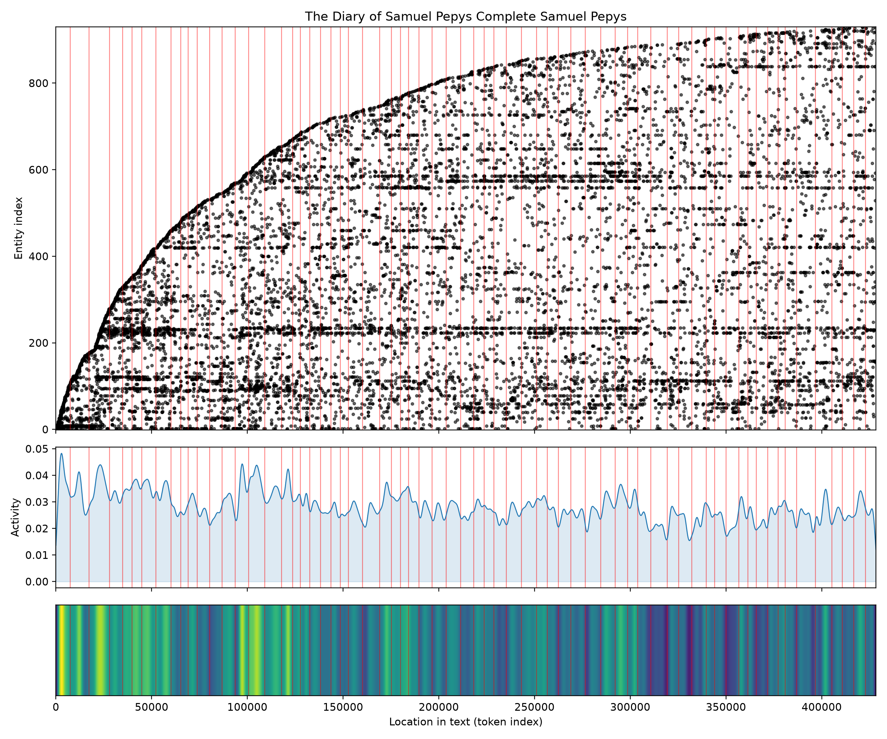

# The Diary of Samuel Pepys
### by Samuel Pepys

1,293,676 words · an Icarus arc — a life lifted on pleasure and small triumphs, then tugged down by scandal, loss, and the sourness of middle age

## The shape of the story

A diary is not a novel, and Pepys knew nothing of arcs when he sat down each night with his quill and his conscience. Yet, viewed from a great height, the ten years he kept his private book do trace something like a rise and a fall — the shape a reader instinctively recognises as Icarus, a life aloft on wax wings that eventually give way. In the first third the pages hum with cheer; the peak near the one-third mark is warm with "good, best, great, luck, pleased, pleasure", the tone of a young clerk finding himself unexpectedly indispensable at the Navy Office. The mid-book peak, just past halfway, glows brighter still — "rejoice, overjoyed, great, merry, perfectly, good" — Pepys at the summit of his fortune, buying new coats, hearing new music, patting his own back in Latin so his wife will not decipher it.

Then the descent. The valley near the two-thirds mark bruises with "bitch, hater, loss, lost, dead, bad", and by the three-quarter turn the register has curdled further into "cock, whore, ass, nasty, bribes, despair". These are the years of Elizabeth's discovery of his infidelities, the failing eyesight that eventually forced him to close the diary, and the political scapegoating that followed the Dutch raid on the Medway. The very first entries also carry a small shadow — "rape, dick, lost, defects, died, ridiculous" — the plague and fire still ahead, but mortality already sitting close to the writing desk. The volatility is low, which fits: this is not the melodrama of fiction but the slow, honest weather of one man's life.

<figure><figcaption>Ten years of nightly candlelight, plotted as feeling: three warm crests of self-satisfaction, then a slow souring through the late 1660s.</figcaption></figure>

## Who lives on the page

The cast of the Diary is a Navy Office ledger crossed with a coffee-house register. Sir William Pen and Sir William Batten, Pepys's rival colleagues, loom largest ("w. pen" and "w. batten" in the tally). Mr. Moore, the family lawyer, appears almost as often. Creed and Coventry — colleagues, patrons, sparring partners — round out the office. London itself is nearly as present as any human, and Whitehall (misfiled as a building but really the court he orbited) hums beneath every week. A few labels are noise or misfile: "pepys" is typed as a place, "westminster" as a person, "wardrobe" is really my Lord Sandwich's household at the King's Wardrobe rather than a character, and the bare word "lady" is almost certainly Lady Sandwich or Lady Batten depending on the week. What the list confirms, gently, is that Pepys wrote his life through his workplace: no wife or lover cracks the top rank, but every naval commissioner does.

<figure><figcaption>The parade of names widens across the decade — new faces arrive, but the Navy Office regulars form the dark horizontal bands that never leave.</figcaption></figure>

## The weave of scenes

Sixty-seven scenes, and the flow diagram looks less like a river and more like a rope of many-coloured threads pulled taut end to end. There is no single climactic knot; instead the density is remarkably even, thickest through the middle where Pepys's social and professional life is at its busiest — dinners, plays, meetings, whispered gossip at Whitehall — and slightly thinner at the frayed ends, where the diary begins tentatively and closes in fading eyesight. What braids the whole together is recurrence: the same handful of colleagues, taverns, and parish churches thread through nearly every scene, so the picture reads as a single continuous fabric rather than a plotted design.

<figure><figcaption>A decade woven into a single cord — no chapters, only the daily return of the same faces, offices, and streets.</figcaption></figure>

## What a reader takes away

To finish Pepys is to feel the strange intimacy of having lived beside a vain, curious, appetitive man for ten years and to have watched, without his knowing, the wax on his wings begin to soften. The Diary leaves you with the ordinary human suspicion that our best years are being enjoyed and lost at the same instant, and that a life honestly recorded — coffee, quarrels, coronations, plague — is finally more moving than any shape a novelist could invent for it.
