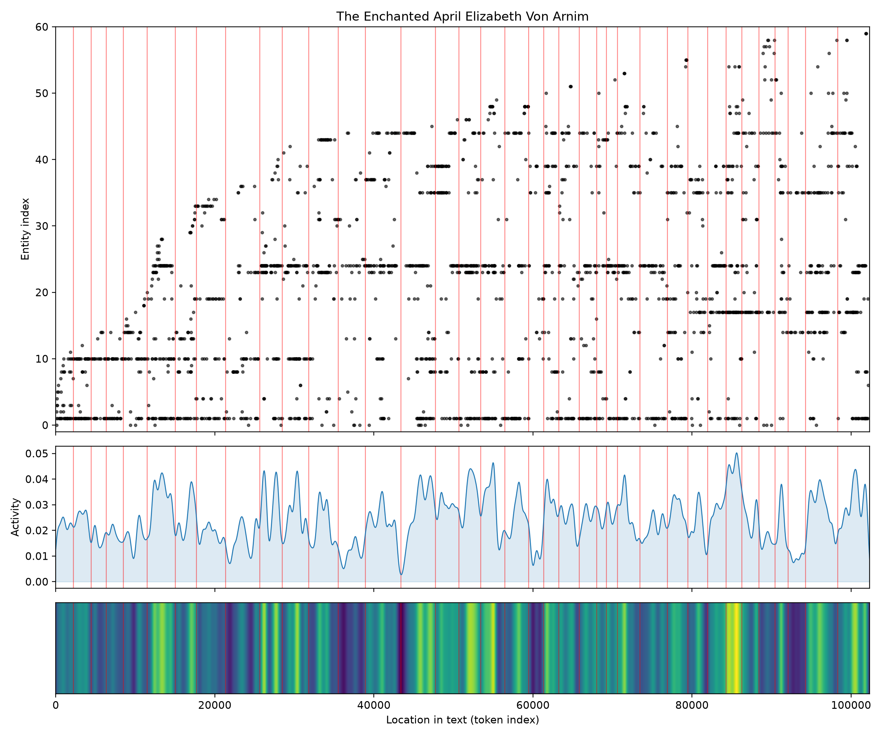

# The Enchanted April
### by Elizabeth von Arnim

80,189 words · a Rags to Riches arc — a grey London life carried, slowly, into sunlight

## The shape of the story

Elizabeth von Arnim's novel begins under a cold drizzle and ends in wisteria. Her arc rises the way a shy person warms in company: hesitantly at first, then with something close to disbelief. The earliest trough, near the seven-percent mark, is damp with "miserable, guilt, guilty, corrupt, irritated" — the very vocabulary of a woman who has been schooled to feel small in her own house. From there the mood lifts sharply to the first bright peak around the quarter-mark, where Italy announces itself in "wonderful, rejoicing, funny, heavenly, brilliant, exuberant" — the exact register of four women stepping onto a sun-warmed terrace and forgetting, for a breath, why they were unhappy.

The middle sags in two small dips. Around the one-third turn the prose grows testy with "damned, worse, hate, killing, ridiculous, lost", the sound of husbands and habits refusing to be left behind; the softer valley near the halfway point murmurs "bad, dreadful, die, miserable, hate, losing", a passing gloom as old resentments surface in the new light. But the last third climbs and keeps climbing. Twin late peaks near seven-eighths and just before the end shimmer with "thrilled, rejoiced, wonderful, love, best" and then "thrilled, wonderful, funny, fun, fantastic, miracle" — an ending that is not so much resolved as radiant.

<figure><figcaption>A cautious brightening, dipped twice by old griefs, then flooded with April.</figcaption></figure>

## Who lives on the page

The four women who rent San Salvatore are all here, ranked by how often their names catch the ear. Mrs. Wilkins (Lotty) leads by a wide margin, with Mrs. Fisher a close second — the elderly grande dame whose thaw is one of the book's quiet miracles. Mrs. Arbuthnot (Rose) and Lady Caroline Dester — nicknamed "Scrap" — round out the quartet, and Briggs, the owner of the castle, hovers at the edge like a boyish afterthought who becomes something more. The husbands trail behind: Mellersh Wilkins and Frederick Arbuthnot, present chiefly as problems to be softened.

San Salvatore itself earns a place among the presences, as does Italy, and the housekeeper Francesca and the manservant Domenico stand in for the whole warm chorus of the villa. A few labels are slightly off — "Francesca" is tagged as an organisation and "Domenico" as a place, small misreadings that only prove how thickly Italian the household hums.

<figure><figcaption>The London names arrive first; the Italian household blooms in from the middle onward.</figcaption></figure>

## The weave of scenes

The narrative flow reads like a long garland strung along a wire: thirty-seven scenes, four hundred and twenty-three connections between the people inside them, and almost no thinning at the edges. The opening scenes are sparse — four to seven figures at a time, the tight interiors of a Hampstead club and a rainy street. Then the scene-population swells and stays swelled: fourteen, sixteen, eighteen, twenty presences braided together as the villa fills with women, servants, husbands, and a suitor. The densest node sits around the two-thirds mark — the scene of twenty — which is exactly where the household reaches its full, tangled bloom and everyone is talking past and toward each other at once. The final scenes stay generous, closing not on a single face but on a room still full of people who have, somehow, learned to like being in the same room.

<figure><figcaption>A steady garland of company — the villa gathers, and refuses to empty.</figcaption></figure>

## What a reader takes away

The Enchanted April leaves you with the specific, physical memory of walls loosening. It is a book about how sunlight, wisteria, and other people's kindness can rearrange a life that had settled for less — and how the first thaw is always suspicious, then grateful, then unable to remember quite why it resisted. You close the book feeling lighter, a little sunburned, and quietly convinced that the right rented room in April could still do it.
