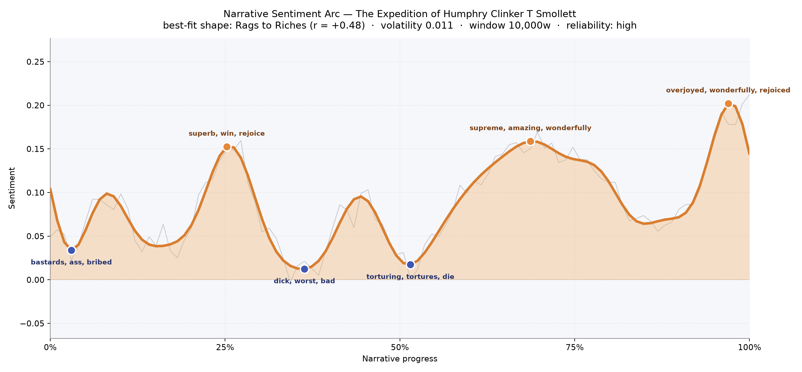
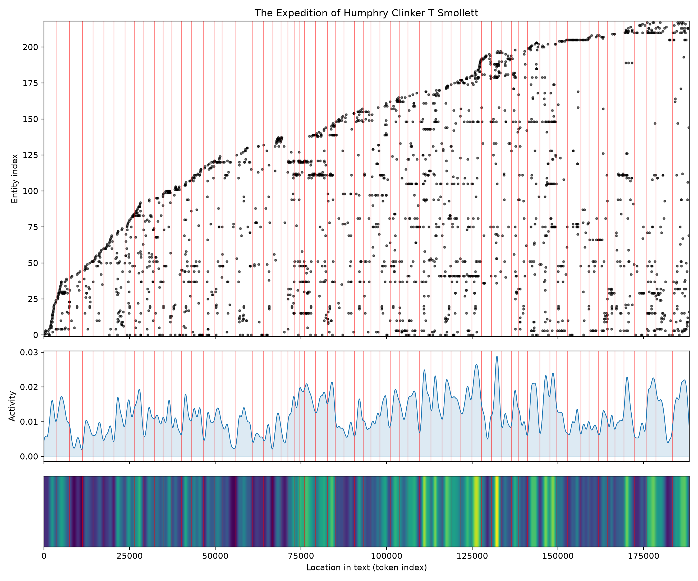

# The Expedition of Humphry Clinker
### by Tobias Smollett

152,277 words · a Rags to Riches arc — a peevish sea-sick company that ends warmed, matched, and reconciled.

## The shape of the story

Smollett's epistolary caravan begins in a puddle of complaint and ends, several hundred pages later, glowing with weddings and hearth-light. That is the felt truth of the arc: a story that grumbles its way into contentment. The opening dip, near the thirtieth reading minute, is thick with "bastards, ass, bribed, losing, despair, dreadful" — Matthew Bramble's gouty spleen, his purse under siege, the letters full of civic disgust. But by the quarter mark the mood lifts into "superb, win, rejoice, wonderful, rejoiced, affection" as the party rattles northward and finds, briefly, a friendlier England.

Two more troughs interrupt the climb. Around the middle third the prose curdles into "dick, worst, bad, foul, nasty, vomit" — Smollett the physician-satirist rolling up his sleeves at Bath's fetid waters and London's rank streets. Just past the halfway pole a bleaker valley bruises with "torturing, tortures, die, miserable, violent, dreadful", the caravan's crankiest hour. Yet the trajectory holds. The last third rises through "supreme, amazing, wonderfully, fantastic, best, great" and crests, almost at the final page, in a burst of "overjoyed, wonderfully, rejoiced, wonderful, win, affection" — the three couplings and the discovery of Humphry's true parentage. It is not a fairy tale so much as a slow convalescence: a party of hypochondriacs, spinsters and vagabonds who complain themselves into happiness.

<figure><figcaption>A grumble in the west, three warm summits east — the mood-line of a journey that ends better than it began.</figcaption></figure>

## Who lives on the page

The most named presence in the book is not a person at all but London, followed closely by England, Scotland and Edinburgh — the geography of the tour is almost its own character, and that feels right for a novel whose plot is a moving carriage. Among the human figures, Humphry Clinker himself is the frequent name, though the tool has miscategorised him as an organisation; the same slip catches Bramble, Lismahago and the Scots. Read past that quirk and the household stands clear: the vinegar-tongued Tabby (Tabitha Bramble), her brother Matt, the lovelorn Liddy, the mysterious Wilson who is not what he seems, the smooth Barton, and the wonderful Lieutenant Lismahago — Smollett's leather-skinned Scot, half scarecrow, half philosopher. Baynard, the ruined country gentleman, hovers at the edges as a cautionary shadow. The gathering is a small one, but every voice writes letters, and every letter has an axe to grind.

<figure><figcaption>New names accumulate steadily as the coach rolls north, then thicken again on the return — the map of a round trip.</figcaption></figure>

## The weave of scenes

Sixty-four scenes, more than a thousand connecting threads: the flow picture is a long dense braid, almost cigar-shaped, tapered at both ends and thickest through the middle. That matches the book's method. Each stop — Bath, London, Harrogate, Scarborough, Edinburgh, Glasgow, the Highlands, back through Wales — pulls in a fresh knot of innkeepers, cousins, quacks and duellists, and those knots overlap because the five letter-writers keep re-describing the same encounters from different angles. The tail scenes swell again as the reunions cluster: the final chapter alone touches forty-four named presences, the crowded wedding-parlour of the novel. Nothing here is parallel-threaded in the modern sense; it is one long communal correspondence, tightly plaited.

<figure><figcaption>A single fat braid of letters — thin at the departure, swollen at the homecoming.</figcaption></figure>

## What a reader takes away

Humphry Clinker leaves you convinced that grumbling is a form of love. Smollett gives us a coachful of the querulous and the ridiculous, drags them through spa towns and Highland mud, and delivers them, blinking, into a small domestic paradise. The lasting flavour is warm, tart, and unmistakably human — the taste of an eighteenth-century family finally, and against its own better judgement, at peace.
