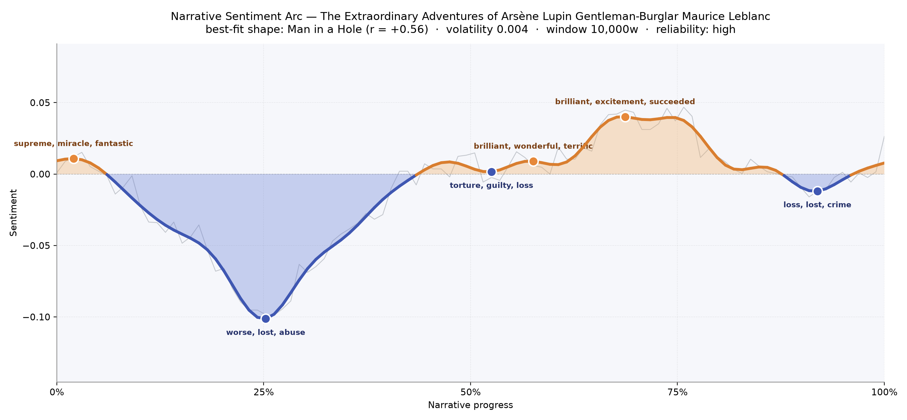
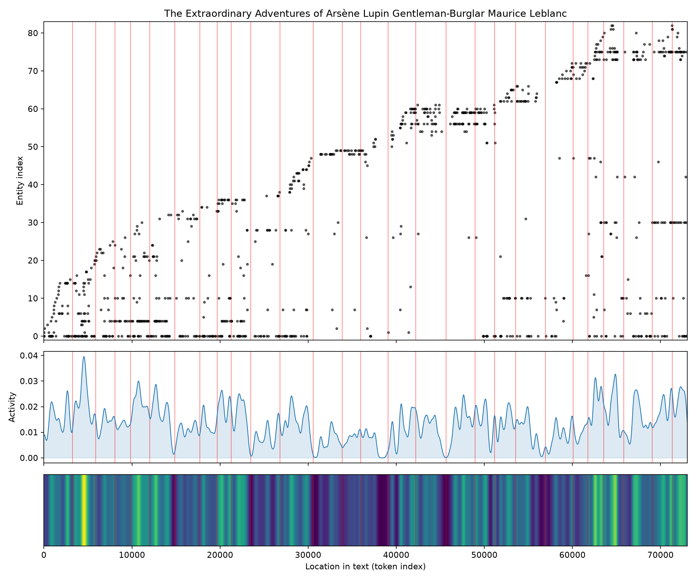
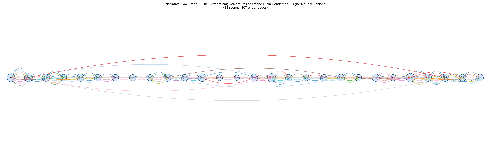

# The Extraordinary Adventures of Arsène Lupin, Gentleman-Burglar
### by Maurice Leblanc

54,578 words · a Man in a Hole arc — a bright start, a long fall into shadow, and a laughing climb back into the sun

## The shape of the story

Leblanc's Lupin cycle opens with the kind of glitter that only a truly cocky thief can command. The earliest peak sparkles with "supreme, miracle, fantastic, fabulous, funny, impressed" — the reader is being dazzled, and the book knows it. Lupin appears already a legend, and the prose refuses to pretend otherwise; it invites you to smirk along with him.

Then, roughly a quarter of the way through, the floor gives out. The deepest valley bruises with "worse, lost, abuse, violent, anger, worry" — a stretch where the game turns cruel, where the elegance of theft curdles into something like real harm. It is the longest, blackest dip in the arc, and it holds. A second, smaller trough near the middle carries "torture, guilty, loss, lost, died, crimes" — the moral weight of a man who steals for pleasure catching up with him, however briefly.

The climb back is where Leblanc shows his hand. Around the two-thirds mark the arc lifts into its highest peak, thick with "brilliant, excitement, succeeded, perfection, visionary, handsome" — Lupin triumphant, the trick pulled off, the applause almost audible. A last small dip near the ending, tinted with "loss, lost, crime, victim, anger, worst", lets the book close on a knowing shrug rather than a fanfare. This is the classic Man-in-a-Hole rhythm: fall, endure, rise — and Leblanc times it with a music-hall grace.

<figure><figcaption>The long shadow at 25% is the book's moral gutter; the sunlit ridge near 70% is Lupin taking his bow.</figcaption></figure>

## Who lives on the page

One name towers over the rest: Arsène Lupin, with more than two hundred mentions, and a further block of "Lupin" alone that pushes his presence past any rival. He is the sun this small solar system rotates around. Ganimard — the doggedly outfoxed inspector — is the second gravitational body, the straight man whose stubbornness gives Lupin his shape. Around them orbit the marks and foils of individual capers: Devanne of the château, the crooked Varin brothers, the banker Andermatt, and the impossibly polite intruder Sherlock Holmes, whom Leblanc famously borrowed for a duel of wits.

A few of the labels wobble — Andermatt, Velmont and Nelly are read as organisations rather than people, and Cahorn drifts toward being a place — but these are the honest fingerprints of a book stitched together from short stories, where names arrive without ceremony. Henriette, Louis Lacombe, Floriani, Imbert and the ever-present Paris round out the cast: victims, aliases, accomplices, and the city that swallows them all.

<figure><figcaption>New faces keep arriving to the very end — each caper drags in a fresh mark for Lupin to charm.</figcaption></figure>

## The weave of scenes

The narrative flow reads like a string of pearls with a few unusually fat beads. Twenty-eight scenes stretch left to right, and the density of connecting threads is heaviest around the middle and again near the final quarter — moments where old accomplices reappear, where a face from an earlier caper is unmasked, where Ganimard's name is invoked once more. The long red arcs that leap across the whole span are the book's private joke: Lupin is everywhere, tying the episodes together even when he is nowhere named. Some scenes carry twenty distinct presences (the crowded drawing-rooms, the courtroom, the country-house gathering); others thin down to three or four, tight two-handers between thief and pursuer. It is not a single tightening spiral so much as a suite of variations on a theme, each returning to the same charming ghost.

<figure><figcaption>Long crossing threads: characters and grudges that refuse to stay inside their own chapters.</figcaption></figure>

## What a reader takes away

You close the book grinning, but a little uneasy about the grin. Leblanc has taught you to root for a burglar, to admire a lie, to feel a small pang at the middle when the cost of Lupin's cleverness shows through — and then to be swept, willingly, back into the applause. What lingers is not any single theft but the shape of the man himself: light on his feet, generous to his equals, cruel only in miniature, and always, always laughing at the door as it clicks shut behind him.
