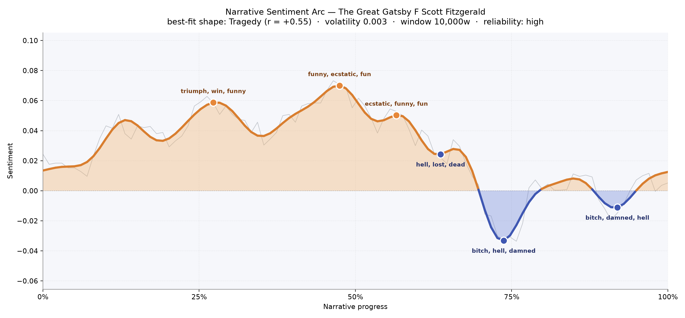
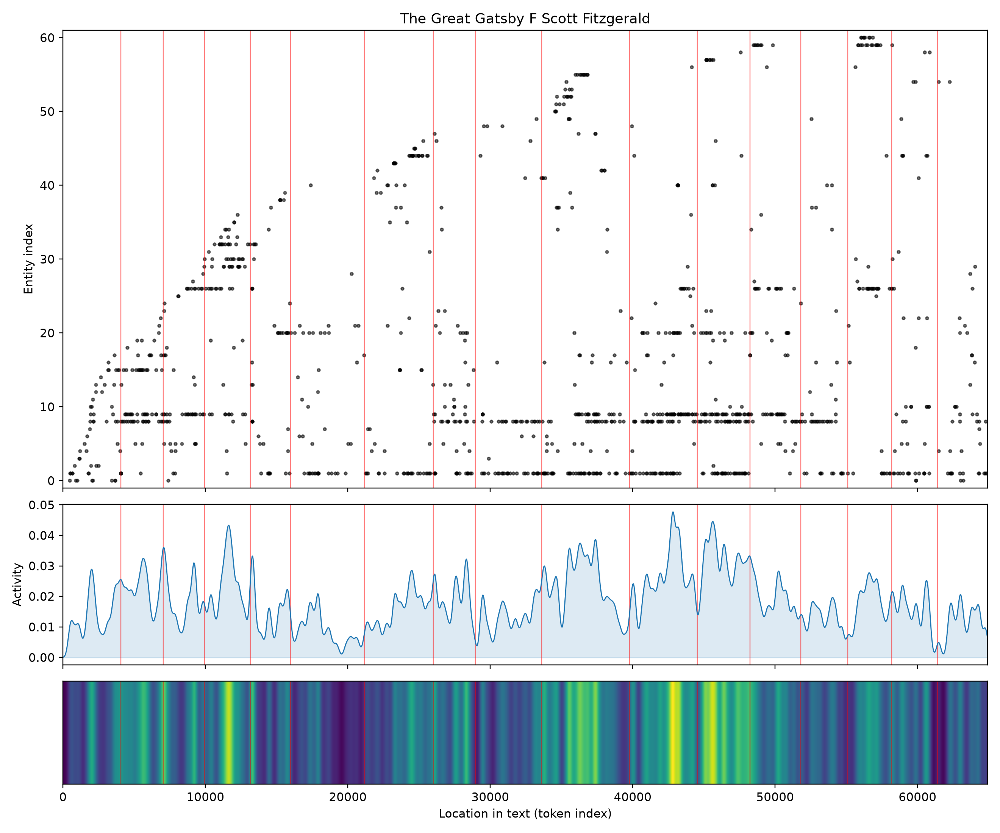
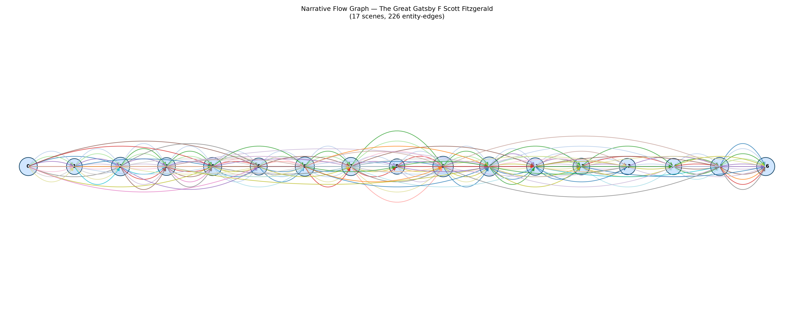

# The Great Gatsby
### by F. Scott Fitzgerald

about 49,970 words · a Tragedy arc — a summer buoyed by wonder before it drowns in what it always was

## The shape of the story

Fitzgerald's novel reads like a party you can hear from the road: bright at first, brighter still as you climb the lawn, and then, somewhere past midnight, gone quiet in a way that never quite comes back. The arc rises for the first half of the book, gathering heat around the middle where the language itself sparkles with "funny, ecstatic, fun, fantastic, nice, startling" — the vocabulary of a green light seen at close range, of a shirt tossed like a flag onto a bed. An earlier crest near the first quarter carries "triumph, win, funny, amazing, triumphant, fantastic": Gatsby staging himself, all his elaborate machinery running perfectly for one incandescent afternoon.

Then the fall. Just past the two-thirds mark the arc slides underwater, thick with "hell, lost, dead, hysterical, died, violence," and by the next dip the words sharpen into "bitch, hell, damned, awful, suck, lost" — the Plaza suite, the hot afternoon, the cracking of a voice full of money. The final valley closes the book with "bitch, damned, hell, dead, lost, died," a hush after gunfire. What the graph feels like, in reading, is the exact sensation of a dream being called by its right name.

<figure><figcaption>The summer glitters, then goes under: three bright crests before the pool closes over.</figcaption></figure>

## Who lives on the page

Gatsby dominates, of course — his name surfaces nearly two hundred and fifty times, more than Daisy and Tom put together, which is the arithmetic of obsession as much as of plot. Daisy and Tom orbit him closely and evenly, the triangle that gives the book its geometry. Around them cluster Jordan Baker (split by the sorting into a first name and a surname, but unmistakably one woman), Wolfshiem with his molar cufflinks, Michaelis at the garage, and Myrtle, whose sixteen mentions carry a weight far beyond their count. Nick, the narrator, appears comparatively little by name — the mark of a voice that watches rather than announces itself.

The places show up as presences too: New York, West Egg, Chicago. They aren't scenery so much as verdicts — old money east, new money west, the valley of ashes lying flat between them. A couple of labels (Jordan tagged as a place, Wilson tagged as an organization) are honest mis-hearings by the sorting; treat them as people and the cast list reads true.

<figure><figcaption>Names cluster and thin like guests arriving and leaving a party that lasts one summer.</figcaption></figure>

## The weave of scenes

Seventeen scenes, threaded by more than two hundred connections — a small book, densely braided. The flow graph shows nearly every character reappearing in nearly every room; the scenes at the middle bulge with names, as if the novel itself were crowding into the Plaza suite. The threads lean and loop, carrying Gatsby and Daisy back across intervening chapters the way memory does, insisting on a face from three parties ago. Toward the very end the strands narrow, the cast falls away, and only a few reach the last scene — the funeral almost no one attends. It looks, on the page, exactly like it feels: a crowded life ending in a nearly empty room.

<figure><figcaption>A braided middle, a lonely tail — the arithmetic of a funeral no one comes to.</figcaption></figure>

## What a reader takes away

What stays is the peculiar Fitzgerald ache: the sense that the brightest hours in a life were also, secretly, the ones already tilting toward loss. The book gives you a summer of white dresses and yellow cars and lets you believe, for a hundred pages, that longing might be enough. Then it teaches you, gently and without cruelty, that it isn't. You close the book carrying a small green light in your chest, and the knowledge that borne back ceaselessly is not a metaphor but a weather.
