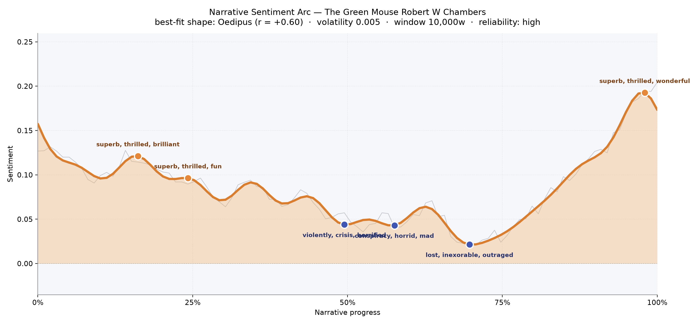
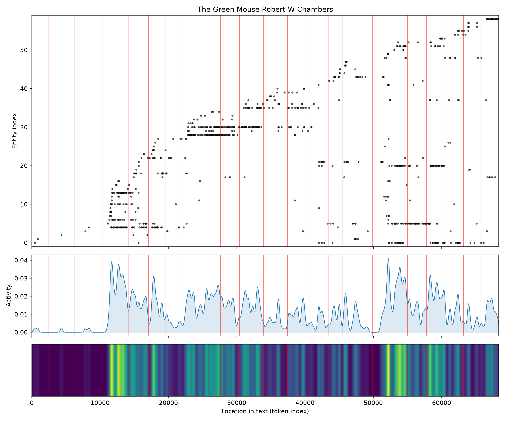

# The Green Mouse
### by Robert W. Chambers

48,843 words · an Oedipus arc — a bright life pulled downward before an unexpected rescue at the very end

## The shape of the story

Chambers opens with a grin. Within the first quarter the mood is high and giddy, the language of the early peaks glittering with "superb, thrilled, brilliant, fun, funny, winning" — the sound of drawing rooms where cleverness has not yet been made to pay for itself. Then, imperceptibly at first and then plainly, the barometer falls. Somewhere near the midpoint the story tightens into its worried middle, a valley that bruises with "violently, crisis, horrified, losing, maddening, worry", and the trouble deepens as it goes: a second dip broods with "conspiracy, horrid, mad, disgusted, awful, destroy", and the lowest hollow, roughly two-thirds through, is heavy with "lost, inexorable, outraged, dying, misleading, died". This is the felt shape of an Oedipus turn — a life lifted only to be undone — but Chambers, incorrigible entertainer that he is, does not leave his people in the pit. In the final tenth, the arc climbs sharply and finishes brighter than it began, in a rush of "superb, thrilled, wonderful, amazing, brilliant, heavenly". You close the book with the surprise of a comic novelist who allowed himself to flirt with catastrophe, then reached in and rescued everyone in time for the last waltz.

<figure><figcaption>A long, cheerful decline into a two-thirds-mark trough, then a vertical dash toward a heavenly finish.</figcaption></figure>

## Who lives on the page

The names that recur most often are Brown, Carr, Smith, and a small constellation of splendidly Chambers-esque women — Sacharissa, Flavilla, Drusilla, Linda — with Clarence, Ferdinand, George, William, and Yates threading between them. The presence of "chambers" among the frequent names is the author's own surname bleeding through the frontmatter, and "destyn" is really the family name Destyn, a nucleus of the romance rather than an organization; the sorter's label should be forgiven. Oyster Bay is the single place-name that surfaces with any weight, quietly locating the antics on the north shore of Long Island, in the summer world of yachts and verandas that Chambers loved to write. What the roster tells you is that this is an ensemble comedy of pairings: several young women, several young men, a scientist-inventor at the center, and a whirl of near-misses. No one figure crushes the others in mentions, which is exactly right for a novel whose engine is the crossing of couples.

<figure><figcaption>A cast that arrives in bright waves — quiet opening, a first surge near the ten-thousand-word mark, another around fifty-two thousand.</figcaption></figure>

## The weave of scenes

The scene chart reads like a musical score with a long, deliberate rest at either end. Chambers spends the first two or three scenes almost alone with one presence — the eccentric inventor, presumably — before the population explodes: a scene mid-first-act carries nineteen distinct figures at once, and a later scene near the climax hoists twenty-one, the busiest room in the book. Between these two crowded set-pieces the story runs in leaner passages of six to ten figures, the kind of chapters where two people talk in a garden and a third overhears. The long arcs sweeping between distant scenes on the flow picture are the returning presences — the same lovers reappearing, the same schemers rebooked — braiding a plot that is less linear than reunited. The thin tail at the end is the coda: characters peel off, the cast contracts, and the last scenes settle to six or eight figures, the number you need for a wedding photograph.

<figure><figcaption>Two crowded knots — one early, one late — joined by long returning arcs, then a quiet decrescendo.</figcaption></figure>

## What a reader takes away

The Green Mouse is a comedy that lets itself feel real distress before it laughs. Its shape teaches something about Chambers's charm: he is willing to march his lovers into genuine misery — conspiracy, dying, lost — because he trusts the last chapter to redeem them in a burst of heavenly light. The book leaves you buoyant, but with the memory of the middle still in the room, the way a summer evening remembers its afternoon storm.
