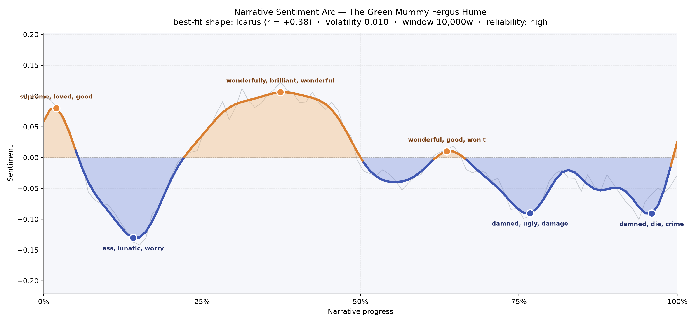
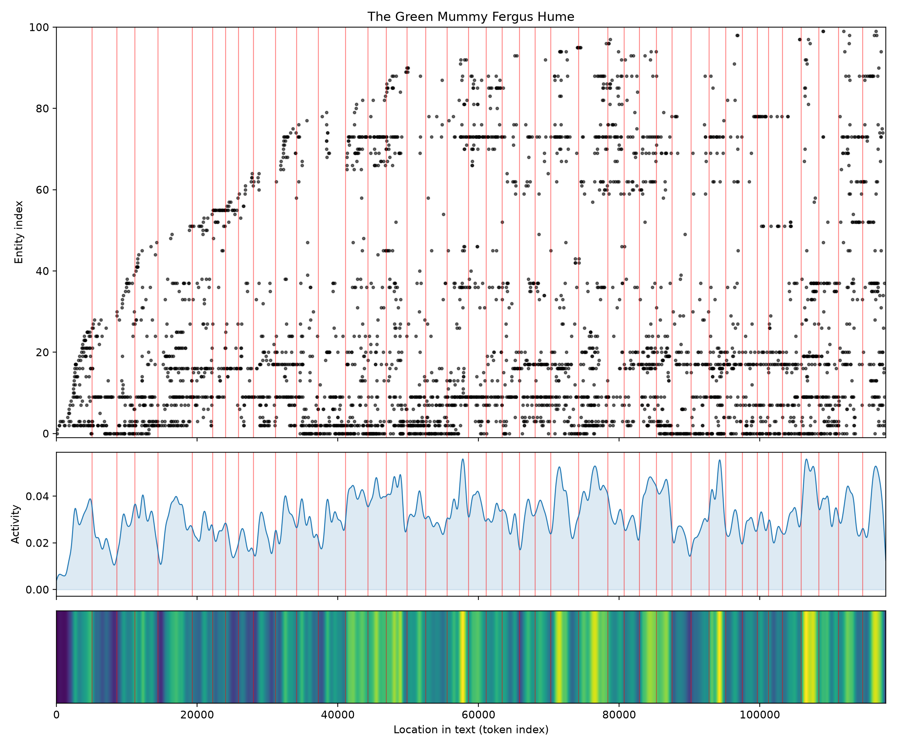
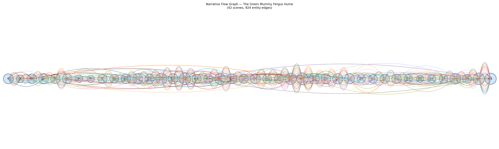

# The Green Mummy
### by Fergus Hume

88,822 words · an Icarus arc — flight in the first half, a long slow scorching descent through the second

## The shape of the story

Hume's mystery opens in something like sunlight. The earliest pages glimmer with "supreme, loved, good, glad", the kind of soft domestic warmth that settles a reader into a chair. Then, almost at once, the floor drops. Roughly a seventh of the way in, the mood curdles into the book's first bruise — a valley thick with "ass, lunatic, worry, worried, furious, lost" — as if a household argument spilled onto the page and refused to be tidied. The story climbs out of that pit and reaches its brightest ridge near the one-third mark, brimming with "wonderfully, brilliant, wonderful, good, admires, love": courtship, praise, the giddy middle of an Edwardian romance where the puzzle still feels like a game.

After that peak, the arc behaves like a man who has flown too near his own cleverness. The second half is a long, uneven fall. A late-middle plateau still murmurs "wonderful, good, joy, beauty, glad", but the smoothing barely lifts above zero — hope grown thin. From there the descent hardens. Around the three-quarter mark the tone darkens into "damned, ugly, damage, angry, liar, madness", and by the final tenth the book closes in a hush of "damned, die, crime, worse, killed, dying". This is the Icarus signature — brightness earned, then spent — and Hume trusts it enough to leave the last page cool rather than triumphant. The line is smooth and its reliability is high; the descent is not a jitter, it is a considered burn.

<figure><figcaption>A bright climb to a brilliant middle, then a widening shadow toward the crime.</figcaption></figure>

## Who lives on the page

The novel's gravity centres on Professor Braddock, the mummy-hungry Egyptologist, whose name dominates the roll call with 434 mentions — his obsession is quite literally the book's most-spoken word. Circling him are Hope, the young lover, and Lucy, the daughter caught between father and suitor; between them the marriage plot breathes. Then comes the sinuous Hiram Jasher, the smuggler-adventurer whose 393 mentions make him nearly Braddock's equal in narrative weight — a rival gravity of appetite and cunning. Sir Random, Bolton, Frank, Sidney and the Peruvian nobleman Don Pedro de Gayangos, along with his daughter Donna Inez, fill out the ensemble.

A few labels wobble at the edges. "Archie" is filed as an organisation and "Cockatoo" and "Hervey" drift into place-name territory, when in truth Cockatoo is Don Pedro's Kanaka servant and Hervey a ship's captain — small misreadings by the tagger, not by the book. The word "mummy" itself sits in the character list at fifty-nine mentions, which is exactly right: the corpse of Inca Caxas is treated as a personage, spoken to and about, coveted like a lover.

<figure><figcaption>Presences accumulating steadily through the first third, then a busy, populated middle and end.</figcaption></figure>

## The weave of scenes

Across forty-two scenes and nearly a thousand connecting threads, the narrative reads like a wide, gently swelling river with two brighter eddies at either bank. Early chapters carry mid-sized casts of twenty-odd figures — enough to sketch a village, not enough to crowd it. The middle stretches (scenes fourteen through twenty-six) fatten to thirty-six, thirty-seven, thirty-eight presences per scene as suspects, servants, sailors and travellers pour in around the stolen mummy. A quieter passage follows near the three-quarter mark, where scenes thirty-five and thirty-six drop to fifteen and nine — an intimate hush before the reveal. Then the finale swells again to thirty-nine and thirty-six: the parlour scene, the confession, the ring of witnesses. The braid is classic detective architecture — introduce, entangle, isolate, gather, resolve — and Hume plays it with a craftsman's confidence.

<figure><figcaption>A long chain of overlapping loops — the ensemble knot of a proper drawing-room mystery.</figcaption></figure>

## What a reader takes away

The Green Mummy leaves the taste of a warm evening that cooled slowly into something graver. Hume gives you flirtation, fussy scholarship and a green-wrapped corpse, then lets greed do its patient work until the book's last breath is spent on crime and dying. You close it not shaken but sobered — reminded that curiosity, when it forgets its manners, can bury more than it unearths.
