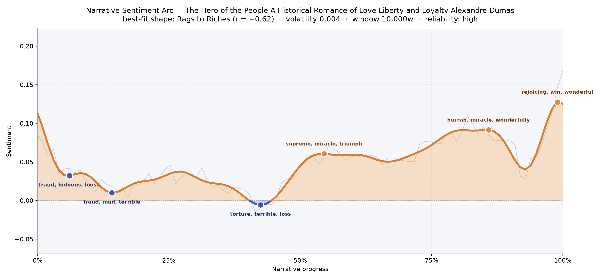
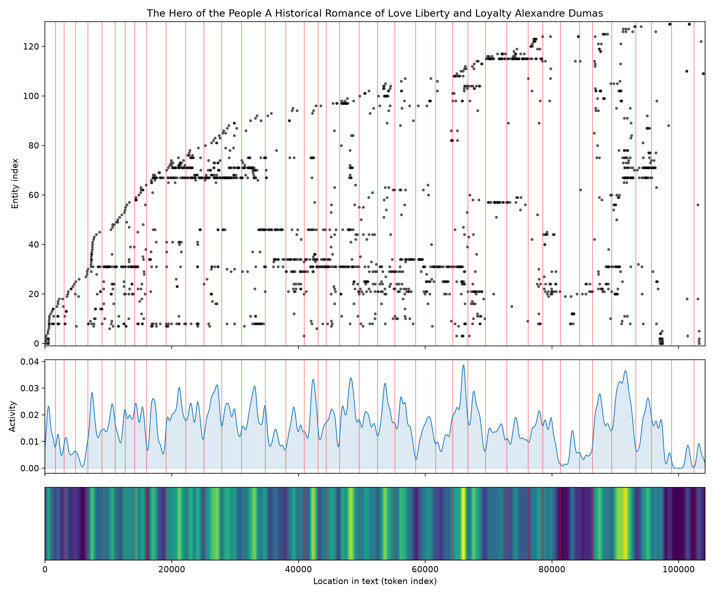
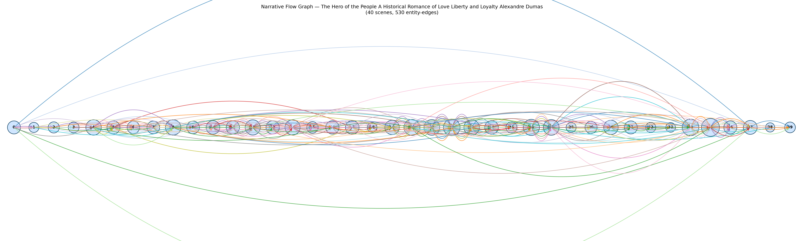

# The Hero of the People: A Historical Romance of Love, Liberty and Loyalty
### by Alexandre Dumas

roughly 80,000 words · a Rags to Riches arc — a story that begins in dread and climbs, unevenly but insistently, into cheer

## The shape of the story

Dumas begins in shadow. The opening chapters press the reader down into a chill that reeks of "fraud, hideous, loose, lost, killed, scum" — an overture of executions, betrayals, and the sour smell of a country that has stopped trusting itself. That first hollow is almost immediately deepened by a second, thick with "fraud, mad, terrible, dreadful, evil, dead", as though the novel wants to be certain we understand the weight of the thing before it lets anyone smile.

The lowest point comes near the two-fifths mark, and it hurts differently: quieter, more private, bruised by "torture, terrible, loss, died, die, desperate". This is not the panic of a crowd but the ache of a person losing what they love. From that trench the line begins its long climb. A first plateau of relief around the middle glows with "supreme, miracle, triumph, great, faithful, popularity" — a public vindication, the Revolution's giddy delusion that history has finally taken its side. The book crescendos twice more, at four-fifths with "hurrah, miracle, wonderfully, fun, supreme, good", and again at the very last page with "rejoicing, win, wonderful, fun, funny, admire". The arc closes almost brashly upward, like curtains flung open on a room we had thought was a tomb.

It is the felt experience of a Rags to Riches climb — not sudden, not clean, but stubborn. A reader leaves the book warmer than they entered it, and slightly suspicious of that warmth.

<figure><figcaption>Two early troughs of dread, a private valley near the middle, then a long staircase up into public rejoicing.</figcaption></figure>

## Who lives on the page

Gilbert dominates — the doctor-philosopher, moral compass, and Dumas's stand-in for reasoned Revolutionary conscience. He appears more than any other figure, a steady presence around whom the storm turns. Close behind him is Pitou, the tender country boy whose name the analysis mistakes for a place; he is unmistakably a person, and one of the novel's warmest hearts. Catherine, his beloved, gives the book its ache; Andrea and Sebastian carry its secrets across generations.

Then the crowned figures step forward — "Majesty", the King, the Queen — three faces of the same anxious throne, alongside the historical Mirabeau, whose great booming presence marks the political scenes. Charny (again read as a place, though he is very much a man, the Queen's loyal officer) and the swindler Beausire round out the human weave. Paris and France are the true locations, and they behave like characters too: crowds that argue, breathe, decide. Isidore and Nicole flicker at the edges, siblings and servants who tie the country plot to the palace one.

<figure><figcaption>A dense stream of returning names — Gilbert, Pitou, Catherine — with new faces steadily joining as the Revolution swells.</figcaption></figure>

## The weave of scenes

Read as a visual score, the scene weave is a broad, busy river. Forty scenes stretch across the page, and the strands between them arc in high, generous curves — five hundred and thirty threads of shared presence, meaning characters keep reappearing, keep re-entering each other's orbits. The middle of the book is where the braid tightens: scenes 20 through 28 pull the largest casts together, sometimes twenty-five or twenty-nine figures at once, a genuine crowd on the page. Scene 36, near the celebratory upswing, is the fullest of all with thirty-five presences — a set-piece Dumas clearly staged for maximum voltage.

The edges are thinner. Early scenes hold six or eight figures; late ones taper to four and eight, as though the novel exhales after its great gathering. Long low-hanging arcs sweep from the first pages to the last — the same names surviving the whole ride. It reads less like parallel threads and more like a spreading and re-gathering, a country crowd swelling into a national one and then dispersing.

<figure><figcaption>Scenes braided by returning figures; the densest knot sits just before the final rejoicing.</figcaption></figure>

## What a reader takes away

You close the book with the strange double taste Dumas so loves: joy earned by grief, and grief that refuses to be entirely rinsed away by joy. The Revolution roars, the heroes are cheered, the lovers counted — yet the early cries of "killed" and "terrible" still ring under the hurrahs. It is a novel about a people learning to hope, and about the private hearts that pay for that public hope. The warmth at the end is real. So is the shadow it walks out of.
