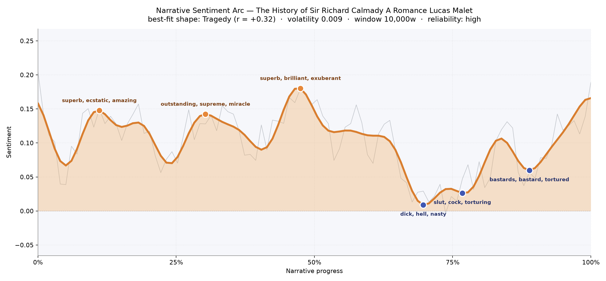
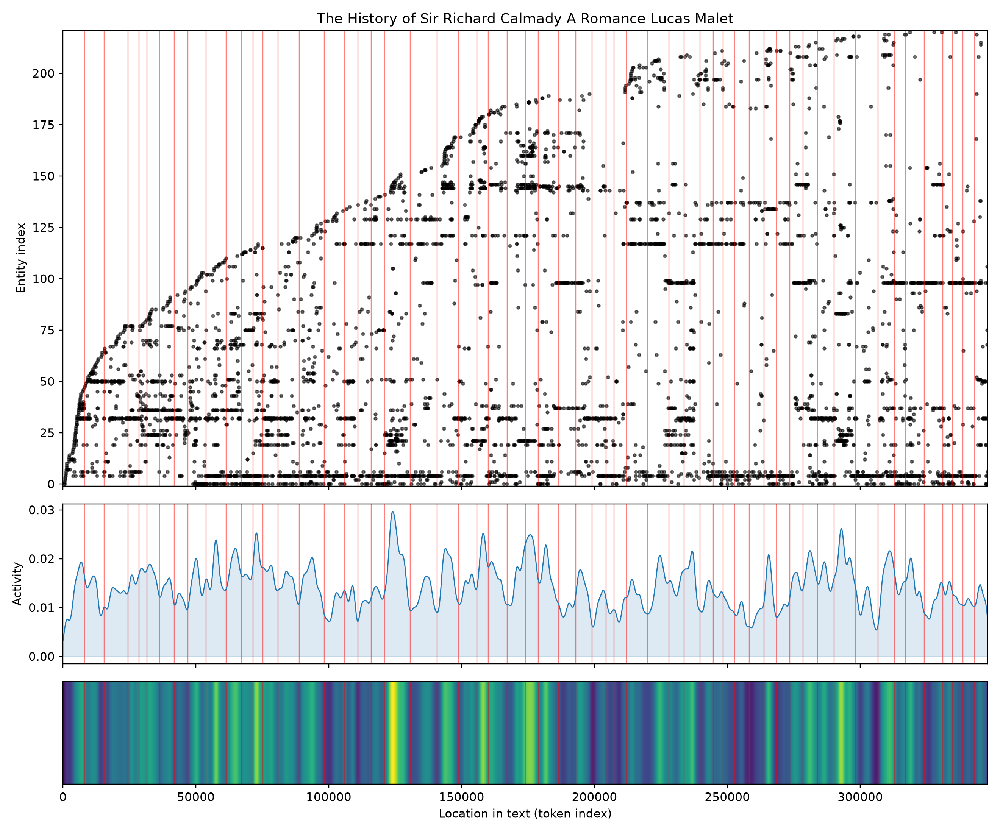
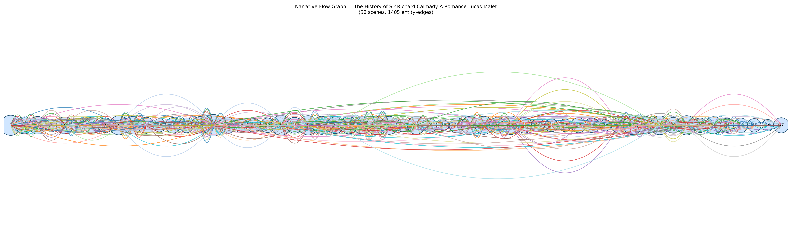

# The History of Sir Richard Calmady: A Romance
### by Lucas Malet

roughly 267,000 words — a Tragedy arc, a life gilded early and darkened by degrees

## The shape of the story

Lucas Malet's long, plush novel opens in radiance and closes in the ashes of that radiance, and the sentiment line traces the descent with an almost cruel patience. For the first half the mood keeps climbing back toward light — the early crest near the eleventh percentile shimmers with "superb, ecstatic, amazing, fantastic, heavenly, rejoiced", a nursery-and-hearth luminosity around Brockhurst and the young heir's charmed childhood. A second summit near the third mark hums with "outstanding, supreme, miracle, masterpiece, triumphant, lovely", the tone of a boy told he is destined for greatness. The highest peak sits just before the midpoint, thick with "superb, brilliant, exuberant, amazing, rejoiced, heavenly" — Richard in his prime seasons, adored, courted, gilded.

Then the floor drops. Around the seventieth percentile the trough bruises with "hell, nasty, awful, ugliness, kill"; a little further on the line sinks again into "slut, cock, torturing, tortured, madness, disgust"; and near the ninth-tenth mark the last valley shudders with "bastards, bastard, tortured, hell, violence". This is not a stumble but a considered fall — the arc of a life lifted high so that the fall might carry meaning. A high-confidence reading in a book this long makes the shape feel definitive rather than impressionistic: sunlight, sunlight, sunlight, and then the long dusk.

<figure><figcaption>Three luminous crests, then a patient descent into the novel's darker third.</figcaption></figure>

## Who lives on the page

Richard towers over every page — his name appears more than seven hundred times, and the diminutive "Dickie" trails him like a childhood shadow, with "Calmady" and "Richard Calmady" thickening the count further. He is the sun this book orbits. Around him, Katherine — his mother — is the second great presence, her devotion and grief scored across the whole length of the story. Honoria, Helen, and Julius form the next tier: intimates, foils, temptations. Ormiston, Fallowfeild, Knott, Louisa, Quayle and the de Vallorbes fill in the wider drawing-room world of country houses, London seasons, and Continental exile. A couple of these are mis-tagged as places — "Honoria" and "Helen" are, of course, women, not towns, and "St. Quentin" here is a titled character rather than a French city — a gentle slip worth naming.

<figure><figcaption>Richard's name saturates every band; new figures accumulate as the world widens.</figcaption></figure>

## The weave of scenes

Fifty-eight scenes, laced together by more than fourteen hundred shared-figure threads — the weave graph looks like a long braided river, wide in the middle and tapering at both ends. The opening panels are dense with the household at Brockhurst; a striking swell around the sixteenth scene (the fullest cast in the book) marks a great gathering, all the country-house society converging on the young baronet. The middle stretches carry parallel threads — London, Paris, the spa towns — as Richard's world enlarges and complicates. Toward the close the strands thin and simplify, arcs falling away one by one, until only a small chamber of figures remains around him. It is the visual signature of a life that gathers company and then, slowly, releases it.

<figure><figcaption>A braided middle, thinning at the edges — company gathered, then let go.</figcaption></figure>

## What a reader takes away

What Malet leaves in the hand is the ache of a golden boy taught, over hundreds of pages, the shape of his own limits. The pleasures of the first half are real — the reader is not tricked into loving Richard, only invited — and that is what makes the later chapters bite. You close the book with the taste of both: the hush of a great house at dawn, and the harder hush that comes after.
