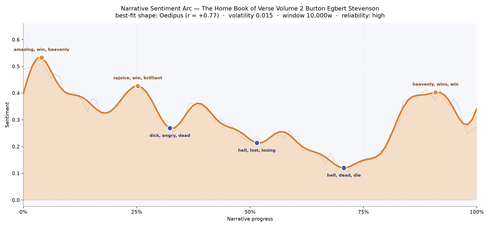
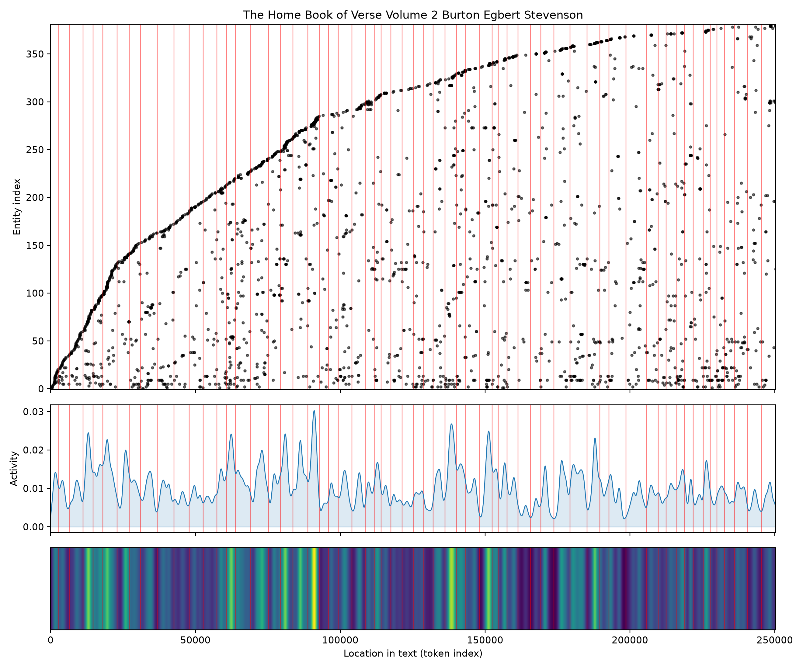
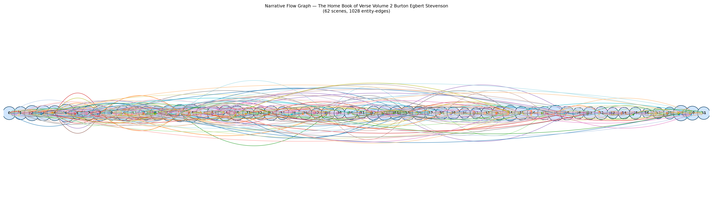

# The Home Book of Verse, Volume 2
### edited by Burton Egbert Stevenson

178,790 words · an Oedipus arc — a company of songs lifted into brightness only to be slowly, tenderly undone

## The shape of the story

This is an anthology, not a single narrative, and yet when you set its poems end-to-end and listen to their emotional weather, the collection breathes with a startlingly coherent curve. The opening reels are giddy — the very first crest bursts with "amazing, win, heavenly, triumph, rejoice, winning," the sound of wedding bells and coronations and the sun still low over a green world. A second, smaller high near the quarter-mark keeps the mood aloft with "rejoice, win, brilliant, love, pleasure, beauty": love poems in full sail, the reader borne along on courtship and celebration.

Then the ground begins to tilt. Around a third of the way in, the arc dips into its first shadow — a trough thick with "dick, angry, dead, die, plagued, plagues" — and though it climbs briefly, each rally is a little lower than the last. By the middle the mood has fallen further, coloured by "hell, lost, losing, died, dead, loose"; by the two-thirds mark it hits its floor, the deepest bruise of the whole book, weighted with "hell, dead, die, betrayed, cruelty, dying." A late peak near the ninetieth percentile lifts the reader once more into "heavenly, wins, win, wonderful, triumph, glad" — a benediction — before the final pages drift down again into resignation. It is, in the felt sense, an Oedipus shape: a life raised into glory only to be worn away, so that even the brightness at the end carries the memory of everything lost. That the best-fit shape lands so cleanly, with the arc's small overall wobble, gives the reading a rare confidence — this is not an accident of a short book, it is the anthology's honest emotional signature.

<figure><figcaption>The volume climbs early into triumph, then subsides through three deepening sorrows before a late, hard-won gleam.</figcaption></figure>

## Who lives on the page

Because this is verse rather than novel, the "characters" the reader meets are strange and lovely: the most frequent presence is not a person at all but the archaic address "thou," followed by "shall," "song," and "sweet" — the vocabulary of invocation, the tools of the singer. Real figures do surface amid the incantation: Mary walks through many of these pages, sometimes the Virgin, sometimes a beloved; Robert Browning appears often enough to be a landmark, both as poet and as presence; Venus presides over the love-poems, and Death, personified and capital-lettered, is unmistakably one of the book's leading players. "Beata Mea Domina" — the refrain of Morris's famous lyric — recurs so often it registers as a character in itself. A few of the top entries ("nay," "ye," "la") are simply the residue of Elizabethan and pastoral diction, and an Irish note flickers through, hinting at the ballad section. The tally, in short, is less a cast list than a chorus: pronouns of address, allegories, and a few beloved names threading through.

<figure><figcaption>New voices keep entering as the pages turn — an ever-widening chorus, with recurring flares of activity where the anthologist gathers themed clusters.</figcaption></figure>

## The weave of scenes

Seen as a woven score, the sixty-two sections of this book behave exactly as an anthology should: dense at the front, where the editor's opening bouquets crowd together with forty and forty-five distinct presences per section, and lighter toward the back, where slimmer clusters of a dozen or so poems stand apart. The threading is unusually generous — over a thousand cross-connections carry names, refrains, and moods from one section to another, so that Mary in an early love-song sends a filament forward to a later elegy, and Death, arriving mid-way, casts long lines both backward and ahead. There is no single climactic knot, only a long, braided river of poems in continuous conversation with themselves.

<figure><figcaption>Sixty-two poem-clusters, laced by more than a thousand shared presences — an anthology that quietly rhymes with itself.</figcaption></figure>

## What a reader takes away

You close this volume as you close a hymnbook after a long service: filled with brightness at first, then gradually acquainted with grief, then lifted once more, gently, before the final quiet. What lingers is not a plot but a temperament — a Victorian conviction that song can hold both triumph and mortality in the same breath, and that the human answer to sorrow is, still and always, to sing.
