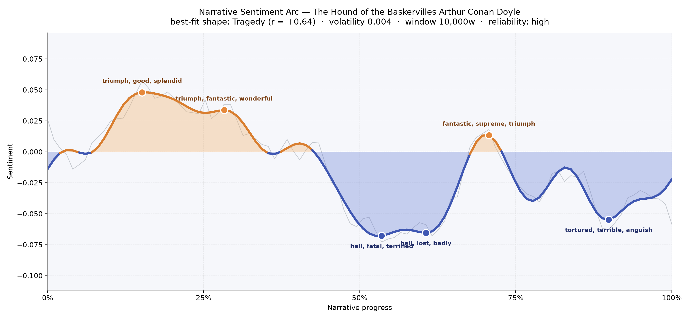
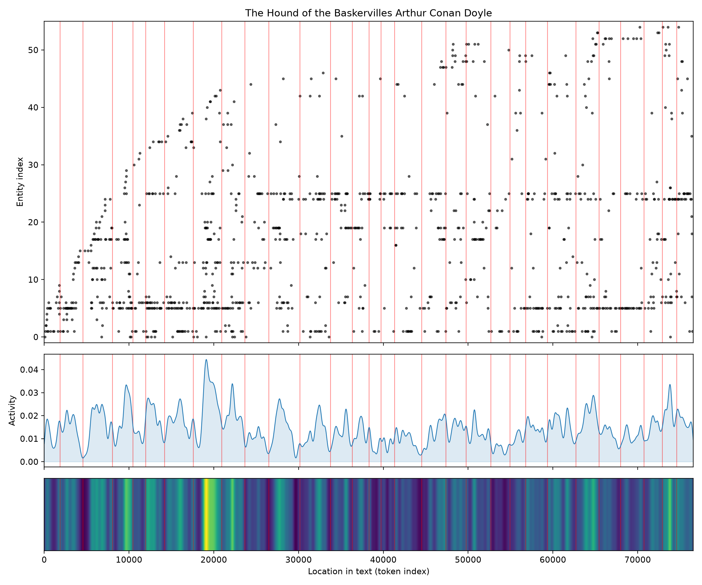

# The Hound of the Baskervilles
### by Arthur Conan Doyle

about 60,000 words, thirty scenes on the moor — a Tragedy arc, the shape of a bright morning turning slowly cold.

## The shape of the story

Doyle's most famous mystery opens in daylight and closes in fog, and the arc of feeling across it moves exactly that way. Early on, the mood lifts into an almost drawing-room brightness — the first crest at roughly the fifteen-percent mark hums with "triumph, good, splendid, glad, delightful, pleasure", the tone of Holmes reading a walking-stick and Watson delighting in his own cleverness. A second, softer crest around the quarter-mile spike glows again with "triumph, fantastic, wonderful, pleasant, great, best": the promise of Baskerville Hall, the excitement of a new client, the pleasure of a case that seems, for the moment, more curiosity than horror.

Then the ground gives way. Once the story leaves London for Dartmoor, the sentiment drops steadily and does not fully return. The deep central trough, near the halfway mark, is thick with "hell, fatal, terrified, lost, died, crime" — the escaped convict, the terror of Selden on the moor, Sir Charles' death rehearsed and re-rehearsed in Watson's mind. The next valley, only a little further on, bruises with "hell, lost, badly, losing, terrible, selfish": Barrymore's candle at the window, Mrs. Stapleton's ruined marriage, a household coming apart. There is one last brief lift near the two-thirds mark — a flash of "fantastic, supreme, triumph, good, best, great" as Holmes reveals himself alive in the stone hut — but the arc's final quarter sinks again, closing on "tortured, terrible, anguish, agonised, despairing, worst": the night of the hound, the bog swallowing Stapleton, the exhausted quiet after. It is a Tragedy in shape if not in verdict — the mystery is solved, yet the feeling the book leaves is not victory but exhaustion.

<figure><figcaption>A cheerful London opening slides into a long moor-darkness; the small late crest is Holmes' reappearance, not a rescue.</figcaption></figure>

## Who lives on the page

The census of names is exactly the one a reader would expect. Holmes towers over everyone with more mentions than any other figure, though — and this is the novel's quiet trick — he is often absent from the page, evoked more than present. Beside him come Sir Henry, Watson, Dr. Mortimer, and Stapleton, the naturalist whose butterfly-net turns out to hold something crueller. Charles Baskerville and Barrymore, the doomed uncle and the watchful butler, round out the inner circle. London appears as a background presence, and the moor itself — Baskerville Hall, Coombe Tracey, England — reads less as scenery than as a cast of places with their own weather and will. A few entries are simply the machinery of the book (a stray "I." from a chapter heading, "baskerville hall" catalogued as a person), and the way the name Baskerville recurs — as Sir Henry, as Sir Charles, as the Hall — shows how completely the family swallows the story.

<figure><figcaption>A dense London opening, a lull as Watson travels alone, then a long busy plateau on the moor.</figcaption></figure>

## The weave of scenes

Read as a score, the thirty scenes braid tightly at either end and loosen in the middle. The first stretch is crowded — Baker Street, the client, the will, the servants — with scenes carrying ten to twenty-five named presences apiece. Then, as Watson takes over the narration from the moor, the strands thin: two scenes near the middle drop to just four or five figures, the loneliness of a man writing letters into silence. The threads gather again for the climax, where the scene-graph crosses itself in long looping arcs — old characters returning, Holmes and Stapleton and Sir Henry pulled onto the same page — before the final scenes taper into the quieter accounting of the aftermath. It is the visual shape of a detective story: a wide opening, a narrow solitary middle, a knotted end.

<figure><figcaption>Long arcs across the middle carry London names back onto the moor for the reckoning.</figcaption></figure>

## What a reader takes away

What lingers is not the puzzle but the atmosphere — the sense that even a solved mystery leaves a stain. The hound is explained; the fear it stood for is not. You close the book warmer to Watson, quietly awed by Holmes, and a little reluctant to walk home in the dark.
