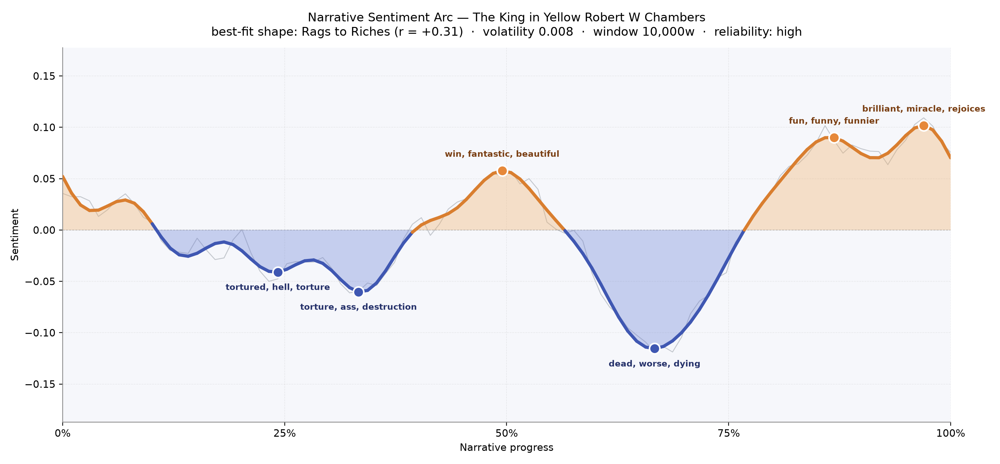
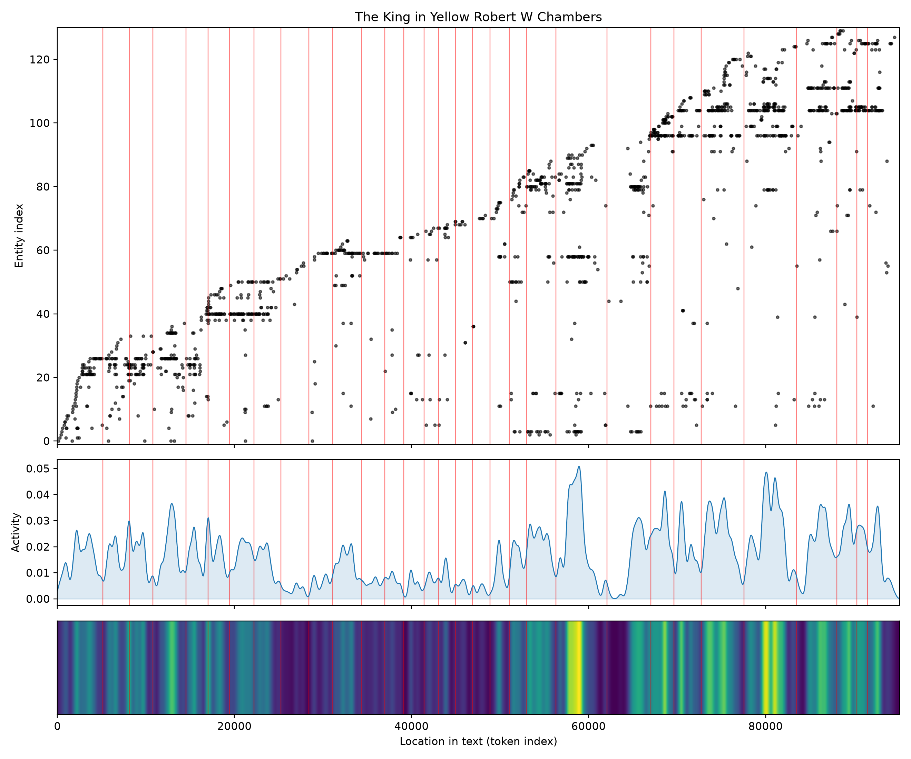
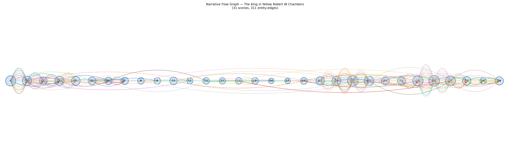

# The King in Yellow
### by Robert W. Chambers

73,084 words · a Rags to Riches arc — a story that wades through dread before rising into strange, giddy light

## The shape of the story

Chambers' book is famous for the shiver it leaves on the neck, and its emotional line matches that reputation only in the first two-thirds; the last third does something almost mischievous. The arc opens in a fragile calm, sinks steadily into two shallow troughs of dread near the quarter and third marks — passages weighted with "tortured, hell, torture, die, angry, hated" and then heavier still with "torture, ass, destruction, hatred, loose, evil" — and after a brief midway lift where a chapter breathes with "win, fantastic, beautiful, amusement, pleasant, good", the story plunges into its deepest cavern at the two-thirds mark, a valley bruised by "dead, worse, dying, warning, furious, worried". That is the Chambers most anthologies quote from: the pallid mask, the yellow sign, the sense that something has been read that cannot be unread.

And then, remarkably, the book climbs. The final quarter tilts upward into two consecutive peaks — one flushed with "fun, funny, funnier, brilliant, miracle, rejoices", the next brighter still with "brilliant, miracle, rejoices, triumphant, winner, glee". This is the ballroom-and-studio Paris of the later stories, the lovers reunited, the American painters trading jokes on the Seine. The rise-and-fall is real; the book only reads as pure horror if you stop halfway.

<figure><figcaption>A long dread that gives way to laughter — the horror stories cluster in the middle, the Bohemian romances at the end.</figcaption></figure>

## Who lives on the page

The two names that anchor the whole volume are Clifford and Hastings, the young American artists whose flirtations and studio talk carry the book's warmer second half; Clifford in particular presides over more pages than anyone else. Around them orbit Boris the sculptor, the doomed Sylvia, the strange invalid Wilde, and Hawberk the armourer whose workshop shelters the narrator of "The Repairer of Reputations". Elliott, Selby, Jack, Colette, and Braith fill out the Latin Quarter chorus — models, sweethearts, fellow painters. Tessie belongs with them too, though the tally has miscatalogued her as a place rather than the studio-model she is; "Louis" likewise is a brother, not a city, and "west" and "American" are atmosphere rather than persons. The list is a fair reflection of the book's split personality: half the names come from Paris studios, half from the shadowed rooms where the play *The King in Yellow* is read aloud.

<figure><figcaption>New figures enter in waves as each story begins — the stepped climb betrays a book of linked tales rather than a single novel.</figcaption></figure>

## The weave of scenes

The narrative flow reads exactly like what this book is: a story collection pretending to be a whole. Early scenes are dense with names — the opening tale piles up more than two dozen figures — then the middle chapters thin dramatically, some carrying only three or five presences, as the horror pieces narrow to a single haunted consciousness in a single room. From the twentieth scene onward the population blooms again, cresting at twenty-eight, thirty, twenty-six as the Parisian stories throw open their café doors and let the whole quarter in. The graph looks like a long chain with a pinched waist, and that pinch is the yellow sign itself: the place where the book empties out so its terror can echo.

<figure><figcaption>A chain of thirty-one scenes with a hollow middle and a crowded finale — the shape of dread giving way to company.</figcaption></figure>

## What a reader takes away

What lingers from Chambers is not one mood but the seam between two. You come for the pallid mask and stay for the studio banter; you leave with the queer sense that the same city holds both. The book teaches, gently, that horror is only ever a room or two away from laughter, and that the walk back into the light is worth taking.
