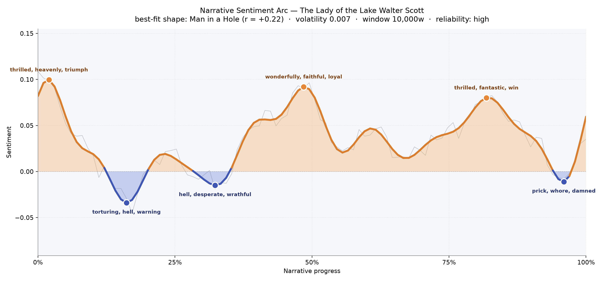
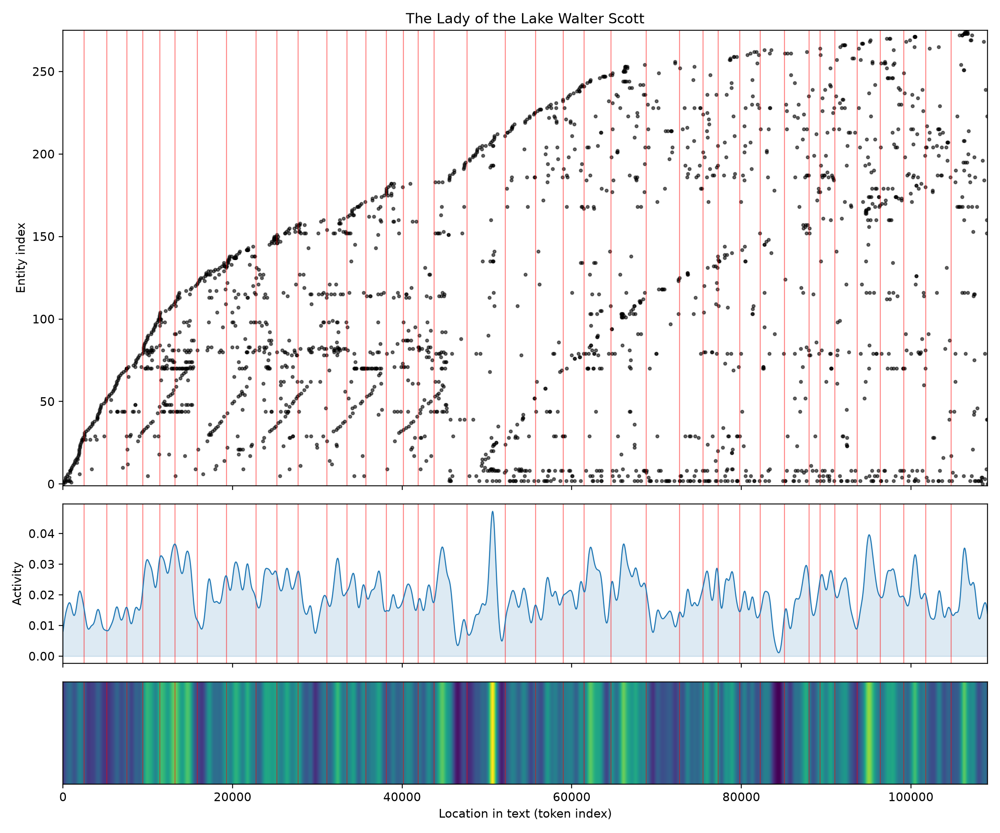

# The Lady of the Lake
### by Walter Scott

77,891 words · a Man-in-a-Hole arc — the heart drops into shadow, then climbs, then drops again before the last light returns

## The shape of the story

Scott's poem opens on a high, silvery note — the first pages are "thrilled, heavenly, triumph, winning" incarnate, all horns and heather and the rush of a stag flushed from cover. Then the ground gives way. Around the sixteen-percent mark the reader falls into the poem's darkest trough, a place "torturing, hell, warning, despair, terror" carve into the mind like a piper's dirge in a blackened glen. A second, shallower dip near a third of the way in is thick with "hell, desperate, wrathful, foul, outrage" — the clan-hatred and coming muster of the Highlands sharpening their edges.

From there the arc rises steadily into the middle chapters, cresting at the halfway mark on words like "wonderfully, faithful, loyal, paradise, won" — Ellen's hospitality, the vows sworn, the harp-lit hours before battle. A third summit near the four-fifths point brings "thrilled, fantastic, win, wonderful, best" as the wandering king reveals himself and hard oaths are honored. Only in the final tenth does the poem pitch once more into a small, bruising valley shot through with "prick, whore, damned, loose, cruel, miserable" — an almost bitter grace-note before the coda. The reading feels genuinely so: a life dropped into peril, lifted by loyalty, and set gently down again.

<figure><figcaption>Two long climbs and two dark hollows: the emotional weather of Scott's Highland romance.</figcaption></figure>

## Who lives on the page

The tally is dominated, unsurprisingly, by "scott" — the author's own name recurring in headers and the footnotes that fringe any nineteenth-century edition. Set that aside and the true cast emerges plainly: **Douglas**, the exiled lord whose honor drives half the plot; **Ellen**, the lady of the lake herself, softer in name-count but central to every hearth; **Roderick** and his sterner double **Roderick Dhu**, the black-browed chieftain of Clan Alpine; **Fitz-James**, the mysterious knight whose true identity braces the ending; and the shadow-king **James**, whose name and Fitz-James's slowly rhyme into one figure. Around them stretches a real geography — **Scotland**, the **Highland** country, **Stirling** with its rock and castle — and a people, the **Scottish** clans. The presence of "shakespeare" among the top names is a footnote-ghost: Scott's editors quote the Bard in glosses. "Thou" and "chieftain" are stray honorifics the tagger has mistaken for places; the reader can smile and move on. What the list confirms is that this is fundamentally a poem of a woman between four men — father, suitor, chieftain, king — and a country between two ways of being.

<figure><figcaption>New names arrive in bright vertical bursts at each canto's opening; the middle cantos hum thickest with presence.</figcaption></figure>

## The weave of scenes

Read as a visual score, the flow graph shows forty scenes strung shore-to-shore, with a thick, braided middle where nearly every figure crosses nearly every other. The densest bloom sits around the twenty-fifth scene, which carries sixty-one presences — the great gathering canto, where the fiery cross runs the glens and the whole poem's cast is called into one room of language. The opening scenes are leaner, threads laid down one by one — huntsman, harper, maiden — and the closing scenes narrow again as the poem gathers its people toward Stirling's throne room. Between those tapered ends the lines cross-hatch relentlessly: this is a poem in which loyalties knot and reknot, and the picture shows exactly that.

<figure><figcaption>A woven middle, tidy edges: Scott's cantos meet in a Highland muster and disperse toward a royal court.</figcaption></figure>

## What a reader takes away

What lingers is the sound of it — the pipe-and-harp cadence of a country that loves its own quarrels and, at the last minute, chooses mercy. Scott sends you down into the hollow with the hunted, up onto the crag with the chieftain, and finally into a torch-lit hall where a king remembers a promise. You close the book carrying a stag's leap, a boat pushing from a reedy shore, and the small, bright knowledge that honor, in Scott's world, still finds a way home.
