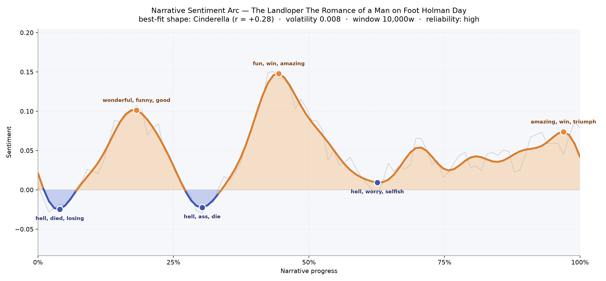
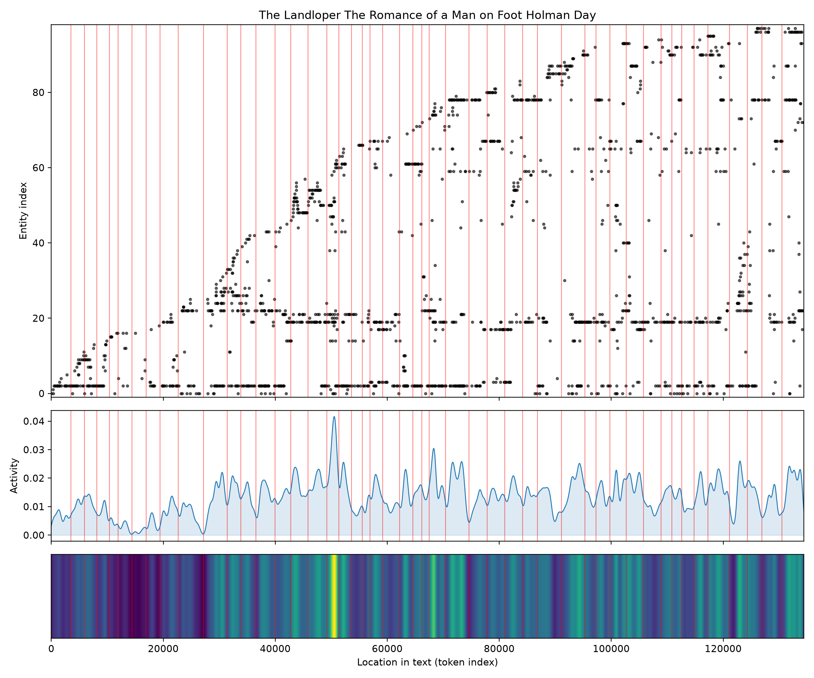

# The Landloper: The Romance of a Man on Foot
### by Holman Day

103,508 words · a Cinderella arc — a wanderer's rise from roadside dust to a hard-won brightness

## The shape of the story

Holman Day's tramp-hero begins in a low place and refuses to stay there. The opening pages sit beneath the waterline; the earliest trough bruises with "hell, died, losing, dying, damage, selfish," as if Walker Farr steps onto the road already carrying somebody else's grief. The mood lifts almost at once — a first crest near the one-fifth mark warms with "wonderful, funny, good, loves, affection, happy," the buoyancy of a stranger being taken in, fed, teased, half-loved by people he has just met.

Then the road turns. Around the one-third mark the arc sinks again, thick with "hell, ass, die, dead, anger, bad," the sound of a man discovering how ugly the town he has walked into really is. What follows is the book's tallest peak, near the halfway line: a burst of "fun, win, amazing, godsend, good, best" that reads like a campaign speech landing, a swindle unmasked, a crowd on his side. A late-middle dip carrying "hell, worry, selfish, angry, anger, desperate" tempers the triumph — the victory costs something — before the closing pages climb once more into "amazing, win, triumph, wonderful, great, loyal." It is the classic upward-tilted fairy tale, and the reliability of the trace is high enough that we can trust the felt trajectory: down, up, down, up, and finally home.

<figure><figcaption>Two valleys, three crests: a footloose man being knocked flat and getting back up, taller each time.</figcaption></figure>

## Who lives on the page

Farr walks through every chapter — 342 mentions, more than any other name, and often doubled as "Walker Farr" when the narrator wants us to remember he is nobody's employee. Dodd is his opposite number, a heavy shadow of 234 appearances, split between the elder Symonds Dodd and the sly Richard Dodd; together they are the machine Farr has come to break. Archer Converse, the old lawyer, presides with quieter authority. Kate and Rosemarie carry the book's tenderness, and a figure named Citizen Drew — half-orator, half-conscience — turns up to give the crowd its voice. "Consolidated" is not a person but the water-company villain, and "Etienne" (tagged here as a place) is really the little mill-town where much of the trouble lives, so read that as a setting rather than a character. Kilgour and Breed round out the political scaffolding. Together they map neatly onto a New England reform romance: the drifter, the boss, the girl, the town.

<figure><figcaption>Names accumulate as Farr stops walking and starts organizing; activity thickens in the middle and never quite lets go.</figcaption></figure>

## The weave of scenes

Forty-eight scenes and nearly five hundred connective threads — a densely populated book for a novel this length. The visual score shows a thin, almost single-file opening: a lone walker on an empty road, meeting one or two people at a time. Around the middle, the strands multiply and braid; scene after scene carries a dozen, sixteen, twenty presences in the same room — town meetings, courtrooms, sickbeds, campaign halls. The longest arcs sweep from the opening chapters all the way to the finale, meaning certain figures (Farr himself, Kate, the Dodds) never really leave. The final scene is the fullest of all, twenty-three presences crowding a single close — the traditional gathering where everyone comes to see how the story ends.

<figure><figcaption>A solitary walk widens into a civic chorus; the closing chapter is the crowded room every romance promises.</figcaption></figure>

## What a reader takes away

The Landloper is a book about being underestimated, and about the peculiar American pleasure of watching a barefoot stranger outthink the men in offices. Its music is not subtle — the valleys are angry, the peaks are frankly happy — but its warmth is real. You close it feeling that decency, walked far enough, eventually finds its town.
