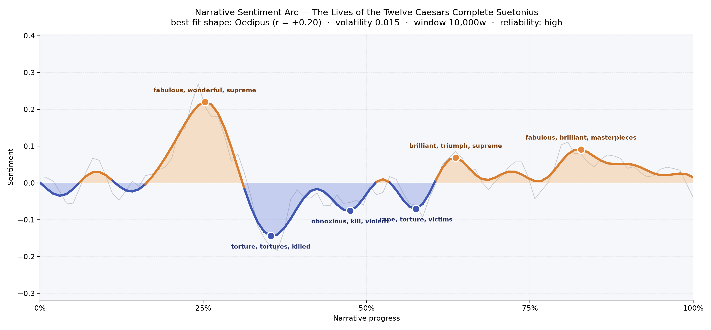
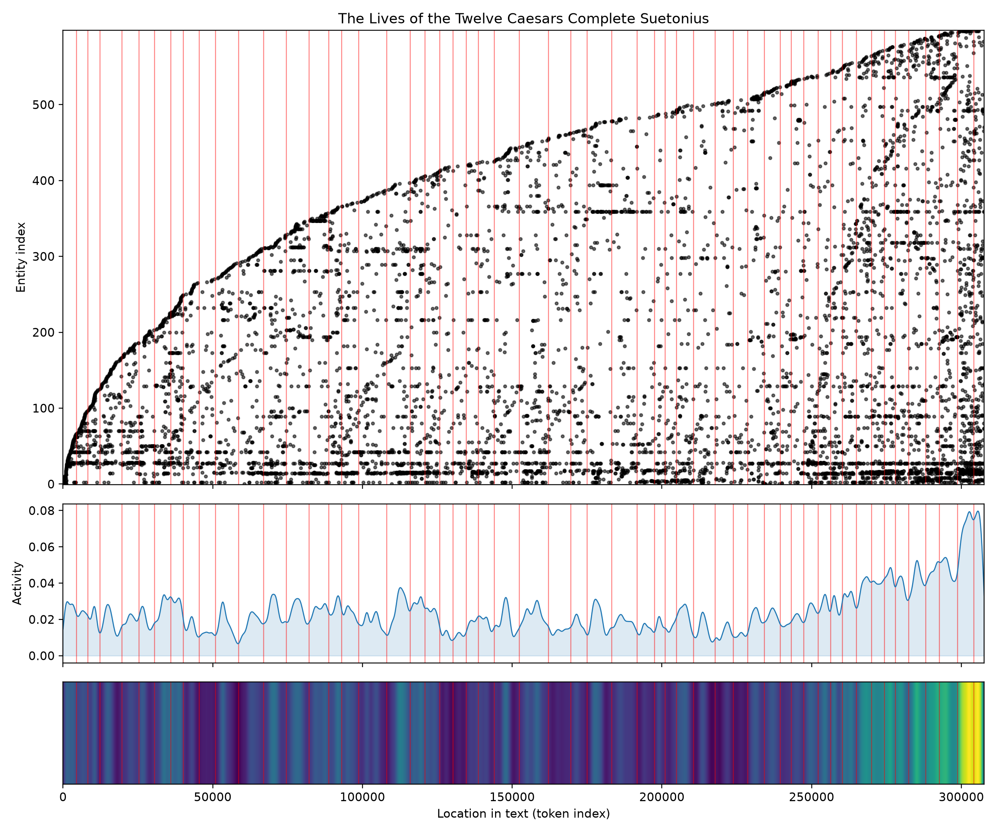

# The Lives of the Twelve Caesars
### by Suetonius

230,616 words · an Oedipus arc — a rise brightened by public glory, then plunged into the private cruelty of emperors.

## The shape of the story

Suetonius does not tell one life; he tells twelve, and yet the composite feels like a single tragic figure lifted onto a throne and then, slowly, unmade by it. The opening quarter climbs like a triumphal parade — the earliest reign glitters with "fabulous, wonderful, supreme, brilliant, magnificent, popular," the vocabulary of a city convinced that its Caesars are gods walking. Then, around the one-third mark, the ground gives way. The steepest trough bruises with "torture, tortures, killed, outrage, loss, died," and the middle chapters keep the wound open: a second dip is thick with "obnoxious, kill, violent, vomited, terrible," and a third, near the story's mid-back, murmurs of "rape, torture, victims, cruelty, crimes."

There are recoveries. Past the halfway point a modest ridge lifts on "brilliant, triumph, supreme, best, succeeds, excellent," as if Vespasian's plain competence had steadied the room, and a later swell near the four-fifths mark shines with "fabulous, brilliant, masterpieces, pleasure, admired." But the closing pages settle back toward neutrality — the fever of empire cooled into biography. This is the Oedipus curve as felt: elevated, then broken, then never quite whole again.

<figure><figcaption>The arc's high noon at 25% is Augustan sunlight; the long shadow that follows is the century of successors.</figcaption></figure>

## Who lives on the page

The census of the book is exactly what a Roman would expect: Augustus stands tallest, mentioned nearly four hundred times, and Rome herself is his equal — city and man almost interchangeable as subjects of the sentence. Behind them the Senate looms, then the adjective "Roman," a whole people used as a chorus. Tiberius, Nero, and the shared name Caesar crowd the next tier; then Claudius, Cicero, Vespasian, Pompey, and Julius Caesar fill in the gallery. A curiosity of the tally: "suetonius" itself appears as a frequent presence, a reminder that the author steps forward in his own margins to cite, quibble, and gossip. A couple of the labels — "roman," "greek," "romans" — are peoples rather than persons, and the machine has occasionally filed emperors under the wrong drawer (Tiberius and Nero appear as institutions), but the shape of the crowd is unmistakably imperial: one city, one senate, twelve men, and the historian looking over their shoulders.

<figure><figcaption>New names accumulate steadily — a court that keeps enlarging — with a bright surge of activity in the final biographies.</figcaption></figure>

## The weave of scenes

Read as a visual score, the flow graph looks less like a plotted novel and more like a woven tapestry: fifty-five panels, each dense with the same recurring cast, threads arcing between them because Augustus casts a shadow onto Nero's chapter and Julius shows up in everyone's family tree. The middle of the weave is thick and even, chapter after chapter carrying roughly comparable populations — a stately, list-like rhythm suited to lives lived in parallel. What breaks the pattern is the ending. The final scenes swell dramatically: the last panels carry more than a hundred distinct presences apiece, one crest reaching 181. Suetonius saves his crowd scenes for the late emperors, where informers, freedmen, wives, soothsayers, and rival claimants pile into the room. The braid tightens; the tapestry frays into a knot.

<figure><figcaption>A long, patient middle gives way to a crowded finale — the empire's cast list swelling as its stability shrinks.</figcaption></figure>

## What a reader takes away

You close the book carrying a suspicion Suetonius plants gently and never lets go: that absolute power is a slow corrosion, and that even the best of these men — the divine Augustus, the plain Vespasian — are surrounded by rooms full of small daily cruelties. The bright vocabulary of the opening has not disappeared; it has simply been outlived by the darker inventory of the middle. What remains is a curiously modern feeling — that history, told close enough to smell the wine and the blood, is mostly a matter of who was in the room, and what they chose to do when the doors closed.
