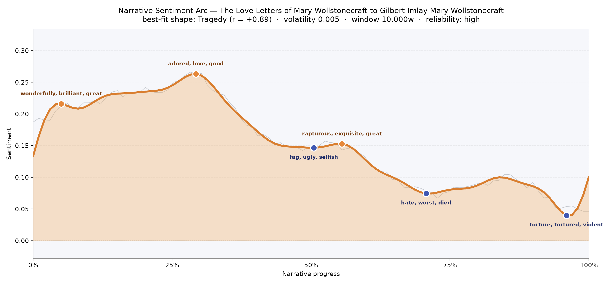
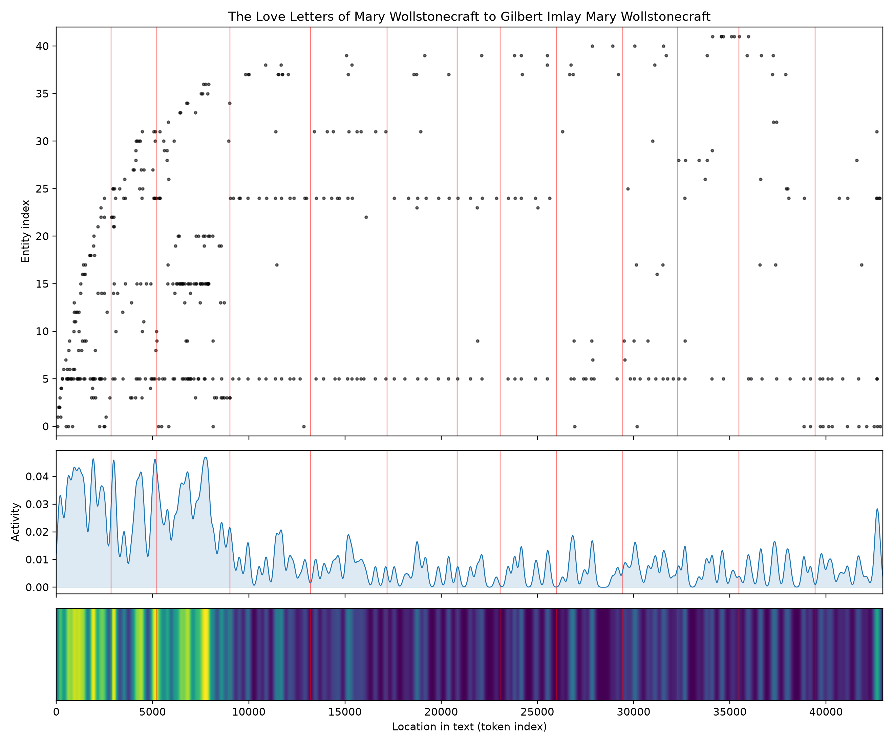
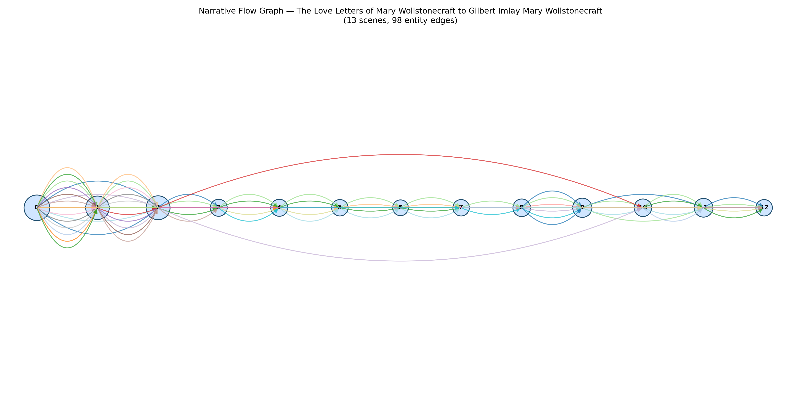

# The Love Letters of Mary Wollstonecraft to Gilbert Imlay
### by Mary Wollstonecraft

About 33,900 words of private correspondence — a clean Tragedy arc, a heart lifted early and slowly worn down.

## The shape of the story

Read as one long letter cycle, this book behaves like a candle burning steadily shorter. The opening pages glow: an early crest thick with "wonderfully, brilliant, great, pleasure, affection, won" gives the sense of a woman newly and gladly in love, still willing to be dazzled. That warmth deepens into the highest peak of the book near the first third, where the language grows almost devotional — "adored, love, good, pleasure, happy, affection" — the vocabulary of a person who believes, or wants to believe, that she has found her permanent home in another human being.

Then the descent begins, and it does not stop. A brief lift near the middle still reaches for grandeur — "rapturous, exquisite, great, affection, pleased, admire" — but the very next dip carries a smaller, sharper vocabulary of domestic exhaustion, where the letters bruise with "fag, ugly, selfish, chastised, angry, plagues". By the two-thirds mark the tone has hardened; the trough is heavy with "hate, worst, died, angry, slave, evil", the language of a woman who has begun to name what is happening to her. The final valley, right at the closing pages, is the darkest of all, sunk in "torture, tortured, violent, despair, cruel, dead". A very steady arc — the swings are shallow — which makes the slow bleed feel more inevitable than dramatic. This is a Tragedy in the plainest sense: not a plunge, but a light going out at a measured, unbearable pace.

<figure><figcaption>A single, unhurried descent from adoration to torment across the correspondence.</figcaption></figure>

## Who lives on the page

The presiding voice is Mary herself — her name appears more than any other figure in the book, which is fitting for a volume assembled from her own hand and reintroduced by later editors. Gilbert Imlay, the addressee, hovers behind almost every line even when the counting registers him only as a scattered surname. The cities do a great deal of the emotional work: Paris towers over every other place, followed by London, with Havre, England, France, and the Norwegian port of Tonsberg tracing the actual geography of her wanderings after him. Godwin and Shelley appear because the edition is framed by their later family history rather than the letters themselves, and Fanny and Johnson belong to that same editorial frame — her daughter, her publisher. A handful of tokens are noise: the recurring "----" is simply the editor's dash where a name was withheld, and "adieu" is Mary's habitual sign-off mistaken for a proper name, which is oddly touching once you notice it. Take those quirks away and what remains is a small cast — one woman, one absent man, and the cities between them.

<figure><figcaption>Names and places crowd the early pages, then thin as the correspondence turns inward.</figcaption></figure>

## The weave of scenes

The flow picture behaves exactly the way a letter book should. The first three clusters are dense knots — the editor's preface and the earliest, longest letters, where twenty or more figures crowd the page: family, publishers, revolutionary Paris, Godwin's later commentary. Then, abruptly, the weave thins. From the fourth cluster onward the correspondence is essentially a two-person conversation, and the graph shrinks to a slender chain of six to eleven presences per scene, threaded by a few long arcs that reach clear across the book — those are the recurring anchors, Mary and Imlay and Paris, holding the whole span together like guy-wires. Near the close a small swell reappears as the editorial voice returns to gather up the ending. It reads less like a plotted novel and more like a life narrowing to one addressee, then widening again only when other hands take over the telling.

<figure><figcaption>A crowded prologue, a long solitary middle, and a quiet editorial return at the end.</figcaption></figure>

## What a reader takes away

You close this book with the ache of having overheard something you were never meant to read. Wollstonecraft's intelligence is intact to the last page, which is what makes the descent so wounding — she watches herself being unloved and reports it in real time. The inheritance is not the sorrow itself but her refusal to be silent inside it: even at the darkest valley, she is still writing, still shaping sentences, still insisting that a woman in despair is also a woman thinking.
