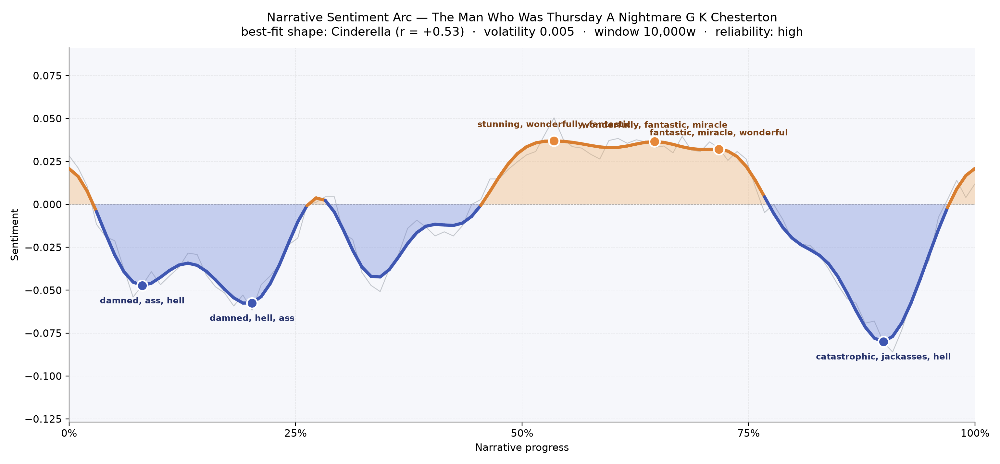
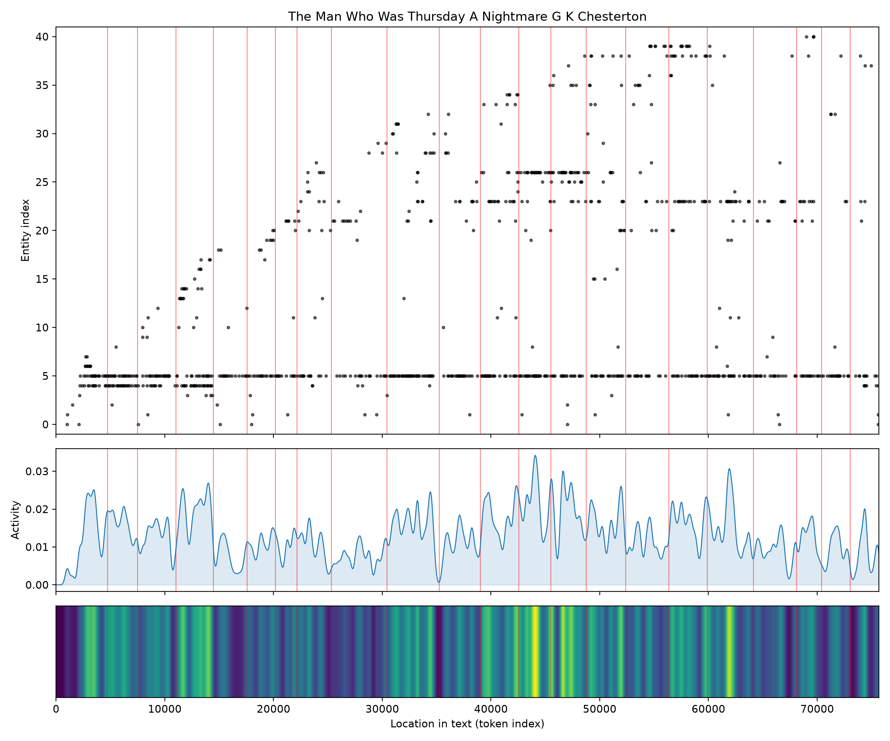
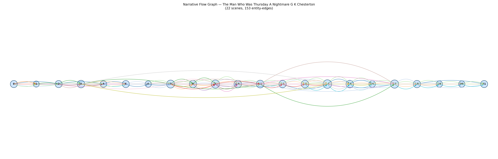

# The Man Who Was Thursday: A Nightmare
### by G. K. Chesterton

59,004 words · a Cinderella arc — a soul dragged through dark alleys before being lifted into astonishment, only to be pitched into the deepest pit of all.

## The shape of the story

Chesterton's nightmare-comedy carries the shape of a Cinderella tale, but a strange, soot-blackened one. The reader begins in gloom: within the first tenth of the book the mood already bruises, thick with "damned, ass, hell, deadly, violently, awful," and by the one-fifth mark it deepens further into a trough where "damned, hell, ass, torture, destroy, died" cluster like coal smoke over the Thames. This is Syme's plunge into anarchist company — the world flipped, everything ordinary made menacing.

Then, at almost exactly the book's midpoint, something extraordinary happens. The arc lifts. From half to three-quarters through, three golden crests rise in succession, and the language shifts into an almost giddy vocabulary: the first crest sparkles with "stunning, wonderfully, fantastic, miracle, excitement, amused," the second climbs into "wonderful, supreme, triumph," and the third holds that same triumphant hum. These are the great chase scenes and rooftop revelations, the moments Chesterton lets his sky open.

And then, near ninety percent through, the floor drops out. The book's darkest single valley — deeper than anything in its opening gloom — arrives in language that reads almost apocalyptic: "catastrophic, jackasses, hell, mad, atrocious, worse." It is the reader's real reward for staying: a metaphysical vertigo just before the final calm. The fit to the Cinderella shape is only moderate, and rightly so — this is not a fairy tale that stays lifted. It rises, dazzles, and asks a terrible question at the end.

<figure><figcaption>Two early troughs of anarchist gloom, a long sunlit ridge of chase and comradeship, and a final plunge into catastrophe just before the close.</figcaption></figure>

## Who lives on the page

One name towers above all others: Syme, the poet-policeman, named four hundred and sixty-five times — more than four times as often as anyone else. He is the book's consciousness, its eye and its ache. Around him orbit the days of the week: Bull the doctor, Gregory the anarchist, the Marquis de Saint Eustache, Gogol, Ratcliffe, Professor de Worms, and the fugitive Comrade Renard. That the tally labels a few of them as organisations rather than people is a small quirk worth smiling at — Chesterton's whole conceit is that these men are less individuals than symbolic offices, so the mislabelling is almost fitting.

Places arrive quietly but decisively: Paris, London, Saffron Park, Victoria — the geography of a chase that runs from a suburban lilac garden to a rooftop in France. The "French" and "Christians" tags remind us the book is also arguing about creeds and nations, not just persons. There is no woman among the top figures, and that absence is honest to the book: this is a fraternity of masks.

<figure><figcaption>Syme runs like a horizon line across the whole book; new figures appear in waves as each Councillor is unmasked.</figcaption></figure>

## The weave of scenes

The scene weave shows twenty-two chapters strung along a slender wire, with the densest tangle of connections gathered squarely in the middle. Early scenes are almost solitary — Syme and Gregory alone, then Syme and the Council. But from around the eighth scene onward the threads thicken, colours cross, and long arcs leap over several chapters at once: those are the recurring pursuers, the reappearing faces beneath new disguises. The final three scenes thin out again to a near-silent tail, as if the crowded dream is dispersing into waking. Two long green and yellow ribbons stretch almost the full length of the book — Syme's presence, and Sunday's shadow.

<figure><figcaption>A slender chain that swells in the middle chapters, where every mask is torn off in turn, then thins into the quiet ending.</figcaption></figure>

## What a reader takes away

You close the book uncertain whether you were reading a thriller, a theology, or a joke told in the dark. The nightmare lifts, briefly, into laughter — and then closes with a question you cannot answer. What lingers is the sensation of running through a foggy city beside a man who suspects everyone, only to discover that suspicion itself was the disguise.
