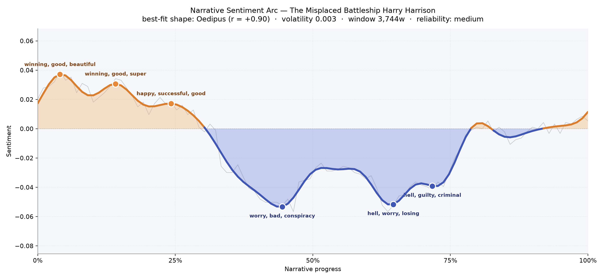
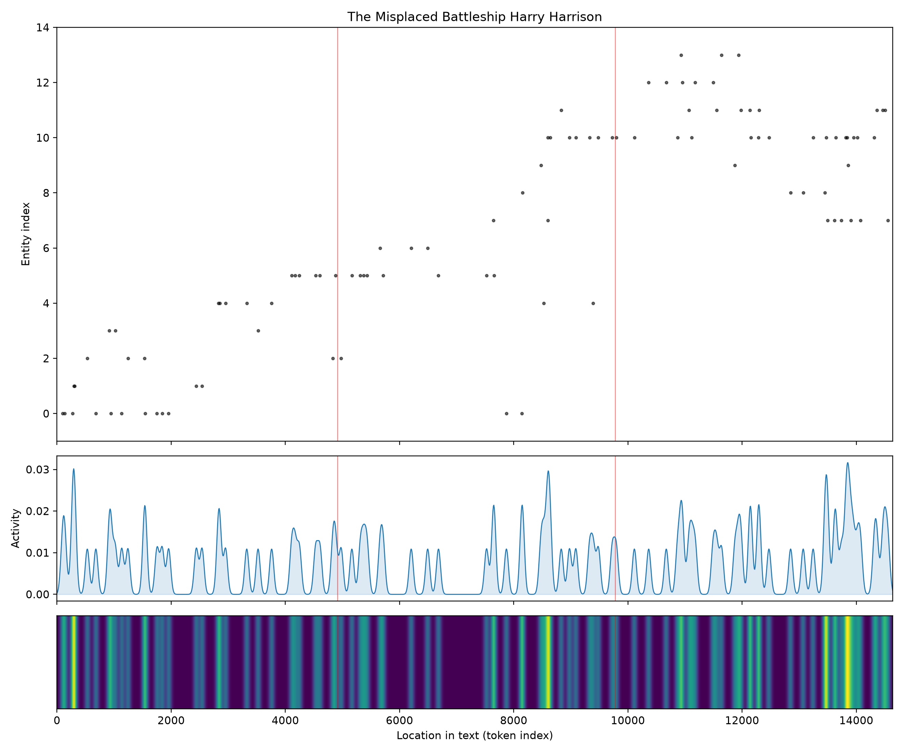
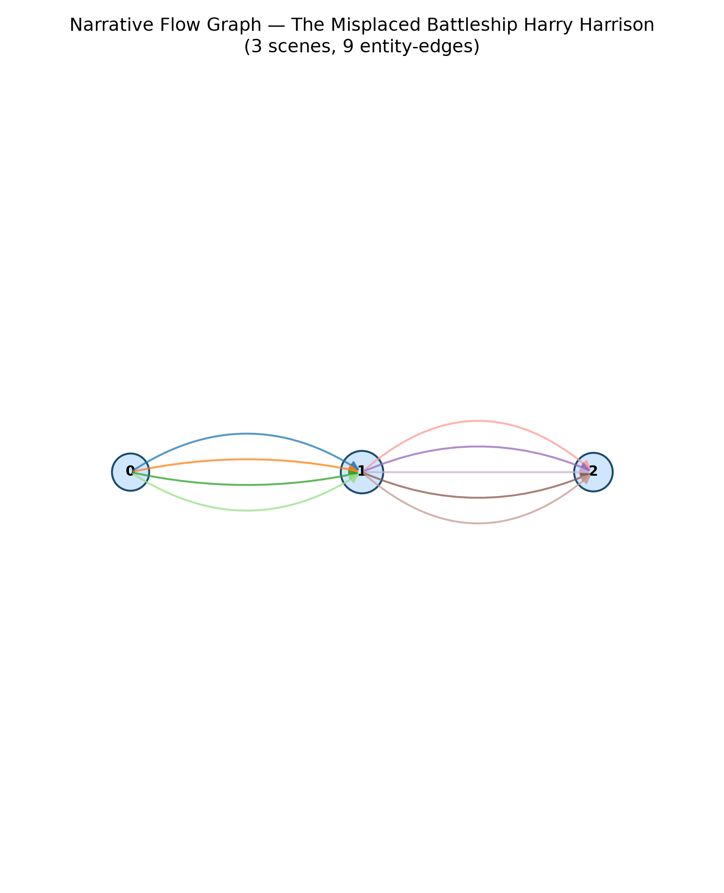

# The Misplaced Battleship
### by Harry Harrison

A brisk 11,346-word caper that traces an Oedipus arc — a story lifted by cleverness only to be dragged down into guilt, conspiracy, and hell.

## The shape of the story

Harrison's novella opens like a con-man's grin: bright, cocksure, already halfway to victory. In the first quarter of the reading, the mood keeps cresting on words like "winning, good, beautiful, great, succeeded" and later "super, happy, successful, delightful, grateful" — the language of a rogue who has just talked his way out of one scrape and into a better suit. You read these opening pages the way you watch a heist unspool when nothing has yet gone wrong. Pepe is charming, the Corps is amused, the universe seems to be cooperating.

Then the floor tilts. Around the two-fifths mark the arc dips hard and stays down, the way a jaunty tune loses its horns and becomes a corridor of doors closing. The first true trough near the midpoint bruises with "worry, bad, conspiracy, desperately, fake, terror" — the moment our clever crew realises the joke has grown teeth. A second, deeper valley just past the two-thirds mark is louder still, thick with "hell, worry, losing, guilty, criminal, bribe," and a third trailing dip carries "hell, guilty, criminal, bribe, died, bad" like an echo that will not fade. Only in the closing sliver does the line climb back above the waterline, and it does so quietly, without ever recovering the sunshine of the opening. That is the Oedipus signature in miniature: a man lifted by his own cleverness only to be undone by it, granted a small stoic composure at the end rather than a rescue. This is a shorter book, so the arc is impressionistic rather than definitive, but the shape is unusually clean and reading the story bears it out.

<figure><figcaption>Sunlit swagger up front; a long submerged middle of conspiracy and guilt; a hairline recovery at the close.</figcaption></figure>

## Who lives on the page

The presiding presence is Pepe — the slippery, self-satisfied protagonist whose name recurs more than any other, a small linguistic proof that this is his show. Ferraro shadows him as the second-most-named figure, the fixer or foil against whom Pepe measures his wit. Inskipp presides from above as the Corps' handler; Angelina glimmers in and out as the femme who redirects the plot's gravity; Cittanuvo, Steng, Rocca, and Mike orbit as accomplices or obstacles. The Navy, the Warlord, the Special Corps, and the plain "Corps" round out the institutional weather — the uniformed, humourless world Pepe keeps outwitting. A couple of the labels are noise the tagger couldn't help: "naval" and the stray Danish "udrydde" slip in as pseudo-places, and Angelina is filed as a location when she is plainly a person. Read past that light static and what remains is a tight ensemble — a rogue, his partner, his boss, his love interest, and the uniformed powers he must outfox.

<figure><figcaption>Names accumulate scene by scene — sparse at the opening, dense and crowded by the final third when the con becomes a chase.</figcaption></figure>

## The weave of scenes

The scene graph is spare and honest: three panels, nine threads. Panel one introduces a small cast — roughly six figures — and hands most of them straight through to panel two, which swells to about ten as the world widens and the stakes multiply. Panel three inherits seven of those threads and carries them to the finish. There are no isolated islands, no orphan subplots; every strand that appears in the middle either arrives from the opening or continues into the ending, which is exactly the braided economy a good caper needs. It reads less like a tapestry and more like a rope: three sections, tightening.

<figure><figcaption>Three panels, one continuous rope of characters — introduced, complicated, resolved.</figcaption></figure>

## What a reader takes away

You close the book with a rueful smile. Harrison starts you laughing, drops you into a long shadow of conspiracy and criminal weight, then lets you out — not into daylight, but into something wiser. The takeaway is small and pointed: cleverness buys you the first act; it is character, barely, that gets you through the third.
