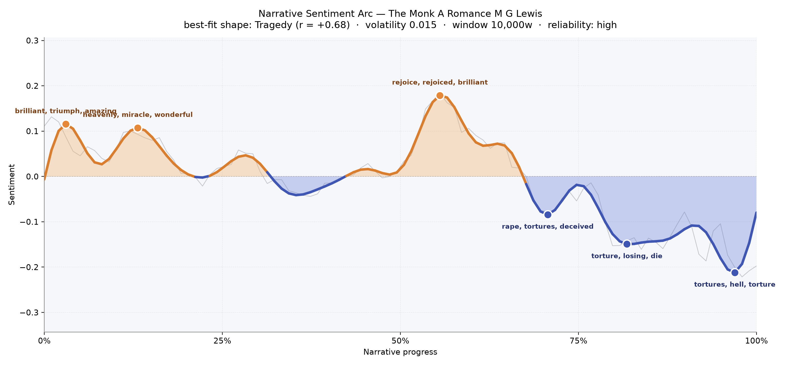
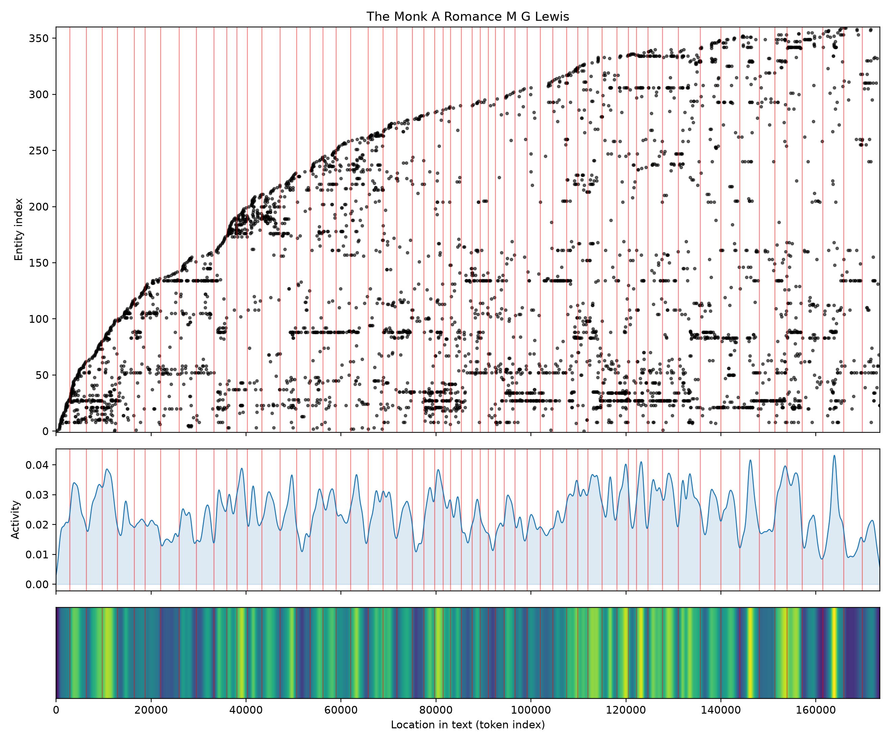

# The Monk: A Romance
### by Matthew Gregory Lewis

138,446 words, a Tragedy arc — a soul lifted by incense and vanity, then dragged down into the pit it prepared for itself.

## The shape of the story

Lewis's Gothic sermon opens in something like grace. The first stretch is bright with cloister colour, the language warm with "brilliant, triumph, amazing" as Madrid crowds hush for a preacher they already half-worship, and then softens again into a devotional glow where "heavenly, miracle, wonderful, rejoice" flicker like altar candles. For a long while the book seems to promise a romance in the older sense — a tale of hope trembling on the edge of vow-taking. The reader is not yet warned.

Around the midpoint the emotional weather touches its highest bloom: a passage thick with "rejoice, rejoiced, brilliant, fantastic, heavenly" that reads, in hindsight, like the last window of clean daylight. From there the line begins to sag, then to fall in earnest. The first true trough near the two-thirds mark is bruised with "rape, tortures, deceived, slave, crime, guilt" — the moment the story's polite Gothic drapery is yanked aside. Deeper still, the arc slumps into "torture, losing, die, loss, crimes, dead", and by the final pages the book gives itself entirely to the abyss, its closing valley heavy with "tortures, hell, torture, rape, dreadful, terrible". This is a Tragedy in the oldest sense: a man who climbs a pulpit and ends in a pit, and the reader climbs and falls with him.

<figure><figcaption>A high, sunlit first half, then a long, unbroken slide into damnation — Lewis's shape is unmistakable.</figcaption></figure>

## Who lives on the page

Four names carry the book on their backs. Antonia — the delicate innocent — is spoken of most often of all, followed by Matilda, the seductress in a novice's habit, then Agnes, the buried nun, and Lorenzo, the young cavalier whose love story runs like a bright thread beside the darker one. Ambrosio, the monk of the title, appears less often by name than one might expect; Lewis prefers to call him "the abbot" or "the friar", which is why he seems, in the raw counts, quieter than his victims. Elvira, Antonia's mother, and later Flora and Jacintha, the fussing servants, round out the domestic circle. The tag beside each name is worth a shrug — Antonia and Ambrosio are flagged as places rather than people by the counting tool, a small misreading that says more about eighteenth-century naming than about the book. Madrid and the abbey stand behind them all, a city and a cloister that feel as present as any character, and the recurring word "nuns" reminds us that the convent itself is a kind of collective presence, watching and whispering.

<figure><figcaption>Names enter in dense early bands and keep accumulating — Lewis crowds his stage and never quite empties it.</figcaption></figure>

## The weave of scenes

The scene weave looks like a long, taut rope with two great knots at either end. Fifty-nine scenes are laced together by more than sixteen hundred shared-figure threads, and the density is remarkable: almost every chapter draws on the same recurring cast, so the arcs of connection sweep across the whole span rather than clustering locally. Two swellings stand out — one near the opening, where Lewis introduces his double plot of Ambrosio and Lorenzo in overlapping company, and a larger one near the end, where the two braids finally meet in dungeon, tomb and auto-da-fé. In between, the threads thin only briefly, in the interpolated tales of the Bleeding Nun and the Wandering Jew, before rejoining the main weave. It is a novel that never lets its threads go slack.

<figure><figcaption>Two dense knots at beginning and end, with a taut span between — Lewis's parallel plots pulled tight.</figcaption></figure>

## What a reader takes away

*The Monk* leaves behind the taste of incense turning to sulphur. Lewis begins in a Madrid of processions and blushing lovers and ends in caverns of torment, and the descent feels earned — not because the reader is punished, but because the book has followed a single, awful logic to its conclusion. What lingers is the double vision: the sweetness of the early chapters remembered inside the horror of the last, and the queasy suspicion that piety, unguarded, can rot into its opposite. It is a Gothic that still knows how to frighten because it took the trouble, first, to enchant.
